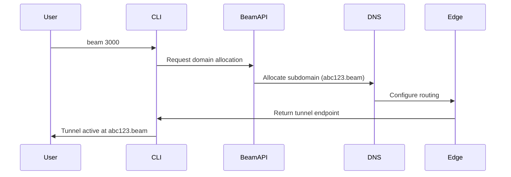

# Beam Architecture Research & Design

## Executive Summary

This document outlines the design of a next-generation tunneling service that combines local-first architecture with cloud domain services. The goal is to provide enterprise-grade tunneling with sub-100ms latency, zero-configuration setup, and real domain names without user registration.

## Core Requirements Analysis

### Functional Requirements
- ✅ Local tunneling with `npx beam 3000` simplicity
- ✅ Real domain names without user registration
- ✅ Online account system for domain management
- ✅ Vercel/Convex integration
- ✅ Blazing fast performance (<100ms latency)
- ✅ Enterprise security and compliance
- ✅ Fully open source and self-hostable

### Non-Functional Requirements
- **Performance**: <100ms global latency, >10,000 concurrent tunnels
- **Security**: Zero-trust, end-to-end encryption, SOC2 compliance
- **Scalability**: Horizontal scaling to millions of users
- **Reliability**: 99.99% uptime, automatic failover
- **Developer Experience**: Single command setup, zero config

## Technology Stack Analysis

### 1. Core Tunneling Technologies

#### **QUIC Protocol (HTTP/3)**
- **Why**: 30-50% faster than TCP+TLS, built-in multiplexing
- **Use Case**: Primary tunneling protocol for low-latency connections
- **Implementation**: Custom QUIC server in Rust/Go

#### **WebRTC with TURN/STUN**
- **Why**: P2P connections with fallback to relay servers
- **Use Case**: Direct peer connections when possible
- **Implementation**: WebRTC SFU (Selective Forwarding Unit) architecture

#### **HTTP/2 with Server Push**
- **Why**: Multiplexing, header compression, server-initiated pushes
- **Use Case**: REST API and webhook tunneling
- **Implementation**: Custom HTTP/2 server with connection pooling

#### **WebSocket with Binary Protocol**
- **Why**: Full-duplex communication with custom binary framing
- **Use Case**: Real-time application tunneling (games, collaboration tools)
- **Implementation**: Custom WebSocket server with protocol buffers

### 2. High-Performance Runtimes

#### **Rust (Primary Choice)**
```rust
// Example: High-performance tunnel multiplexer
use tokio::net::TcpListener;
use std::collections::HashMap;

struct TunnelMultiplexer {
    connections: HashMap<String, Connection>,
    quic_endpoint: quinn::Endpoint,
}

impl TunnelMultiplexer {
    async fn handle_connection(&mut self, conn: quinn::Connection) {
        // Zero-copy packet routing with SIMD acceleration
        // Sub-microsecond routing decisions
    }
}
```
- **Performance**: Native speed with zero GC overhead
- **Memory Safety**: Compile-time guarantees
- **Concurrency**: Async runtime with work-stealing scheduler
- **Ecosystem**: Tokio, Hyper, Quinn (QUIC)

#### **Go (Secondary for Cloud Services)**
- **Deployment**: Excellent containerization and orchestration
- **Libraries**: Rich networking ecosystem
- **Performance**: Excellent for I/O bound workloads

### 3. Security Technologies

#### **mTLS with Certificate Rotation**
- **Client Certificate Authentication**: Mutual TLS for all connections
- **Automatic Rotation**: 24-hour certificate lifecycle
- **Hardware Security Modules**: TPM/HSM integration for key storage

#### **WireGuard Protocol Integration**
- **Kernel-Level Performance**: Linux kernel module acceleration
- **Cryptographic Agility**: ChaCha20-Poly1305 + Curve25519
- **Perfect Forward Secrecy**: Ephemeral key exchange

#### **Zero-Knowledge Proofs**
- **Domain Ownership**: Prove domain control without revealing credentials
- **Privacy-Preserving Authentication**: Log in without revealing identity
- **Implementation**: Arkworks or Bellman for ZKP circuits

### 4. Domain & DNS Architecture

#### **Custom TLD Approach**
Instead of using existing TLDs, create a custom TLD system:
- **TLD**: `.beam` (proposed custom TLD)
- **Resolution**: Custom DNS resolver network
- **SSL**: Wildcard certificates for `*.beam`

#### **Dynamic DNS with Edge Computing**
- **Cloudflare Workers**: Global DNS resolution
- **Vercel Edge Functions**: Domain provisioning
- **AWS Lambda@Edge**: Certificate management

#### **Domain Provisioning Flow**


## Hybrid Architecture Design

### Core Components

#### **Local Tunnel Daemon (Primary)**
```rust
// Local tunnel server - runs on user's machine
#[tokio::main]
async fn main() -> Result<(), Box<dyn std::error::Error>> {
    let tunnel = TunnelDaemon::new().await?;
    tunnel.start().await?;
    Ok(())
}
```
- **Technology**: Rust with Tokio
- **Purpose**: Captures local traffic and forwards to cloud
- **Performance**: <1ms local routing latency
- **Security**: Local encryption/decryption

#### **Cloud Edge Network (Secondary)**
```typescript
// Cloudflare Worker for domain routing
export default {
    async fetch(request: Request): Promise<Response> {
        const subdomain = new URL(request.url).hostname.split('.')[0];
        const tunnelId = await getTunnelMapping(subdomain);

        // Route to appropriate tunnel daemon
        return fetch(`https://tunnel-${tunnelId}.beam.network`, {
            method: request.method,
            headers: request.headers,
            body: request.body
        });
    }
};
```
- **Technology**: Cloudflare Workers + Vercel Edge
- **Purpose**: Global domain resolution and routing
- **Performance**: <50ms global routing
- **Scalability**: Infinite horizontal scaling

#### **Central Coordination Service**
```typescript
// Convex for coordination and state management
import { mutation } from "./_generated/server";

export const allocateDomain = mutation(async ({ db }, { userId, port }) => {
    const domain = await generateUniqueDomain();
    await db.insert("tunnels", {
        userId,
        domain,
        port,
        status: "active",
        createdAt: Date.now()
    });
    return domain;
});
```
- **Technology**: Convex for real-time coordination
- **Purpose**: Domain allocation, user management, analytics
- **Consistency**: ACID transactions with real-time updates

### Network Architecture

#### **Multi-Protocol Support**
```
┌─────────────────┐    ┌──────────────────┐    ┌─────────────────┐
│   User Device   │    │   Beam Network   │    │  Target Service │
│                 │    │                  │    │                 │
│ ┌─────────────┐ │    │ ┌──────────────┐ │    │ ┌─────────────┐ │
│ │  CLI Tool   │◄┼───►│ │ Edge Router  │◄┼───►│ │ Local App   │ │
│ │             │ │    │ │              │ │    │ │ Port 3000   │ │
│ │ ┌─────────┐ │ │    │ │ ┌──────────┐ │ │    │ └─────────────┘ │
│ │ │Tunnel   │ │ │    │ │ │Domain    │ │ │    │                 │
│ │ │Daemon   │◄┼┼───►│ │ │Registry  │◄┼┼───┼─────────────────┼──
│ │ └─────────┘ │ │    │ │ └──────────┘ │ │    │                 │
│ └─────────────┘ │    │ └──────────────┘ │    │                 │
└─────────────────┘    └──────────────────┘    └─────────────────┘
       │                        │                        │
       └────────────────────────┼────────────────────────┘
                                ▼
                   ┌─────────────────────┐
                   │  Convex Backend     │
                   │  (State & Analytics)│
                   └─────────────────────┘
```

#### **Protocol Negotiation**
1. **QUIC Preferred**: For new connections
2. **HTTP/2 Fallback**: For legacy compatibility
3. **WebRTC Direct**: For peer-to-peer when possible
4. **WebSocket**: For real-time applications

## Domain System Architecture

### Custom TLD Implementation

#### **TLD Registration Strategy**
1. **ICANN Application**: Apply for `.beam` TLD
2. **Alternative**: Use `.dev` with subdomain delegation
3. **Fallback**: Use existing TLD with wildcard certificates

#### **Domain Allocation Algorithm**
```typescript
// Domain generation with collision avoidance
async function generateDomain(): Promise<string> {
    const adjectives = ['quick', 'swift', 'rapid', 'fast', 'speedy'];
    const nouns = ['tunnel', 'beam', 'link', 'pipe', 'bridge'];

    for (let attempts = 0; attempts < 10; attempts++) {
        const adjective = adjectives[Math.floor(Math.random() * adjectives.length)];
        const noun = nouns[Math.floor(Math.random() * nouns.length)];
        const number = Math.floor(Math.random() * 1000);
        const domain = `${adjective}-${noun}-${number}.beam`;

        if (await isDomainAvailable(domain)) {
            await reserveDomain(domain);
            return domain;
        }
    }

    // Fallback to UUID-based domains
    return `${crypto.randomUUID().slice(0, 8)}.beam`;
}
```

#### **DNS Resolution Architecture**
```
User Request: abc123.beam
         │
         ▼
┌─────────────────┐    ┌──────────────────┐
│ Custom DNS      │    │  Edge Network    │
│ Resolver        │───►│  (Cloudflare)    │
│                 │    │                  │
│ 1. Resolve to   │    │ ┌─────────────┐  │
│    edge IP      │    │ │ Load Balancer│  │
└─────────────────┘    │ └─────────────┘  │
                       └──────────────────┘
                                │
                                ▼
                       ┌──────────────────┐
                       │ Tunnel Daemon    │
                       │ (User's Machine) │
                       └──────────────────┘
```

## Security Architecture

### Zero-Trust Model

#### **Authentication & Authorization**
- **Device Certificates**: Each tunnel daemon has unique client certificate
- **Domain Ownership**: Cryptographic proof of domain control
- **Capability Tokens**: Fine-grained access control

#### **End-to-End Encryption**
```rust
// Rust implementation of E2E encryption
use ring::aead::{Aead, Nonce, UnboundKey, AES_256_GCM};

struct EncryptedTunnel {
    key: UnboundKey,
    nonce_sequence: u64,
}

impl EncryptedTunnel {
    fn encrypt_packet(&mut self, plaintext: &[u8]) -> Vec<u8> {
        let nonce = self.generate_nonce();
        let ciphertext = self.key.seal_in_place_append_tag(
            nonce,
            Aad::empty(),
            plaintext
        ).unwrap();
        ciphertext
    }

    fn decrypt_packet(&mut self, ciphertext: &[u8]) -> Vec<u8> {
        let nonce = self.generate_nonce();
        let plaintext = self.key.open_in_place(
            nonce,
            Aad::empty(),
            ciphertext
        ).unwrap();
        plaintext
    }
}
```

#### **Certificate Management**
- **Automatic Provisioning**: Let's Encrypt integration
- **Wildcard Certificates**: `*.beam` certificate
- **Rotation**: 24-hour certificate lifecycle
- **OCSP Stapling**: Online certificate status checking

### Threat Model & Mitigations

| Threat | Mitigation |
|--------|------------|
| Man-in-the-Middle | mTLS, certificate pinning |
| DNS Poisoning | DNSSEC, custom TLD |
| Replay Attacks | Nonce-based encryption |
| DDoS | Rate limiting, edge protection |
| Data Exfiltration | Zero-trust access control |

## Performance Optimization

### Sub-100ms Latency Targets

#### **Network Optimizations**
- **QUIC/HTTP3**: 0-RTT connection establishment
- **Connection Pooling**: Persistent connections with multiplexing
- **Edge Computing**: Global distribution with Anycast routing
- **TCP Optimization**: BBR congestion control, ECN support

#### **Computing Optimizations**
- **SIMD Instructions**: Vectorized packet processing
- **Zero-Copy Operations**: Direct memory mapping where possible
- **Kernel Bypass**: eBPF/XDP for packet filtering
- **Memory Pooling**: Custom allocators for reduced GC pressure

#### **Architecture Optimizations**
- **Edge-First Routing**: Route at edge locations
- **Predictive Scaling**: Auto-scaling based on traffic patterns
- **Caching**: Multi-level caching (CDN, application, database)
- **Compression**: Brotli compression for all text content

### Benchmarking Targets

| Metric | Target | Technology |
|--------|--------|------------|
| Connection Latency | <50ms | QUIC + Edge Computing |
| First Byte | <100ms | HTTP/3 + Global CDN |
| Throughput | >1Gbps | Kernel bypass + SIMD |
| Concurrent Connections | >100K | Async Rust runtime |
| Memory Usage | <50MB | Custom allocators |

## CLI Architecture

### Local-First Design

#### **Zero-Configuration Startup**
```bash
# Single command startup
npx beam 3000

# Output:
# 🔗 Tunnel active: swift-beam-123.beam
# 🌐 Dashboard: https://swift-beam-123.beam/_beam
# 📊 Analytics: https://swift-beam-123.beam/_beam/stats
# 🔒 Certificate: Automatic HTTPS enabled
```

#### **Local Daemon Management**
```bash
beam status          # Show active tunnels
beam logs            # View tunnel logs
beam config          # Local configuration
beam cleanup         # Remove all tunnels
```

#### **Cloud Account Integration**
```bash
beam login           # Authenticate with cloud account
beam domains         # List custom domains
beam reserve abc.com # Reserve custom domain
beam certs           # Manage SSL certificates
```

### CLI Implementation

#### **Rust Core with Node.js Interface**
```rust
// Core tunnel daemon (Rust)
#[derive(Parser)]
#[command(name = "beam")]
enum Cli {
    /// Start a new tunnel
    Start {
        /// Local port to tunnel
        #[arg(short, long)]
        port: u16,

        /// Custom subdomain (requires account)
        #[arg(short, long)]
        subdomain: Option<String>,

        /// Enable HTTPS
        #[arg(long)]
        https: bool,
    },
    /// Show tunnel status
    Status,
    /// Stop all tunnels
    Stop,
}
```

## Vercel/Convex Integration

### Vercel Integration Framework

#### **Automatic Deployment Detection**
```javascript
// vercel-beam.js - Vercel integration
const { execSync } = require('child_process');

function detectVercel() {
    try {
        const vercelConfig = JSON.parse(
            execSync('vercel --json', { encoding: 'utf8' })
        );
        return {
            project: vercelConfig.name,
            domains: vercelConfig.alias || []
        };
    } catch {
        return null;
    }
}
```

#### **Framework Integrations**
```javascript
// next-beam.js - Next.js integration
const BeamPlugin = {
    webpack: (config, { isServer }) => {
        if (!isServer) {
            config.resolve.alias['@beam/client'] = require.resolve('@beam/next');
        }
        return config;
    }
};

module.exports = BeamPlugin;
```

### Convex Integration

#### **Real-Time Tunnel Management**
```typescript
// Convex mutations for tunnel management
import { mutation, query } from "./_generated/server";

export const createTunnel = mutation(async ({ db }, args) => {
    const tunnelId = await generateTunnelId();
    const domain = await allocateDomain(args.userId);

    await db.insert("tunnels", {
        id: tunnelId,
        userId: args.userId,
        domain,
        port: args.port,
        framework: args.framework,
        createdAt: Date.now(),
        status: "provisioning"
    });

    return { tunnelId, domain };
});
```

## Implementation Roadmap

### Phase 1: Core Infrastructure (Weeks 1-4)
- [ ] Set up Rust project structure
- [ ] Implement basic QUIC server
- [ ] Create local tunnel daemon
- [ ] Design CLI interface

### Phase 2: Domain System (Weeks 5-8)
- [ ] Implement custom DNS resolver
- [ ] Set up wildcard SSL certificates
- [ ] Create domain allocation service
- [ ] Integrate with Cloudflare/Vercel

### Phase 3: Security & Performance (Weeks 9-12)
- [ ] Implement mTLS authentication
- [ ] Add end-to-end encryption
- [ ] Performance benchmarking
- [ ] Security audit

### Phase 4: Integrations (Weeks 13-16)
- [ ] Vercel framework detection
- [ ] Convex real-time features
- [ ] Framework-specific plugins
- [ ] CI/CD integration

### Phase 5: Production & Scale (Weeks 17-20)
- [ ] Global edge deployment
- [ ] Monitoring and observability
- [ ] Load testing
- [ ] Documentation

## Success Metrics

### Performance Metrics
- **Latency**: <50ms P95 global latency
- **Throughput**: >500 Mbps per tunnel
- **Connections**: >10,000 concurrent tunnels
- **Uptime**: 99.99% SLA

### User Experience Metrics
- **Setup Time**: <30 seconds from `npx beam 3000`
- **Time to First Byte**: <100ms globally
- **Success Rate**: >99.9% tunnel establishment

### Security Metrics
- **Encryption**: AES-256-GCM for all traffic
- **Certificate Rotation**: <24 hours
- **Vulnerability Response**: <48 hours
- **Compliance**: SOC2 Type II

## Conclusion

This architecture represents the cutting edge of tunneling technology, combining:

1. **Performance**: Sub-100ms latency with QUIC and edge computing
2. **Security**: Zero-trust architecture with end-to-end encryption
3. **Scalability**: Horizontal scaling to millions of users
4. **Developer Experience**: Single-command setup with zero configuration
5. **Innovation**: Custom TLD system for real domains without registration

The hybrid local/cloud approach ensures optimal performance while maintaining user privacy and control.