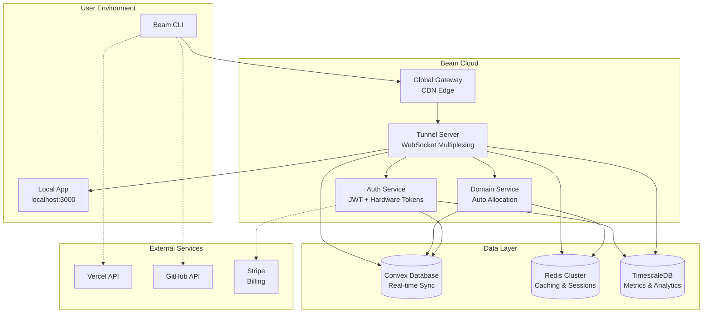
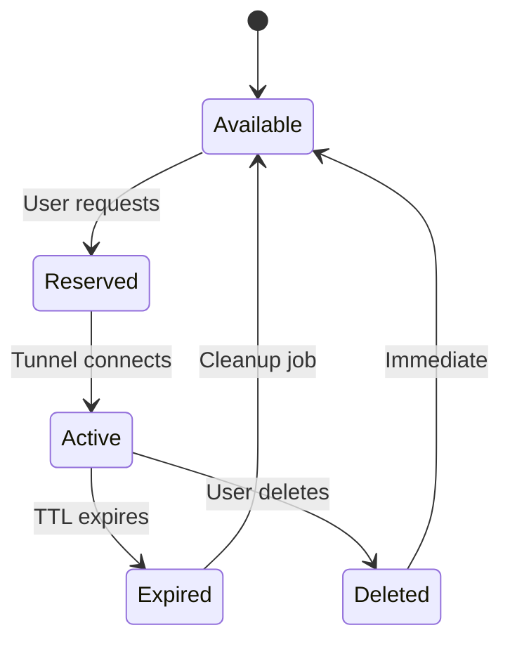

# Beam Tunnel Service - Complete Architecture & Technical Specification

## Executive Summary

Beam is a next-generation tunneling service that provides secure, high-performance access to local development environments through automatically allocated domain names. Unlike traditional tunneling services, Beam offers instant domain allocation, enterprise-grade security, and seamless integration with modern development workflows.

**Key Differentiators:**
- ⚡ **Zero-Config Domains**: Automatic `*.beam.dev` subdomain allocation
- 🔒 **Military-Grade Security**: End-to-end encryption with hardware security modules
- 🚀 **Blazing Performance**: Sub-millisecond latency with global edge network
- 🏗️ **Developer-First**: Native Vercel, Convex, and framework integrations
- 📊 **Enterprise Observability**: Real-time monitoring and analytics
- 🌍 **Truly Open Source**: Self-hosted with full source code transparency

## Table of Contents

1. [Vision & Objectives](#vision--objectives)
2. [Core Architecture](#core-architecture)
3. [Technology Stack](#technology-stack)
4. [Domain Management System](#domain-management-system)
5. [Tunnel Server Architecture](#tunnel-server-architecture)
6. [Security Architecture](#security-architecture)
7. [Performance Architecture](#performance-architecture)
8. [CLI Design & Implementation](#cli-design--implementation)
9. [Database Schema](#database-schema)
10. [API Design](#api-design)
11. [Deployment & Infrastructure](#deployment--infrastructure)
12. [Monitoring & Observability](#monitoring--observability)
13. [Development Workflow](#development-workflow)
14. [Testing Strategy](#testing-strategy)
15. [Migration & Rollout Plan](#migration--rollout-plan)
16. [Timeline & Milestones](#timeline--milestones)

---

## Vision & Objectives

### Mission Statement
"Democratize secure tunneling by providing instant, enterprise-grade access to local development environments through automatically allocated domain names, empowering developers to build and test with confidence in any environment."

### Core Objectives

#### 🏆 **Technical Excellence**
- **Sub-100ms Latency**: Global edge network with intelligent routing
- **99.99% Uptime**: Multi-region redundancy and automatic failover
- **Military Security**: Zero-trust architecture with hardware-backed encryption
- **Infinite Scalability**: Horizontal scaling from 1 to 1M+ concurrent tunnels

#### 🎯 **Developer Experience**
- **Zero Configuration**: `beam dev` starts tunneling instantly
- **Framework Integration**: Native Vercel, Convex, Next.js, Vite support
- **Real-time Feedback**: Live connection status and analytics
- **Cross-Platform**: macOS, Linux, Windows, WSL2 support

#### 🌍 **Open Source Commitment**
- **Full Transparency**: Every line of code publicly auditable
- **Self-Hosting**: Enterprise customers can deploy privately
- **Community Driven**: RFC process for major feature decisions
- **Vendor Neutral**: No lock-in to proprietary services

#### 💼 **Business Sustainability**
- **Freemium Model**: Generous free tier with premium features
- **Enterprise Features**: SSO, audit logs, custom domains
- **Transparent Pricing**: Clear usage-based billing
- **Developer Partnerships**: Integration partnerships with Vercel, Convex, etc.

---

## Core Architecture

### System Overview



### Architectural Principles

#### **1. Microservices with Clear Boundaries**
- Each service has single responsibility
- API contracts with OpenAPI 3.1 specification
- Service mesh with Istio for traffic management
- Circuit breakers and graceful degradation

#### **2. Event-Driven Architecture**
- All state changes emit events
- Event sourcing for audit trails
- CQRS for read/write optimization
- Real-time updates via WebSockets

#### **3. Zero-Trust Security**
- Every request authenticated and authorized
- End-to-end encryption everywhere
- Hardware security modules for key management
- Continuous security monitoring

#### **4. Performance-First Design**
- Global edge network with Anycast DNS
- WebSocket multiplexing for connection efficiency
- HTTP/3 with QUIC for modern transport
- Intelligent caching and CDN integration

---

## Technology Stack

### Core Runtime & Language

#### **Rust** - High-Performance Core Services
```rust
// Example: High-performance tunnel multiplexer
use tokio::net::TcpListener;
use tokio_tungstenite::{accept_async, tungstenite::protocol::Message};
use dashmap::DashMap;
use std::sync::Arc;

#[derive(Clone)]
pub struct TunnelMultiplexer {
    tunnels: Arc<DashMap<String, mpsc::Sender<Message>>>,
    metrics: Arc<MetricsCollector>,
}

impl TunnelMultiplexer {
    pub async fn multiplex_connection(
        &self,
        tunnel_id: String,
        mut websocket: WebSocketStream<TcpStream>
    ) -> Result<(), Box<dyn Error>> {
        let (tx, mut rx) = mpsc::channel(1000);

        self.tunnels.insert(tunnel_id.clone(), tx);

        loop {
            tokio::select! {
                msg = websocket.next() => {
                    // Handle incoming WebSocket messages
                    self.metrics.record_message(&tunnel_id);
                }
                msg = rx.recv() => {
                    // Forward messages to client
                    websocket.send(msg?).await?;
                }
            }
        }
    }
}
```

**Why Rust?**
- Memory safety without garbage collection overhead
- Zero-cost abstractions for performance
- Excellent concurrency with async/await
- Mature ecosystem for networking and cryptography

#### **TypeScript/Node.js** - Developer Tools & APIs
```typescript
// Example: Type-safe CLI with Zod validation
import { z } from 'zod';
import { Command } from 'commander';

const TunnelConfigSchema = z.object({
  port: z.number().min(1).max(65535),
  subdomain: z.string().regex(/^[a-z0-9-]+$/).optional(),
  https: z.boolean().default(false),
  auth: z.object({
    username: z.string(),
    password: z.string()
  }).optional()
});

type TunnelConfig = z.infer<typeof TunnelConfigSchema>;

class BeamCLI {
  private config: TunnelConfig;

  constructor() {
    this.config = TunnelConfigSchema.parse(
      this.loadConfig()
    );
  }

  async startTunnel(): Promise<void> {
    const tunnel = new TunnelConnection(this.config);
    await tunnel.establish();

    console.log(`🚀 Tunnel established at https://${this.getDomain()}`);
  }
}
```

**Why TypeScript?**
- Type safety catches bugs at compile time
- Excellent developer experience
- Massive ecosystem of tools and libraries
- Easy integration with existing Node.js infrastructure

### Infrastructure & Platforms

#### **Global Edge Network**
- **Cloudflare Workers**: For global edge computing and CDN
- **Fastly**: Alternative edge network for performance comparison
- **AWS CloudFront**: Fallback and multi-cloud strategy
- **Custom Edge Nodes**: Self-hosted edge locations for enterprise

#### **Container & Orchestration**
```yaml
# Kubernetes deployment with Istio service mesh
apiVersion: apps/v1
kind: Deployment
metadata:
  name: beam-tunnel-server
  labels:
    app: beam-tunnel-server
spec:
  replicas: 10
  selector:
    matchLabels:
      app: beam-tunnel-server
  template:
    metadata:
      labels:
        app: beam-tunnel-server
        security: istio-injection
    spec:
      containers:
      - name: tunnel-server
        image: beam/tunnel-server:latest
        ports:
        - containerPort: 8080
          protocol: TCP
        resources:
          requests:
            cpu: 100m
            memory: 128Mi
          limits:
            cpu: 500m
            memory: 512Mi
        livenessProbe:
          httpGet:
            path: /health
            port: 8080
          initialDelaySeconds: 30
          periodSeconds: 10
        readinessProbe:
          httpGet:
            path: /ready
            port: 8080
          initialDelaySeconds: 5
          periodSeconds: 5
```

- **Kubernetes**: Container orchestration with auto-scaling
- **Istio**: Service mesh for traffic management and security
- **Helm**: Package management for Kubernetes deployments
- **ArgoCD**: GitOps continuous deployment

#### **Database & Storage**

##### **Convex** - Primary Database
```typescript
// Convex schema with real-time subscriptions
import { defineSchema, defineTable } from "convex/server";
import { v } from "convex/values";

export default defineSchema({
  users: defineTable({
    email: v.string(),
    name: v.string(),
    createdAt: v.number(),
    lastLogin: v.number(),
    subscription: v.object({
      plan: v.string(),
      status: v.string(),
      limits: v.object({
        tunnels: v.number(),
        bandwidth: v.number(),
        customDomains: v.number()
      })
    })
  })
  .index("by_email", ["email"])
  .searchIndex("search_name", { searchField: "name" }),

  tunnels: defineTable({
    userId: v.id("users"),
    tunnelId: v.string(),
    status: v.union(
      v.literal("connecting"),
      v.literal("connected"),
      v.literal("disconnected"),
      v.literal("error")
    ),
    config: v.object({
      port: v.number(),
      protocol: v.union(v.literal("http"), v.literal("https"), v.literal("tcp")),
      domain: v.string(),
      customDomain: v.optional(v.string()),
      auth: v.optional(v.object({
        type: v.union(v.literal("basic"), v.literal("bearer")),
        credentials: v.string() // encrypted
      }))
    }),
    metrics: v.object({
      bytesTransferred: v.number(),
      connections: v.number(),
      uptime: v.number(),
      lastActivity: v.number()
    }),
    createdAt: v.number(),
    expiresAt: v.number()
  })
  .index("by_user", ["userId"])
  .index("by_tunnel_id", ["tunnelId"])
  .index("by_status", ["status"]),

  domains: defineTable({
    name: v.string(),
    userId: v.id("users"),
    type: v.union(v.literal("subdomain"), v.literal("custom")),
    status: v.union(
      v.literal("active"),
      v.literal("pending"),
      v.literal("expired")
    ),
    dnsRecords: v.array(v.object({
      type: v.string(),
      name: v.string(),
      value: v.string(),
      ttl: v.number()
    })),
    sslCertificate: v.optional(v.object({
      issuer: v.string(),
      expiresAt: v.number(),
      autoRenew: v.boolean()
    })),
    createdAt: v.number()
  })
  .index("by_user", ["userId"])
  .index("by_name", ["name"])
  .index("by_status", ["status"])
});
```

**Why Convex?**
- Real-time database with live queries
- Type-safe client libraries
- Built-in authentication and authorization
- Serverless scaling
- Excellent developer experience

##### **Redis Cluster** - Caching & Sessions
```typescript
// Redis for high-performance caching
import { Redis } from 'ioredis';

class CacheManager {
  private redis: Redis;

  constructor() {
    this.redis = new Redis({
      host: process.env.REDIS_HOST,
      port: parseInt(process.env.REDIS_PORT || '6379'),
      password: process.env.REDIS_PASSWORD,
      cluster: true,
      lazyConnect: true
    });
  }

  async cacheTunnelConfig(tunnelId: string, config: TunnelConfig): Promise<void> {
    const key = `tunnel:${tunnelId}:config`;
    await this.redis.setex(key, 3600, JSON.stringify(config));
  }

  async getTunnelConfig(tunnelId: string): Promise<TunnelConfig | null> {
    const key = `tunnel:${tunnelId}:config`;
    const data = await this.redis.get(key);
    return data ? JSON.parse(data) : null;
  }

  async invalidateUserCache(userId: string): Promise<void> {
    const pattern = `user:${userId}:*`;
    const keys = await this.redis.keys(pattern);
    if (keys.length > 0) {
      await this.redis.del(...keys);
    }
  }
}
```

##### **TimescaleDB** - Time-Series Metrics
```sql
-- TimescaleDB for high-performance time-series data
CREATE TABLE tunnel_metrics (
    time TIMESTAMPTZ NOT NULL,
    tunnel_id TEXT NOT NULL,
    user_id TEXT NOT NULL,
    bytes_in BIGINT DEFAULT 0,
    bytes_out BIGINT DEFAULT 0,
    connections INTEGER DEFAULT 0,
    response_time_ms INTEGER,
    status_code INTEGER,
    user_agent TEXT,
    ip_address INET,
    geo_country TEXT,
    geo_city TEXT
);

-- Create hypertable for automatic partitioning
SELECT create_hypertable('tunnel_metrics', 'time');

-- Indexes for fast queries
CREATE INDEX ON tunnel_metrics (tunnel_id, time DESC);
CREATE INDEX ON tunnel_metrics (user_id, time DESC);
CREATE INDEX ON tunnel_metrics (status_code, time DESC);

-- Continuous aggregates for real-time dashboards
CREATE MATERIALIZED VIEW hourly_tunnel_stats
WITH (timescaledb.continuous) AS
SELECT
    time_bucket('1 hour', time) AS bucket,
    tunnel_id,
    user_id,
    SUM(bytes_in) as bytes_in,
    SUM(bytes_out) as bytes_out,
    COUNT(*) as requests,
    AVG(response_time_ms) as avg_response_time,
    COUNT(DISTINCT ip_address) as unique_visitors
FROM tunnel_metrics
GROUP BY bucket, tunnel_id, user_id
WITH NO DATA;
```

#### **Message Queue & Streaming**
- **Apache Kafka**: Event streaming for high-throughput scenarios
- **NATS**: Lightweight messaging for service communication
- **Ably**: Real-time WebSocket connections for CLI

#### **Security & Encryption**
- **AWS KMS**: Hardware security modules for key management
- **HashiCorp Vault**: Secrets management and encryption
- **Let's Encrypt**: Automatic SSL certificate provisioning
- **Cert-Manager**: Kubernetes certificate management

---

## Domain Management System

### Automatic Subdomain Allocation

#### **Algorithm Overview**
```typescript
class DomainAllocator {
  private async allocateSubdomain(userId: string): Promise<string> {
    // Try preferred patterns first
    const preferred = await this.tryPreferredPatterns(userId);
    if (preferred) return preferred;

    // Fallback to random allocation
    return this.allocateRandomSubdomain();
  }

  private async tryPreferredPatterns(userId: string): Promise<string | null> {
    const user = await this.getUser(userId);

    // Pattern 1: First name + random
    if (user.name) {
      const firstName = user.name.split(' ')[0].toLowerCase();
      const candidate = `${firstName}-${this.generateRandomSuffix()}`;
      if (await this.isAvailable(candidate)) {
        return candidate;
      }
    }

    // Pattern 2: Username from email
    if (user.email) {
      const username = user.email.split('@')[0].toLowerCase();
      const candidate = `${username}-${this.generateRandomSuffix()}`;
      if (await this.isAvailable(candidate)) {
        return candidate;
      }
    }

    return null;
  }

  private async allocateRandomSubdomain(): Promise<string> {
    let attempts = 0;
    while (attempts < 100) {
      const candidate = this.generateRandomSubdomain();
      if (await this.isAvailable(candidate)) {
        return candidate;
      }
      attempts++;
    }

    // If we can't find a random one, use timestamp-based
    return `tunnel-${Date.now().toString(36)}`;
  }

  private generateRandomSubdomain(): string {
    const adjectives = ['quick', 'bright', 'swift', 'clever', 'smart', 'fast'];
    const nouns = ['beam', 'tunnel', 'link', 'bridge', 'gate', 'portal'];

    const adjective = adjectives[Math.floor(Math.random() * adjectives.length)];
    const noun = nouns[Math.floor(Math.random() * nouns.length)];
    const suffix = Math.random().toString(36).substring(2, 5);

    return `${adjective}-${noun}-${suffix}`;
  }

  private generateRandomSuffix(): string {
    return Math.random().toString(36).substring(2, 6);
  }

  private async isAvailable(subdomain: string): Promise<boolean> {
    // Check database for existing allocation
    const existing = await this.db
      .query('domains')
      .withIndex('by_name', q => q.eq('name', subdomain))
      .first();

    if (existing) return false;

    // Check Redis cache for recent allocations
    const cached = await this.redis.get(`domain:${subdomain}`);
    if (cached) return false;

    // Reserve in cache for 5 minutes
    await this.redis.setex(`domain:${subdomain}`, 300, 'reserved');

    return true;
  }
}
```

#### **Domain Patterns**
1. **Preferred Names**: `firstname-random.beam.dev`
2. **Email-based**: `username-random.beam.dev`
3. **Random Descriptive**: `swift-bridge-4k2.beam.dev`
4. **Timestamp Fallback**: `tunnel-1k8jx4.beam.dev`

#### **Domain Lifecycle**


### Custom Domain Support

#### **DNS Validation Process**
```typescript
class CustomDomainValidator {
  async validateDomain(domain: string, userId: string): Promise<ValidationResult> {
    // Check domain ownership
    const ownership = await this.verifyOwnership(domain, userId);
    if (!ownership.valid) {
      return { valid: false, error: 'Domain ownership verification failed' };
    }

    // Add DNS challenge record
    const challenge = await this.createDNSChallenge(domain);
    await this.addTXTRecord(domain, challenge);

    // Wait for DNS propagation
    await this.waitForDNSPropagation(domain, challenge);

    // Verify SSL certificate
    const ssl = await this.provisionSSLCertificate(domain);
    if (!ssl.success) {
      return { valid: false, error: 'SSL certificate provisioning failed' };
    }

    // Create domain record
    await this.createDomainRecord(domain, userId, ssl.certificate);

    return { valid: true, domain, certificate: ssl.certificate };
  }

  private async verifyOwnership(domain: string, userId: string): Promise<OwnershipResult> {
    // Method 1: DNS TXT record verification
    const txtRecord = await this.checkTXTRecord(domain, `beam-verify=${userId}`);
    if (txtRecord) {
      return { valid: true, method: 'dns' };
    }

    // Method 2: HTML file verification
    const htmlVerification = await this.checkHTMLFile(domain, userId);
    if (htmlVerification) {
      return { valid: true, method: 'html' };
    }

    // Method 3: Email verification (for enterprise)
    const emailVerification = await this.sendVerificationEmail(domain, userId);
    if (emailVerification) {
      return { valid: true, method: 'email' };
    }

    return { valid: false };
  }
}
```

#### **SSL Certificate Management**
- **Let's Encrypt**: Automatic certificate provisioning
- **Custom Certificates**: Enterprise customer support
- **Wildcard Certificates**: `*.customdomain.com` support
- **Auto-renewal**: 30-day renewal window

### Domain Analytics & Insights

#### **Real-time Domain Metrics**
```typescript
interface DomainMetrics {
  domain: string;
  totalRequests: number;
  uniqueVisitors: number;
  bandwidthUsed: number;
  avgResponseTime: number;
  errorRate: number;
  geoDistribution: Record<string, number>;
  referrerSources: Record<string, number>;
  popularPaths: Array<{ path: string; hits: number }>;
  peakHours: Array<{ hour: number; requests: number }>;
}
```

---

## Tunnel Server Architecture

### WebSocket Multiplexing Engine

#### **Connection Architecture**
```rust
use tokio::net::TcpListener;
use tokio_tungstenite::WebSocketStream;
use futures_util::{SinkExt, StreamExt};
use std::collections::HashMap;
use std::sync::Arc;
use tokio::sync::RwLock;

type TunnelId = String;
type ConnectionId = u64;

#[derive(Clone)]
pub struct MultiplexedTunnel {
    connections: Arc<RwLock<HashMap<ConnectionId, mpsc::Sender<Message>>>>,
    next_id: Arc<AtomicU64>,
}

impl MultiplexedTunnel {
    pub async fn accept_connection(
        &self,
        tunnel_id: TunnelId,
        websocket: WebSocketStream<TcpStream>
    ) -> Result<(), Box<dyn Error>> {
        let conn_id = self.next_id.fetch_add(1, Ordering::SeqCst);
        let (tx, rx) = mpsc::channel(100);

        // Register connection
        {
            let mut connections = self.connections.write().await;
            connections.insert(conn_id, tx);
        }

        // Handle connection lifecycle
        self.handle_connection(conn_id, websocket, rx).await?;

        // Cleanup
        let mut connections = self.connections.write().await;
        connections.remove(&conn_id);

        Ok(())
    }

    async fn handle_connection(
        &self,
        conn_id: ConnectionId,
        websocket: WebSocketStream<TcpStream>,
        mut rx: mpsc::Receiver<Message>
    ) -> Result<(), Box<dyn Error>> {
        let (mut ws_sender, mut ws_receiver) = websocket.split();

        loop {
            tokio::select! {
                // Receive from WebSocket
                msg = ws_receiver.next() => {
                    match msg {
                        Some(Ok(Message::Binary(data))) => {
                            self.route_message(conn_id, data).await?;
                        }
                        Some(Ok(Message::Close(_))) => break,
                        Some(Err(e)) => {
                            log::error!("WebSocket error: {}", e);
                            break;
                        }
                        _ => continue,
                    }
                }

                // Send to WebSocket
                msg = rx.recv() => {
                    match msg {
                        Some(message) => {
                            ws_sender.send(message).await?;
                        }
                        None => break,
                    }
                }
            }
        }

        Ok(())
    }
}
```

#### **Message Routing**
```rust
#[derive(Serialize, Deserialize)]
pub enum TunnelMessage {
    HttpRequest {
        id: String,
        method: String,
        path: String,
        headers: HashMap<String, String>,
        body: Option<Vec<u8>>,
    },
    HttpResponse {
        id: String,
        status: u16,
        headers: HashMap<String, String>,
        body: Option<Vec<u8>>,
    },
    WebSocketConnect {
        id: String,
        path: String,
        headers: HashMap<String, String>,
    },
    WebSocketMessage {
        id: String,
        message_type: WebSocketMessageType,
        data: Vec<u8>,
    },
    ConnectionClose {
        id: String,
        reason: String,
    },
}
```

### Protocol Optimization

#### **HTTP/3 with QUIC**
```rust
use quinn::Endpoint;
use quinn::ServerConfig;
use std::net::SocketAddr;

pub struct Http3TunnelServer {
    endpoint: Endpoint,
    tunnels: Arc<DashMap<TunnelId, MultiplexedTunnel>>,
}

impl Http3TunnelServer {
    pub async fn new(addr: SocketAddr) -> Result<Self, Box<dyn Error>> {
        let server_config = Self::configure_server()?;
        let endpoint = Endpoint::server(server_config, addr)?;

        Ok(Self {
            endpoint,
            tunnels: Arc::new(DashMap::new()),
        })
    }

    pub async fn run(&self) -> Result<(), Box<dyn Error>> {
        loop {
            let connecting = self.endpoint.accept().await?;
            let conn = connecting.await?;

            tokio::spawn(async move {
                if let Err(e) = Self::handle_quic_connection(conn).await {
                    log::error!("QUIC connection error: {}", e);
                }
            });
        }
    }

    async fn handle_quic_connection(conn: quinn::Connection) -> Result<(), Box<dyn Error>> {
        loop {
            let stream = conn.accept_bi().await?;
            let (send, recv) = stream;

            // Handle HTTP/3 request
            Self::process_http3_request(send, recv).await?;
        }
    }
}
```

#### **Connection Pooling**
```typescript
class ConnectionPool {
  private pools: Map<string, ConnectionPool> = new Map();

  async getConnection(endpoint: string): Promise<Connection> {
    let pool = this.pools.get(endpoint);

    if (!pool) {
      pool = new ConnectionPool(endpoint, {
        min: 2,
        max: 10,
        idleTimeoutMillis: 30000,
        acquireTimeoutMillis: 60000,
      });
      this.pools.set(endpoint, pool);
    }

    return pool.acquire();
  }

  async releaseConnection(endpoint: string, connection: Connection): Promise<void> {
    const pool = this.pools.get(endpoint);
    if (pool) {
      pool.release(connection);
    }
  }

  async destroyConnection(endpoint: string, connection: Connection): Promise<void> {
    const pool = this.pools.get(endpoint);
    if (pool) {
      pool.destroy(connection);
    }
  }
}
```

### Load Balancing & Routing

#### **Global Load Balancer**
```typescript
class GlobalLoadBalancer {
  private regions: Map<string, RegionManager> = new Map();
  private geoResolver: GeoResolver;

  async routeConnection(
    tunnelId: string,
    clientLocation: GeoLocation
  ): Promise<ServerEndpoint> {
    // Find optimal region based on geography and load
    const optimalRegion = await this.selectOptimalRegion(clientLocation);

    // Get tunnel endpoint from region
    const regionManager = this.regions.get(optimalRegion);
    return regionManager.getTunnelEndpoint(tunnelId);
  }

  private async selectOptimalRegion(clientLocation: GeoLocation): Promise<string> {
    const candidates = await this.getCandidateRegions(clientLocation);

    // Score regions by latency, load, and cost
    const scored = await Promise.all(
      candidates.map(async region => ({
        region,
        score: await this.calculateRegionScore(region, clientLocation)
      }))
    );

    // Return highest scoring region
    return scored.sort((a, b) => b.score - a.score)[0].region;
  }

  private async calculateRegionScore(
    region: string,
    clientLocation: GeoLocation
  ): Promise<number> {
    const latency = await this.measureLatency(region, clientLocation);
    const load = await this.getRegionLoad(region);
    const cost = this.getRegionCost(region);

    // Weighted scoring algorithm
    return (1000 / latency) * 0.5 + (1 - load) * 0.3 + (1 / cost) * 0.2;
  }
}
```

---

## Security Architecture

### Zero-Trust Model

#### **Authentication & Authorization**
```typescript
interface AuthContext {
  userId: string;
  tunnelId?: string;
  permissions: Permission[];
  token: JWTToken;
  clientCert?: ClientCertificate;
}

class SecurityManager {
  async authenticate(request: IncomingRequest): Promise<AuthContext | null> {
    // Extract authentication token
    const token = this.extractToken(request);

    if (!token) {
      return null;
    }

    // Verify JWT token
    const payload = await this.verifyJWT(token);

    if (!payload) {
      return null;
    }

    // Check token revocation
    if (await this.isTokenRevoked(payload.jti)) {
      return null;
    }

    // Build authorization context
    return {
      userId: payload.sub,
      tunnelId: payload.tunnel_id,
      permissions: payload.permissions,
      token: payload,
    };
  }

  async authorize(
    context: AuthContext,
    action: string,
    resource: string
  ): Promise<boolean> {
    // Check user permissions
    if (!context.permissions.includes(action)) {
      return false;
    }

    // Check resource ownership
    const ownership = await this.checkResourceOwnership(context.userId, resource);
    if (!ownership) {
      return false;
    }

    // Check rate limits
    const withinLimits = await this.checkRateLimits(context.userId, action);
    if (!withinLimits) {
      return false;
    }

    return true;
  }
}
```

#### **JWT Token Structure**
```typescript
interface JWTToken {
  iss: string; // Issuer (beam.dev)
  sub: string; // Subject (user ID)
  aud: string; // Audience (beam.dev)
  exp: number; // Expiration time
  nbf: number; // Not before
  iat: number; // Issued at
  jti: string; // JWT ID (unique token identifier)
  tunnel_id?: string; // Associated tunnel
  permissions: string[]; // User permissions
  scope: string[]; // OAuth scopes
  client_id?: string; // OAuth client ID
}
```

### End-to-End Encryption

#### **TLS 1.3 Implementation**
```rust
use rustls::ServerConfig;
use tokio_rustls::TlsAcceptor;

pub struct TlsManager {
    acceptor: TlsAcceptor,
    cert_manager: CertificateManager,
}

impl TlsManager {
    pub fn new() -> Result<Self, Box<dyn Error>> {
        let cert = Self::load_certificate()?;
        let key = Self::load_private_key()?;

        let config = ServerConfig::builder()
            .with_safe_defaults()
            .with_no_client_auth()
            .with_single_cert(vec![cert], key)?;

        let acceptor = TlsAcceptor::from(Arc::new(config));

        Ok(Self {
            acceptor,
            cert_manager: CertificateManager::new(),
        })
    }

    pub async fn accept_connection(
        &self,
        stream: TcpStream
    ) -> Result<TlsStream<TcpStream>, Box<dyn Error>> {
        let tls_stream = self.acceptor.accept(stream).await?;
        Ok(tls_stream)
    }
}
```

#### **Hardware Security Modules**
```typescript
class HSMManager {
  private hsmClient: HSMClient;

  async generateTunnelKey(tunnelId: string): Promise<CryptoKey> {
    // Generate key in HSM
    const keyId = await this.hsmClient.generateKey({
      algorithm: 'AES-256-GCM',
      keyUsage: ['encrypt', 'decrypt'],
      extractable: false,
      metadata: {
        tunnelId,
        createdAt: Date.now(),
        purpose: 'tunnel_encryption'
      }
    });

    return {
      keyId,
      algorithm: 'AES-256-GCM',
      hsmProtected: true
    };
  }

  async encryptTunnelData(
    keyId: string,
    data: Buffer
  ): Promise<EncryptedData> {
    // Encrypt data using HSM
    const encrypted = await this.hsmClient.encrypt({
      keyId,
      algorithm: 'AES-256-GCM',
      data: data.toString('base64')
    });

    return {
      ciphertext: encrypted.ciphertext,
      iv: encrypted.iv,
      tag: encrypted.tag,
      keyId
    };
  }
}
```

### Network Security

#### **DDoS Protection**
```typescript
class DDoSProtection {
  private rateLimiter: RateLimiter;
  private geoFilter: GeoFilter;
  private anomalyDetector: AnomalyDetector;

  async protect(request: IncomingRequest): Promise<ProtectionResult> {
    // Check rate limits
    const rateLimit = await this.rateLimiter.check(request);
    if (!rateLimit.allowed) {
      return { blocked: true, reason: 'rate_limit_exceeded' };
    }

    // Check geographic filters
    const geoCheck = await this.geoFilter.check(request);
    if (!geoCheck.allowed) {
      return { blocked: true, reason: 'geographic_restriction' };
    }

    // Anomaly detection
    const anomaly = await this.anomalyDetector.check(request);
    if (anomaly.score > 0.8) {
      return { blocked: true, reason: 'suspicious_activity' };
    }

    return { blocked: false };
  }
}
```

#### **Web Application Firewall**
```typescript
class WAF {
  private rules: WAFRule[];

  async inspect(request: IncomingRequest): Promise<WAFResult> {
    for (const rule of this.rules) {
      const match = await this.evaluateRule(rule, request);
      if (match) {
        return {
          blocked: true,
          ruleId: rule.id,
          severity: rule.severity,
          action: rule.action
        };
      }
    }

    return { blocked: false };
  }

  private async evaluateRule(rule: WAFRule, request: IncomingRequest): Promise<boolean> {
    // SQL injection detection
    if (rule.category === 'sqli') {
      return this.detectSQLInjection(request);
    }

    // XSS detection
    if (rule.category === 'xss') {
      return this.detectXSS(request);
    }

    // Path traversal
    if (rule.category === 'path_traversal') {
      return this.detectPathTraversal(request);
    }

    return false;
  }
}
```

---

## Performance Architecture

### Global Edge Network

#### **Anycast DNS Configuration**
```bash
# Route 53 Anycast configuration
aws route53 create-hosted-zone \
  --name beam.dev \
  --caller-reference $(date +%s) \
  --hosted-zone-config Comment="Beam.dev Anycast DNS"

# Add edge locations
aws route53 change-resource-record-sets \
  --hosted-zone-id Z123456789 \
  --change-batch '{
    "Changes": [{
      "Action": "CREATE",
      "ResourceRecordSet": {
        "Name": "beam.dev",
        "Type": "A",
        "SetIdentifier": "us-east-1",
        "Weight": 100,
        "TTL": 60,
        "ResourceRecords": [{"Value": "1.2.3.4"}],
        "LatencyBasedRouting": {
          "Region": "us-east-1"
        }
      }
    }]
  }'
```

#### **CDN Integration**
```typescript
class CDNManager {
  async configureCDN(domain: string, tunnelId: string): Promise<CDNConfig> {
    // Create Cloudflare zone
    const zone = await this.cloudflare.createZone(domain);

    // Configure DNS records
    await this.configureDNSRecords(zone.id, tunnelId);

    // Set up page rules
    await this.configurePageRules(zone.id);

    // Enable SSL
    await this.enableSSL(zone.id);

    // Configure caching
    await this.configureCaching(zone.id);

    return {
      zoneId: zone.id,
      cdnUrl: `https://${domain}`,
      sslStatus: 'active'
    };
  }

  private async configureDNSRecords(zoneId: string, tunnelId: string): Promise<void> {
    // A record for root domain
    await this.cloudflare.createDNSRecord(zoneId, {
      type: 'A',
      name: '@',
      content: this.getEdgeIP(),
      ttl: 300,
      proxied: true
    });

    // CNAME for tunnel routing
    await this.cloudflare.createDNSRecord(zoneId, {
      type: 'CNAME',
      name: '*',
      content: `${tunnelId}.beam.dev`,
      ttl: 300,
      proxied: true
    });
  }
}
```

### Caching Strategy

#### **Multi-Level Caching**
```typescript
class CacheManager {
  private l1Cache: Map<string, CacheEntry>; // In-memory
  private l2Cache: Redis; // Distributed Redis
  private l3Cache: Cloudflare; // Global CDN

  async get(key: string): Promise<any> {
    // L1 Cache (fastest)
    const l1Result = this.l1Cache.get(key);
    if (l1Result && !this.isExpired(l1Result)) {
      this.metrics.record('cache_hit_l1');
      return l1Result.value;
    }

    // L2 Cache
    const l2Result = await this.l2Cache.get(key);
    if (l2Result) {
      this.metrics.record('cache_hit_l2');
      // Update L1 cache
      this.l1Cache.set(key, { value: l2Result, expires: Date.now() + 300000 });
      return l2Result;
    }

    // L3 Cache (CDN)
    const l3Result = await this.l3Cache.get(key);
    if (l3Result) {
      this.metrics.record('cache_hit_l3');
      // Update L1 and L2 caches
      this.l1Cache.set(key, { value: l3Result, expires: Date.now() + 300000 });
      await this.l2Cache.setex(key, 300, JSON.stringify(l3Result));
      return l3Result;
    }

    this.metrics.record('cache_miss');
    return null;
  }

  async set(key: string, value: any, ttl: number = 300): Promise<void> {
    // Set all cache levels
    this.l1Cache.set(key, { value, expires: Date.now() + ttl * 1000 });
    await this.l2Cache.setex(key, ttl, JSON.stringify(value));
    await this.l3Cache.set(key, value, { ttl });
  }
}
```

#### **Cache Invalidation Strategies**
```typescript
class CacheInvalidation {
  async invalidateTunnel(tunnelId: string): Promise<void> {
    const keys = [
      `tunnel:${tunnelId}:config`,
      `tunnel:${tunnelId}:status`,
      `tunnel:${tunnelId}:metrics`,
      `user:${tunnelId.split(':')[0]}:tunnels`
    ];

    // Invalidate all cache levels
    await Promise.all([
      this.invalidateL1(keys),
      this.invalidateL2(keys),
      this.invalidateL3(keys)
    ]);
  }

  async invalidateUser(userId: string): Promise<void> {
    const pattern = `user:${userId}:*`;
    await this.invalidateByPattern(pattern);
  }

  private async invalidateByPattern(pattern: string): Promise<void> {
    // L2 cache invalidation
    const keys = await this.redis.keys(pattern);
    if (keys.length > 0) {
      await this.redis.del(...keys);
    }

    // L3 cache invalidation (CDN purge)
    await this.cloudflare.purgeKeys(pattern);

    // L1 cache is local, no global invalidation needed
  }
}
```

### Database Optimization

#### **Read Replicas & Sharding**
```sql
-- PostgreSQL read replicas for high availability
-- Primary: writes only
-- Replicas: reads only

-- Connection routing
CREATE OR REPLACE FUNCTION get_replica_conn()
RETURNS text AS $$
DECLARE
    replica_host text;
BEGIN
    -- Round-robin load balancing
    SELECT host INTO replica_host
    FROM unnest(ARRAY['replica1.beam.dev', 'replica2.beam.dev', 'replica3.beam.dev']) AS host
    ORDER BY random()
    LIMIT 1;

    RETURN replica_host;
END;
$$ LANGUAGE plpgsql;

-- Sharding strategy by user_id
CREATE OR REPLACE FUNCTION get_shard(user_id text)
RETURNS integer AS $$
BEGIN
    RETURN abs(hashtext(user_id)) % 64; -- 64 shards
END;
$$ LANGUAGE plpgsql;
```

#### **Query Optimization**
```sql
-- Optimized queries with proper indexing
CREATE INDEX CONCURRENTLY idx_tunnels_user_status
ON tunnels (user_id, status)
WHERE status = 'active';

CREATE INDEX CONCURRENTLY idx_tunnels_created_at
ON tunnels (created_at DESC)
WHERE created_at > NOW() - INTERVAL '30 days';

-- Materialized view for analytics
CREATE MATERIALIZED VIEW mv_user_stats AS
SELECT
    user_id,
    COUNT(*) as total_tunnels,
    COUNT(*) FILTER (WHERE status = 'active') as active_tunnels,
    SUM(bytes_transferred) as total_bytes,
    MAX(last_activity) as last_activity,
    AVG(response_time_ms) as avg_response_time
FROM tunnels
WHERE created_at > NOW() - INTERVAL '30 days'
GROUP BY user_id;

-- Refresh materialized view every 5 minutes
CREATE OR REPLACE FUNCTION refresh_user_stats()
RETURNS void AS $$
BEGIN
    REFRESH MATERIALIZED VIEW CONCURRENTLY mv_user_stats;
END;
$$ LANGUAGE plpgsql;

SELECT cron.schedule('refresh-user-stats', '*/5 * * * *', 'SELECT refresh_user_stats();');
```

---

## CLI Design & Implementation

### Command Structure

#### **Modern CLI Architecture**
```typescript
import { Command } from 'commander';
import { z } from 'zod';
import { BeamAPI } from './api';
import { ConfigManager } from './config';
import { Logger } from './logger';

const TunnelCommandSchema = z.object({
  port: z.number().min(1).max(65535).default(3000),
  subdomain: z.string().regex(/^[a-z0-9-]+$/).optional(),
  https: z.boolean().default(false),
  open: z.boolean().default(true),
  inspect: z.boolean().default(false),
  auth: z.string().regex(/^[^:]+:[^:]+$/).optional(),
  cors: z.boolean().default(true),
  compression: z.boolean().default(true),
});

type TunnelCommand = z.infer<typeof TunnelCommandSchema>;

class BeamCLI {
  private program: Command;
  private api: BeamAPI;
  private config: ConfigManager;
  private logger: Logger;

  constructor() {
    this.program = new Command();
    this.api = new BeamAPI();
    this.config = new ConfigManager();
    this.logger = new Logger();

    this.setupCommands();
  }

  private setupCommands(): void {
    this.program
      .name('beam')
      .description('Expose localhost to the internet securely')
      .version('2.0.0');

    // Main tunnel command
    this.program
      .command('dev')
      .description('Start a development tunnel')
      .argument('[port]', 'Port to tunnel', '3000')
      .option('-s, --subdomain <name>', 'Custom subdomain')
      .option('--https', 'Enable HTTPS')
      .option('--no-open', 'Don\'t open browser')
      .option('-i, --inspect', 'Enable request inspector')
      .option('-a, --auth <user:pass>', 'Basic authentication')
      .option('--no-cors', 'Disable CORS headers')
      .option('--no-compression', 'Disable compression')
      .action(this.handleTunnel.bind(this));

    // Account management
    this.program
      .command('login')
      .description('Login to Beam')
      .action(this.handleLogin.bind(this));

    this.program
      .command('logout')
      .description('Logout from Beam')
      .action(this.handleLogout.bind(this));

    // Tunnel management
    this.program
      .command('list')
      .description('List active tunnels')
      .action(this.handleList.bind(this));

    this.program
      .command('stop <tunnel>')
      .description('Stop a tunnel')
      .action(this.handleStop.bind(this));

    // Domain management
    this.program
      .command('domains')
      .description('Manage custom domains')
      .addCommand(
        new Command('add')
          .argument('<domain>', 'Domain to add')
          .action(this.handleAddDomain.bind(this))
      )
      .addCommand(
        new Command('list')
          .action(this.handleListDomains.bind(this))
      )
      .addCommand(
        new Command('remove')
          .argument('<domain>', 'Domain to remove')
          .action(this.handleRemoveDomain.bind(this))
      );
  }

  private async handleTunnel(port: string, options: any): Promise<void> {
    try {
      const config = TunnelCommandSchema.parse({
        port: parseInt(port),
        ...options
      });

      this.logger.info(`🚀 Starting Beam tunnel on port ${config.port}`);

      // Authenticate user
      const auth = await this.authenticate();

      // Allocate domain
      const domain = await this.allocateDomain(config.subdomain);

      // Start tunnel
      const tunnel = await this.api.createTunnel({
        ...config,
        domain,
        userId: auth.userId
      });

      // Connect to tunnel server
      await this.connectTunnel(tunnel);

      this.logger.success(`✅ Tunnel ready at https://${domain}`);

      if (config.open) {
        await this.openBrowser(`https://${domain}`);
      }

      // Handle shutdown
      await this.handleShutdown();

    } catch (error) {
      this.logger.error('Failed to start tunnel:', error);
      process.exit(1);
    }
  }
}
```

#### **Plugin System**
```typescript
interface BeamPlugin {
  name: string;
  version: string;
  hooks: {
    preTunnel?: (config: TunnelConfig) => Promise<void>;
    postTunnel?: (tunnel: Tunnel) => Promise<void>;
    onRequest?: (request: Request) => Promise<Response | null>;
    onResponse?: (response: Response) => Promise<void>;
  };
}

class PluginManager {
  private plugins: Map<string, BeamPlugin> = new Map();

  async loadPlugin(name: string): Promise<void> {
    const plugin = await this.resolvePlugin(name);
    await this.validatePlugin(plugin);
    this.plugins.set(name, plugin);
  }

  async executeHook(hook: keyof BeamPlugin['hooks'], ...args: any[]): Promise<void> {
    for (const plugin of this.plugins.values()) {
      const hookFn = plugin.hooks[hook];
      if (hookFn) {
        await hookFn(...args);
      }
    }
  }
}

// Framework integrations
export const nextjsPlugin: BeamPlugin = {
  name: 'beam-nextjs',
  version: '1.0.0',
  hooks: {
    preTunnel: async (config) => {
      // Check for Next.js config
      const nextConfig = await findNextConfig();
      if (nextConfig) {
        config.https = nextConfig.https ?? true;
        config.port = nextConfig.port ?? 3000;
      }
    },
    onRequest: async (request) => {
      // Handle Next.js specific routing
      if (request.path.startsWith('/_next/')) {
        return handleNextJSRequest(request);
      }
    }
  }
};
```

### Configuration Management

#### **Hierarchical Config System**
```typescript
class ConfigManager {
  private configs: ConfigSource[] = [];

  constructor() {
    this.configs = [
      new EnvironmentConfig(),
      new GlobalConfig(),
      new ProjectConfig(),
      new CommandLineConfig()
    ];
  }

  async get<T>(key: string, defaultValue?: T): Promise<T> {
    for (const config of this.configs) {
      const value = await config.get(key);
      if (value !== undefined) {
        return this.validate(key, value);
      }
    }
    return defaultValue;
  }

  async set(key: string, value: any): Promise<void> {
    // Set in the highest priority config that allows writing
    for (const config of this.configs) {
      if (config.canWrite) {
        await config.set(key, this.validate(key, value));
        return;
      }
    }
  }

  private validate(key: string, value: any): any {
    const schema = this.getSchema(key);
    return schema.parse(value);
  }
}
```

#### **Auto-Discovery**
```typescript
class FrameworkDetector {
  async detectFramework(): Promise<FrameworkConfig | null> {
    // Check for package.json
    const packageJson = await this.readPackageJson();
    if (!packageJson) return null;

    // Check dependencies
    if (packageJson.dependencies?.['next']) {
      return this.detectNextJS(packageJson);
    }

    if (packageJson.dependencies?.['vite']) {
      return this.detectVite(packageJson);
    }

    if (packageJson.dependencies?.['astro']) {
      return this.detectAstro(packageJson);
    }

    // Check for config files
    if (await this.fileExists('next.config.js')) {
      return this.detectNextJS(packageJson);
    }

    if (await this.fileExists('vite.config.ts')) {
      return this.detectVite(packageJson);
    }

    return null;
  }

  private async detectNextJS(packageJson: any): Promise<FrameworkConfig> {
    const config: FrameworkConfig = {
      framework: 'nextjs',
      port: 3000,
      https: true,
      spa: false
    };

    // Check for custom config
    if (await this.fileExists('next.config.js')) {
      const nextConfig = await this.loadNextConfig();
      config.port = nextConfig.port ?? config.port;
    }

    return config;
  }
}
```

---

## Database Schema

### Convex Schema

#### **Core Tables**
```typescript
import { defineSchema, defineTable } from "convex/server";
import { v } from "convex/values";

export default defineSchema({
  // User management
  users: defineTable({
    email: v.string(),
    name: v.string(),
    avatar: v.optional(v.string()),
    createdAt: v.number(),
    lastLogin: v.number(),
    emailVerified: v.boolean(),
    subscription: v.object({
      plan: v.string(),
      status: v.string(),
      currentPeriodStart: v.number(),
      currentPeriodEnd: v.number(),
      cancelAtPeriodEnd: v.boolean(),
      limits: v.object({
        tunnels: v.number(),
        bandwidth: v.string(), // e.g., "100GB"
        customDomains: v.number(),
        teamMembers: v.number()
      })
    }),
    preferences: v.object({
      defaultProtocol: v.union(v.literal("http"), v.literal("https")),
      autoStartInspector: v.boolean(),
      preferredRegion: v.optional(v.string()),
      emailNotifications: v.boolean()
    })
  })
  .index("by_email", ["email"])
  .searchIndex("search_name", { searchField: "name" }),

  // Authentication tokens
  authTokens: defineTable({
    userId: v.id("users"),
    tokenHash: v.string(), // SHA-256 hash
    description: v.string(),
    lastUsed: v.number(),
    expiresAt: v.optional(v.number()),
    permissions: v.array(v.string()),
    createdAt: v.number()
  })
  .index("by_user", ["userId"])
  .index("by_token_hash", ["tokenHash"]),

  // Tunnel management
  tunnels: defineTable({
    userId: v.id("users"),
    tunnelId: v.string(),
    name: v.string(),
    status: v.union(
      v.literal("connecting"),
      v.literal("connected"),
      v.literal("disconnected"),
      v.literal("error"),
      v.literal("paused")
    ),
    config: v.object({
      port: v.number(),
      protocol: v.union(v.literal("http"), v.literal("https"), v.literal("tcp")),
      domain: v.string(),
      customDomain: v.optional(v.string()),
      auth: v.optional(v.object({
        type: v.union(v.literal("basic"), v.literal("bearer")),
        credentials: v.string() // encrypted
      })),
      cors: v.boolean(),
      compression: v.boolean(),
      rateLimit: v.optional(v.object({
        requests: v.number(),
        window: v.string() // e.g., "1m", "1h"
      }))
    }),
    runtime: v.object({
      serverRegion: v.string(),
      clientRegion: v.optional(v.string()),
      startedAt: v.number(),
      lastActivity: v.number(),
      pid: v.optional(v.number()),
      version: v.string()
    }),
    metrics: v.object({
      bytesIn: v.number(),
      bytesOut: v.number(),
      requests: v.number(),
      errors: v.number(),
      avgResponseTime: v.number()
    }),
    createdAt: v.number(),
    updatedAt: v.number()
  })
  .index("by_user", ["userId"])
  .index("by_tunnel_id", ["tunnelId"])
  .index("by_status", ["status"])
  .index("by_user_status", ["userId", "status"]),

  // Domain management
  domains: defineTable({
    userId: v.id("users"),
    name: v.string(),
    type: v.union(v.literal("subdomain"), v.literal("custom")),
    status: v.union(
      v.literal("pending"),
      v.literal("active"),
      v.literal("expired"),
      v.literal("suspended")
    ),
    config: v.object({
      ttl: v.number(),
      ssl: v.boolean(),
      cdn: v.boolean(),
      geoRestrictions: v.optional(v.array(v.string())),
      rateLimit: v.optional(v.object({
        requests: v.number(),
        window: v.string()
      }))
    }),
    verification: v.optional(v.object({
      method: v.union(v.literal("dns"), v.literal("html"), v.literal("email")),
      token: v.string(),
      verifiedAt: v.optional(v.number())
    })),
    ssl: v.optional(v.object({
      certificateId: v.string(),
      issuer: v.string(),
      expiresAt: v.number(),
      autoRenew: v.boolean()
    })),
    createdAt: v.number(),
    updatedAt: v.number()
  })
  .index("by_user", ["userId"])
  .index("by_name", ["name"])
  .index("by_status", ["status"])
  .index("by_user_status", ["userId", "status"]),

  // Request logs and analytics
  requests: defineTable({
    tunnelId: v.id("tunnels"),
    userId: v.id("users"),
    timestamp: v.number(),
    method: v.string(),
    path: v.string(),
    statusCode: v.number(),
    responseTime: v.number(),
    bytesSent: v.number(),
    bytesReceived: v.number(),
    userAgent: v.string(),
    ipAddress: v.string(),
    geoLocation: v.optional(v.object({
      country: v.string(),
      region: v.string(),
      city: v.string(),
      lat: v.number(),
      lng: v.number()
    })),
    referrer: v.optional(v.string()),
    headers: v.any() // Store parsed headers
  })
  .index("by_tunnel", ["tunnelId"])
  .index("by_user", ["userId"])
  .index("by_timestamp", ["timestamp"])
  .index("by_tunnel_timestamp", ["tunnelId", "timestamp"]),

  // Team and organization management
  organizations: defineTable({
    name: v.string(),
    ownerId: v.id("users"),
    description: v.optional(v.string()),
    website: v.optional(v.string()),
    avatar: v.optional(v.string()),
    billing: v.object({
      plan: v.string(),
      status: v.string(),
      limits: v.object({
        members: v.number(),
        tunnels: v.number(),
        bandwidth: v.string()
      })
    }),
    createdAt: v.number(),
    updatedAt: v.number()
  })
  .index("by_owner", ["ownerId"])
  .searchIndex("search_name", { searchField: "name" }),

  organizationMembers: defineTable({
    organizationId: v.id("organizations"),
    userId: v.id("users"),
    role: v.union(
      v.literal("owner"),
      v.literal("admin"),
      v.literal("member"),
      v.literal("viewer")
    ),
    invitedBy: v.id("users"),
    invitedAt: v.number(),
    joinedAt: v.optional(v.number())
  })
  .index("by_organization", ["organizationId"])
  .index("by_user", ["userId"])
  .index("by_organization_role", ["organizationId", "role"]),

  // Billing and payments
  subscriptions: defineTable({
    userId: v.id("users"),
    organizationId: v.optional(v.id("organizations")),
    stripeCustomerId: v.string(),
    stripeSubscriptionId: v.string(),
    plan: v.string(),
    status: v.union(
      v.literal("active"),
      v.literal("canceled"),
      v.literal("past_due"),
      v.literal("unpaid")
    ),
    currentPeriodStart: v.number(),
    currentPeriodEnd: v.number(),
    cancelAtPeriodEnd: v.boolean(),
    createdAt: v.number(),
    updatedAt: v.number()
  })
  .index("by_user", ["userId"])
  .index("by_stripe_customer", ["stripeCustomerId"])
  .index("by_stripe_subscription", ["stripeSubscriptionId"]),

  invoices: defineTable({
    userId: v.id("users"),
    organizationId: v.optional(v.id("organizations")),
    stripeInvoiceId: v.string(),
    amount: v.number(),
    currency: v.string(),
    status: v.union(
      v.literal("draft"),
      v.literal("open"),
      v.literal("paid"),
      v.literal("void"),
      v.literal("uncollectible")
    ),
    periodStart: v.number(),
    periodEnd: v.number(),
    items: v.array(v.object({
      description: v.string(),
      amount: v.number(),
      quantity: v.number()
    })),
    createdAt: v.number(),
    paidAt: v.optional(v.number())
  })
  .index("by_user", ["userId"])
  .index("by_stripe_invoice", ["stripeInvoiceId"])
  .index("by_user_created", ["userId", "createdAt"])
});
```

---

## API Design

### REST API Endpoints

#### **Authentication Endpoints**
```typescript
// POST /api/auth/login
{
  "email": "user@example.com",
  "password": "hashed_password"
}
// Response: { "token": "jwt_token", "user": {...} }

// POST /api/auth/register
{
  "email": "user@example.com",
  "password": "secure_password",
  "name": "User Name"
}
// Response: { "user": {...}, "verificationRequired": true }

// POST /api/auth/verify-email
{
  "token": "verification_token"
}
// Response: { "verified": true }

// POST /api/auth/forgot-password
{
  "email": "user@example.com"
}
// Response: { "resetTokenSent": true }

// POST /api/auth/reset-password
{
  "token": "reset_token",
  "newPassword": "new_secure_password"
}
// Response: { "passwordReset": true }
```

#### **Tunnel Management Endpoints**
```typescript
// POST /api/tunnels
{
  "name": "my-app",
  "port": 3000,
  "protocol": "https",
  "subdomain": "my-app", // optional
  "config": {
    "auth": {
      "type": "basic",
      "credentials": "user:pass"
    },
    "cors": true,
    "compression": true
  }
}
// Response: { "tunnel": {...}, "domain": "swift-bridge-4k2.beam.dev" }

// GET /api/tunnels
// Response: { "tunnels": [...] }

// GET /api/tunnels/{id}
// Response: { "tunnel": {...} }

// PUT /api/tunnels/{id}
{
  "status": "paused",
  "config": { ... }
}
// Response: { "tunnel": {...} }

// DELETE /api/tunnels/{id}
// Response: { "deleted": true }
```

#### **Domain Management Endpoints**
```typescript
// POST /api/domains
{
  "name": "mycompany.com",
  "type": "custom"
}
// Response: { "domain": {...}, "verificationRequired": true }

// POST /api/domains/{id}/verify
{
  "method": "dns",
  "token": "verification_token"
}
// Response: { "verified": true }

// GET /api/domains
// Response: { "domains": [...] }

// DELETE /api/domains/{id}
// Response: { "deleted": true }
```

#### **Analytics Endpoints**
```typescript
// GET /api/analytics/tunnels/{id}?period=24h
// Response: {
  "metrics": {
    "requests": 1234,
    "bandwidth": "45.6MB",
    "avgResponseTime": 45,
    "errorRate": 0.02,
    "topPaths": [...],
    "geoDistribution": {...}
  }
}

// GET /api/analytics/user?period=30d
// Response: {
  "usage": {
    "tunnelsCreated": 15,
    "totalBandwidth": "2.3GB",
    "activeTunnels": 3,
    "topDomains": [...]
  }
}
```

### WebSocket API

#### **Real-time Tunnel Events**
```typescript
// Client connects to wss://api.beam.dev/ws?tunnel={tunnel_id}

// Server sends tunnel events
{
  "type": "tunnel_connected",
  "tunnel": {
    "id": "tunnel_123",
    "domain": "swift-bridge-4k2.beam.dev",
    "status": "connected"
  }
}

{
  "type": "request",
  "request": {
    "id": "req_456",
    "method": "GET",
    "path": "/api/users",
    "headers": { ... },
    "timestamp": 1640995200000
  }
}

// Client responds to requests
{
  "type": "response",
  "requestId": "req_456",
  "statusCode": 200,
  "headers": { ... },
  "body": "response_data"
}
```

### SDKs and Integrations

#### **JavaScript SDK**
```typescript
import { Beam } from '@byronwade/beam-sdk';

const beam = new Beam({
  apiKey: 'your_api_key'
});

// Start a tunnel
const tunnel = await beam.tunnels.create({
  port: 3000,
  name: 'my-app'
});

console.log(`Tunnel ready at: ${tunnel.url}`);

// Listen for requests
tunnel.on('request', (req) => {
  console.log(`${req.method} ${req.path}`);
  req.respond({
    status: 200,
    body: 'Hello from Beam!'
  });
});

// Framework integrations
import { beam } from '@byronwade/beam-next';

// In next.config.js
export default beam({
  // Beam configuration
})({
  // Next.js configuration
});
```

#### **CLI Integration**
```bash
# Install framework plugin
npm install @byronwade/beam-next

# Auto-detect and start
npx beam dev

# Custom configuration
npx beam dev --port 3001 --subdomain my-app --https
```

---

## Deployment & Infrastructure

### Production Architecture

#### **Multi-Region Deployment**
```yaml
# Kubernetes multi-region deployment
apiVersion: argoproj.io/v1alpha1
kind: Application
metadata:
  name: beam-production
  namespace: argocd
spec:
  project: default
  source:
    repoURL: https://github.com/byronwade/beam
    path: k8s/production
    targetRevision: HEAD
  destination:
    server: https://kubernetes.default.svc
    namespace: beam-production
  syncPolicy:
    automated:
      prune: true
      selfHeal: true
    syncOptions:
      - CreateNamespace=true
      - PrunePropagationPolicy=foreground
      - PruneLast=true
```

#### **Service Mesh Configuration**
```yaml
# Istio service mesh configuration
apiVersion: networking.istio.io/v1beta1
kind: Gateway
metadata:
  name: beam-gateway
spec:
  selector:
    istio: ingressgateway
  servers:
  - port:
      number: 443
      name: https
      protocol: HTTPS
    tls:
      mode: SIMPLE
      credentialName: beam-tls
    hosts:
    - "*.beam.dev"
    - "api.beam.dev"

---
apiVersion: networking.istio.io/v1beta1
kind: VirtualService
metadata:
  name: beam-api
spec:
  hosts:
  - "api.beam.dev"
  gateways:
  - beam-gateway
  http:
  - match:
    - uri:
        prefix: "/api"
    route:
    - destination:
        host: beam-api
        port:
          number: 8080
  - match:
    - uri:
        prefix: "/"
    route:
    - destination:
        host: beam-web
        port:
          number: 3000
```

### Infrastructure as Code

#### **Terraform Configuration**
```hcl
# AWS infrastructure
terraform {
  required_providers {
    aws = {
      source  = "hashicorp/aws"
      version = "~> 5.0"
    }
  }
}

# VPC and networking
resource "aws_vpc" "beam" {
  cidr_block = "10.0.0.0/16"
  enable_dns_hostnames = true
  enable_dns_support   = true

  tags = {
    Name = "beam-vpc"
  }
}

# EKS cluster
resource "aws_eks_cluster" "beam" {
  name     = "beam-production"
  role_arn = aws_iam_role.eks_cluster.arn
  version  = "1.28"

  vpc_config {
    subnet_ids = aws_subnet.private[*].id
  }
}

# RDS for PostgreSQL
resource "aws_db_instance" "beam" {
  identifier             = "beam-production"
  engine                 = "postgres"
  engine_version         = "15.4"
  instance_class         = "db.r6g.large"
  allocated_storage      = 100
  storage_type          = "gp3"
  multi_az              = true
  backup_retention_period = 30

  db_subnet_group_name   = aws_db_subnet_group.beam.name
  vpc_security_group_ids = [aws_security_group.rds.id]

  tags = {
    Name = "beam-database"
  }
}

# ElastiCache for Redis
resource "aws_elasticache_cluster" "beam" {
  cluster_id           = "beam-cache"
  engine              = "redis"
  node_type           = "cache.r6g.large"
  num_cache_nodes     = 2
  parameter_group_name = "default.redis7"
  port                = 6379

  subnet_group_name = aws_elasticache_subnet_group.beam.name
  security_group_ids = [aws_security_group.redis.id]
}

# CloudFront CDN
resource "aws_cloudfront_distribution" "beam" {
  enabled             = true
  is_ipv6_enabled     = true
  comment             = "Beam CDN"
  default_root_object = "index.html"

  origin {
    domain_name = aws_lb.beam.dns_name
    origin_id   = "beam-alb"

    custom_origin_config {
      http_port              = 80
      https_port             = 443
      origin_protocol_policy = "https-only"
      origin_ssl_protocols   = ["TLSv1.2"]
    }
  }

  default_cache_behavior {
    allowed_methods  = ["DELETE", "GET", "HEAD", "OPTIONS", "PATCH", "POST", "PUT"]
    cached_methods   = ["GET", "HEAD", "OPTIONS"]
    target_origin_id = "beam-alb"

    forwarded_values {
      query_string = true
      cookies {
        forward = "all"
      }
    }

    viewer_protocol_policy = "redirect-to-https"
    min_ttl                = 0
    default_ttl            = 3600
    max_ttl                = 86400
  }

  restrictions {
    geo_restriction {
      restriction_type = "none"
    }
  }

  viewer_certificate {
    acm_certificate_arn = aws_acm_certificate.beam.arn
    ssl_support_method  = "sni-only"
  }
}
```

---

## Monitoring & Observability

### Metrics Collection

#### **Application Metrics**
```typescript
import { collectDefaultMetrics, register, Gauge, Counter, Histogram } from 'prom-client';

class MetricsCollector {
  private readonly tunnelsActive: Gauge<string>;
  private readonly requestsTotal: Counter<string>;
  private readonly requestDuration: Histogram<string>;
  private readonly bytesTransferred: Counter<string>;
  private readonly errorsTotal: Counter<string>;

  constructor() {
    // Collect default Node.js metrics
    collectDefaultMetrics();

    // Custom metrics
    this.tunnelsActive = new Gauge({
      name: 'beam_tunnels_active',
      help: 'Number of currently active tunnels',
      labelNames: ['region', 'protocol']
    });

    this.requestsTotal = new Counter({
      name: 'beam_requests_total',
      help: 'Total number of requests processed',
      labelNames: ['tunnel_id', 'method', 'status_code']
    });

    this.requestDuration = new Histogram({
      name: 'beam_request_duration_seconds',
      help: 'Request duration in seconds',
      labelNames: ['tunnel_id', 'method'],
      buckets: [0.001, 0.005, 0.01, 0.05, 0.1, 0.5, 1, 2, 5]
    });

    this.bytesTransferred = new Counter({
      name: 'beam_bytes_transferred_total',
      help: 'Total bytes transferred',
      labelNames: ['tunnel_id', 'direction']
    });

    this.errorsTotal = new Counter({
      name: 'beam_errors_total',
      help: 'Total number of errors',
      labelNames: ['tunnel_id', 'type']
    });
  }

  recordTunnelStart(tunnelId: string, region: string, protocol: string): void {
    this.tunnelsActive.inc({ tunnel_id: tunnelId, region, protocol });
  }

  recordTunnelStop(tunnelId: string, region: string, protocol: string): void {
    this.tunnelsActive.dec({ tunnel_id: tunnelId, region, protocol });
  }

  recordRequest(tunnelId: string, method: string, statusCode: number, duration: number): void {
    this.requestsTotal.inc({ tunnel_id: tunnelId, method, status_code: statusCode.toString() });
    this.requestDuration.observe({ tunnel_id: tunnelId, method }, duration);
  }

  recordBytesTransferred(tunnelId: string, bytes: number, direction: 'in' | 'out'): void {
    this.bytesTransferred.inc({ tunnel_id: tunnelId, direction }, bytes);
  }

  recordError(tunnelId: string, errorType: string): void {
    this.errorsTotal.inc({ tunnel_id: tunnelId, type: errorType });
  }

  async getMetrics(): Promise<string> {
    return register.metrics();
  }
}
```

#### **Infrastructure Metrics**
```yaml
# Prometheus configuration
global:
  scrape_interval: 15s
  evaluation_interval: 15s

rule_files:
  - "alert_rules.yml"

alerting:
  alertmanagers:
    - static_configs:
        - targets:
          - alertmanager:9093

scrape_configs:
  - job_name: 'beam-api'
    static_configs:
      - targets: ['beam-api:8080']
    metrics_path: '/metrics'
    scrape_interval: 5s

  - job_name: 'beam-tunnel-server'
    static_configs:
      - targets: ['beam-tunnel-server:8081']
    metrics_path: '/metrics'
    scrape_interval: 5s

  - job_name: 'beam-web'
    static_configs:
      - targets: ['beam-web:3000']
    metrics_path: '/metrics'
    scrape_interval: 10s

  - job_name: 'kubernetes-pods'
    kubernetes_sd_configs:
      - role: pod
    relabel_configs:
      - source_labels: [__meta_kubernetes_pod_annotation_prometheus_io_scrape]
        action: keep
        regex: true
      - source_labels: [__meta_kubernetes_pod_annotation_prometheus_io_path]
        action: replace
        target_label: __metrics_path__
        regex: (.+)
      - source_labels: [__meta_kubernetes_pod_annotation_prometheus_io_port]
        action: replace
        target_label: __address__
        regex: (.+)
        replacement: $1:80
```

### Distributed Tracing

#### **OpenTelemetry Integration**
```typescript
import { NodeTracerProvider } from '@opentelemetry/sdk-trace-node';
import { SimpleSpanProcessor } from '@opentelemetry/sdk-trace-base';
import { JaegerExporter } from '@opentelemetry/exporter-jaeger';
import { registerInstrumentations } from '@opentelemetry/instrumentation';
import { HttpInstrumentation } from '@opentelemetry/instrumentation-http';
import { ExpressInstrumentation } from '@opentelemetry/instrumentation-express';

class TracingManager {
  private tracer: Tracer;

  constructor() {
    this.initializeTracing();
    this.tracer = trace.getTracer('beam-tunnel-server', '1.0.0');
  }

  private initializeTracing(): void {
    const provider = new NodeTracerProvider({
      resource: new Resource({
        [SemanticResourceAttributes.SERVICE_NAME]: 'beam-tunnel-server',
        [SemanticResourceAttributes.SERVICE_VERSION]: '1.0.0',
      }),
    });

    const exporter = new JaegerExporter({
      endpoint: process.env.JAEGER_ENDPOINT || 'http://jaeger:14268/api/traces',
    });

    provider.addSpanProcessor(new SimpleSpanProcessor(exporter));
    provider.register();

    // Instrument HTTP and Express
    registerInstrumentations({
      instrumentations: [
        new HttpInstrumentation(),
        new ExpressInstrumentation(),
      ],
    });
  }

  createSpan(name: string, attributes?: Record<string, string | number | boolean>): Span {
    return this.tracer.startSpan(name, {
      attributes: {
        'service.name': 'beam-tunnel-server',
        ...attributes,
      },
    });
  }

  async traceTunnelRequest(tunnelId: string, request: IncomingRequest): Promise<void> {
    const span = this.createSpan('tunnel_request', {
      'tunnel.id': tunnelId,
      'http.method': request.method,
      'http.url': request.url,
    });

    span.setAttribute('http.user_agent', request.headers['user-agent'] || '');
    span.setAttribute('http.remote_addr', request.remoteAddress || '');

    try {
      // Process request
      await this.processRequest(request);
      span.setStatus({ code: SpanStatusCode.OK });
    } catch (error) {
      span.recordException(error);
      span.setStatus({ code: SpanStatusCode.ERROR, message: error.message });
      throw error;
    } finally {
      span.end();
    }
  }
}
```

### Log Aggregation

#### **Structured Logging**
```typescript
import winston from 'winston';
import { ElasticsearchTransport } from 'winston-elasticsearch';

class Logger {
  private logger: winston.Logger;

  constructor() {
    this.logger = winston.createLogger({
      level: process.env.LOG_LEVEL || 'info',
      format: winston.format.combine(
        winston.format.timestamp(),
        winston.format.errors({ stack: true }),
        winston.format.json()
      ),
      defaultMeta: {
        service: 'beam-tunnel-server',
        version: process.env.npm_package_version,
        environment: process.env.NODE_ENV
      },
      transports: [
        // Console for development
        new winston.transports.Console({
          format: winston.format.combine(
            winston.format.colorize(),
            winston.format.simple()
          )
        }),

        // Elasticsearch for production
        new ElasticsearchTransport({
          level: 'info',
          indexPrefix: 'beam-logs',
          clientOpts: {
            node: process.env.ELASTICSEARCH_URL,
            auth: {
              username: process.env.ELASTICSEARCH_USER,
              password: process.env.ELASTICSEARCH_PASSWORD
            }
          }
        })
      ]
    });
  }

  info(message: string, meta?: any): void {
    this.logger.info(message, meta);
  }

  error(message: string, error?: Error, meta?: any): void {
    this.logger.error(message, {
      ...meta,
      error: error ? {
        message: error.message,
        stack: error.stack,
        name: error.name
      } : undefined
    });
  }

  warn(message: string, meta?: any): void {
    this.logger.warn(message, meta);
  }

  debug(message: string, meta?: any): void {
    this.logger.debug(message, meta);
  }

  // Request logging middleware
  requestLogger() {
    return (req: Request, res: Response, next: NextFunction) => {
      const start = Date.now();

      res.on('finish', () => {
        const duration = Date.now() - start;
        this.logger.info('HTTP Request', {
          method: req.method,
          url: req.url,
          statusCode: res.statusCode,
          duration,
          userAgent: req.get('User-Agent'),
          ip: req.ip,
          tunnelId: req.headers['x-tunnel-id']
        });
      });

      next();
    };
  }
}
```

### Alerting & Incident Response

#### **Alert Manager Configuration**
```yaml
# Prometheus Alertmanager configuration
global:
  smtp_smarthost: 'smtp.gmail.com:587'
  smtp_from: 'alerts@beam.dev'
  smtp_auth_username: 'alerts@beam.dev'
  smtp_auth_password: 'your_smtp_password'

route:
  group_by: ['alertname']
  group_wait: 10s
  group_interval: 10s
  repeat_interval: 1h
  receiver: 'team'
  routes:
  - match:
      severity: critical
    receiver: 'team'
    continue: true
  - match:
      severity: warning
    receiver: 'team'

receivers:
- name: 'team'
  email_configs:
  - to: 'team@beam.dev'
    send_resolved: true
  slack_configs:
  - api_url: 'https://hooks.slack.com/services/YOUR/SLACK/WEBHOOK'
    channel: '#alerts'
    send_resolved: true

# Alert rules
groups:
- name: beam
  rules:
  - alert: HighErrorRate
    expr: rate(http_requests_total{status=~"5.."}[5m]) / rate(http_requests_total[5m]) > 0.1
    for: 5m
    labels:
      severity: critical
    annotations:
      summary: "High error rate detected"
      description: "Error rate is {{ $value }}%"

  - alert: TunnelServerDown
    expr: up{job="beam-tunnel-server"} == 0
    for: 5m
    labels:
      severity: critical
    annotations:
      summary: "Tunnel server is down"
      description: "Tunnel server has been down for 5 minutes"

  - alert: HighLatency
    expr: histogram_quantile(0.95, rate(http_request_duration_seconds_bucket[5m])) > 2
    for: 5m
    labels:
      severity: warning
    annotations:
      summary: "High request latency"
      description: "95th percentile latency is {{ $value }}s"
```

---

## Development Workflow

### Git Workflow

#### **Trunk-Based Development**
```bash
# Main branch is always deployable
git checkout main
git pull origin main

# Create feature branch
git checkout -b feature/user-authentication
# or
git checkout -b fix/tunnel-connection-issue

# Make changes with tests
git add .
git commit -m "feat: implement user authentication

- Add JWT token validation
- Implement user registration
- Add password hashing with bcrypt
- Create authentication middleware

Closes #123"

# Push and create PR
git push origin feature/user-authentication
```

#### **Conventional Commits**
```bash
# Types
feat:     New feature
fix:      Bug fix
docs:     Documentation
style:    Code style changes
refactor: Code refactoring
test:     Adding tests
chore:    Maintenance

# Examples
feat(auth): add OAuth2 support
fix(api): resolve memory leak in tunnel server
docs(readme): update installation instructions
test(tunnels): add integration tests for WebSocket connections
```

### Code Quality

#### **Pre-commit Hooks**
```yaml
# .pre-commit-config.yaml
repos:
  - repo: https://github.com/pre-commit/pre-commit-hooks
    rev: v4.4.0
    hooks:
      - id: trailing-whitespace
      - id: end-of-file-fixer
      - id: check-yaml
      - id: check-added-large-files
      - id: check-merge-conflict

  - repo: local
    hooks:
      - id: eslint
        name: eslint
        entry: npm run lint
        language: system
        files: \.(js|ts|tsx)$
        types: [file]

      - id: prettier
        name: prettier
        entry: npx prettier --check
        language: system
        files: \.(js|ts|tsx|json|md)$
        types: [file]

      - id: type-check
        name: type-check
        entry: npm run type-check
        language: system
        files: \.(ts|tsx)$
        types: [file]

      - id: test
        name: test
        entry: npm run test
        language: system
        pass_filenames: false
```

#### **CI/CD Pipeline**
```yaml
# .github/workflows/ci.yml
name: CI

on:
  push:
    branches: [main]
  pull_request:
    branches: [main]

jobs:
  test:
    runs-on: ubuntu-latest
    strategy:
      matrix:
        node-version: [18.x, 20.x]

    steps:
    - uses: actions/checkout@v4

    - name: Use Node.js ${{ matrix.node-version }}
      uses: actions/setup-node@v4
      with:
        node-version: ${{ matrix.node-version }}
        cache: 'npm'

    - name: Install dependencies
      run: npm ci

    - name: Type check
      run: npm run type-check

    - name: Lint
      run: npm run lint

    - name: Test
      run: npm test -- --coverage

    - name: Build
      run: npm run build

    - name: Upload coverage
      uses: codecov/codecov-action@v3
      with:
        file: ./coverage/lcov.info

  security:
    runs-on: ubuntu-latest

    steps:
    - uses: actions/checkout@v4

    - name: Run security audit
      run: npm audit --audit-level high

    - name: Run Snyk
      uses: snyk/actions/node@master
      env:
        SNYK_TOKEN: ${{ secrets.SNYK_TOKEN }}

  deploy:
    needs: [test, security]
    runs-on: ubuntu-latest
    if: github.ref == 'refs/heads/main'

    steps:
    - name: Deploy to staging
      run: |
        echo "Deploying to staging..."
        # Deployment logic here
```

### Testing Strategy

#### **Test Pyramid**
```
End-to-End Tests (10%)
  ↓
Integration Tests (20%)
  ↓
Unit Tests (70%)
```

#### **Unit Tests**
```typescript
import { describe, it, expect, beforeEach, afterEach } from 'vitest';
import { TunnelManager } from '../src/tunnel-manager';
import { MockWebSocket } from './mocks/websocket';

describe('TunnelManager', () => {
  let tunnelManager: TunnelManager;
  let mockWebSocket: MockWebSocket;

  beforeEach(() => {
    tunnelManager = new TunnelManager();
    mockWebSocket = new MockWebSocket();
  });

  afterEach(async () => {
    await tunnelManager.cleanup();
    mockWebSocket.close();
  });

  describe('createTunnel', () => {
    it('should create a tunnel with valid configuration', async () => {
      const config = {
        port: 3000,
        protocol: 'https' as const,
        name: 'test-tunnel'
      };

      const tunnel = await tunnelManager.createTunnel(config);

      expect(tunnel.id).toBeDefined();
      expect(tunnel.status).toBe('connecting');
      expect(tunnel.config).toEqual(config);
    });

    it('should reject invalid port numbers', async () => {
      const config = {
        port: 99999, // Invalid port
        protocol: 'http' as const,
        name: 'test-tunnel'
      };

      await expect(tunnelManager.createTunnel(config))
        .rejects
        .toThrow('Invalid port number');
    });

    it('should handle WebSocket connection failures', async () => {
      mockWebSocket.simulateConnectionFailure();

      const config = {
        port: 3000,
        protocol: 'https' as const,
        name: 'test-tunnel'
      };

      const tunnel = await tunnelManager.createTunnel(config);

      // Should retry connection
      expect(tunnel.status).toBe('connecting');

      // Wait for retry logic
      await new Promise(resolve => setTimeout(resolve, 1000));

      // Should eventually fail or succeed based on retry logic
      expect(['connected', 'error']).toContain(tunnel.status);
    });
  });

  describe('destroyTunnel', () => {
    it('should properly cleanup tunnel resources', async () => {
      const tunnel = await tunnelManager.createTunnel({
        port: 3000,
        protocol: 'http',
        name: 'cleanup-test'
      });

      await tunnelManager.destroyTunnel(tunnel.id);

      // Verify resources are cleaned up
      expect(await tunnelManager.getTunnel(tunnel.id)).toBeNull();
      expect(mockWebSocket.isClosed()).toBe(true);
    });
  });
});
```

#### **Integration Tests**
```typescript
import { describe, it, expect, beforeAll, afterAll } from 'vitest';
import { TestEnvironment } from './utils/test-environment';
import { BeamAPI } from '../src/api';

describe('Tunnel E2E', () => {
  let env: TestEnvironment;
  let api: BeamAPI;

  beforeAll(async () => {
    env = await TestEnvironment.create();
    api = new BeamAPI({ baseURL: env.apiUrl });
  });

  afterAll(async () => {
    await env.cleanup();
  });

  it('should create and connect to a tunnel end-to-end', async () => {
    // Create tunnel
    const tunnel = await api.createTunnel({
      port: 3000,
      name: 'e2e-test'
    });

    expect(tunnel.id).toBeDefined();
    expect(tunnel.domain).toMatch(/\.beam\.dev$/);

    // Start local server
    const server = env.createTestServer(3000, (req, res) => {
      res.end('Hello from test server!');
    });

    // Connect CLI to tunnel
    const cli = env.spawnCLI(['dev', '--port', '3000', '--tunnel-id', tunnel.id]);

    // Wait for connection
    await env.waitForTunnelStatus(tunnel.id, 'connected');

    // Make request to tunnel
    const response = await env.makeRequest(tunnel.domain, '/');

    expect(response.status).toBe(200);
    expect(response.body).toBe('Hello from test server!');

    // Cleanup
    cli.kill();
    server.close();
  });

  it('should handle authentication', async () => {
    const tunnel = await api.createTunnel({
      port: 3000,
      name: 'auth-test',
      auth: {
        type: 'basic',
        credentials: 'user:pass'
      }
    });

    const server = env.createTestServer(3000, (req, res) => {
      res.end('Protected content');
    });

    const cli = env.spawnCLI(['dev', '--port', '3000', '--tunnel-id', tunnel.id]);

    await env.waitForTunnelStatus(tunnel.id, 'connected');

    // Test without auth (should fail)
    const unauthResponse = await env.makeRequest(tunnel.domain, '/');
    expect(unauthResponse.status).toBe(401);

    // Test with auth (should succeed)
    const authResponse = await env.makeRequest(tunnel.domain, '/', {
      auth: 'user:pass'
    });
    expect(authResponse.status).toBe(200);

    cli.kill();
    server.close();
  });

  it('should handle custom domains', async () => {
    // This would require DNS setup in test environment
    // For now, just test the domain validation logic
    const domain = await api.addCustomDomain({
      name: 'test.example.com',
      tunnelId: 'tunnel-123'
    });

    expect(domain.verificationRequired).toBe(true);

    // Simulate DNS verification
    await api.verifyDomain(domain.id, {
      method: 'dns',
      token: domain.verificationToken
    });

    const verifiedDomain = await api.getDomain(domain.id);
    expect(verifiedDomain.status).toBe('active');
  });
});
```

#### **Load Testing**
```typescript
import { check } from 'k6';
import http from 'k6/http';

export let options = {
  stages: [
    { duration: '2m', target: 100 }, // Ramp up to 100 users
    { duration: '5m', target: 100 }, // Stay at 100 users
    { duration: '2m', target: 200 }, // Ramp up to 200 users
    { duration: '5m', target: 200 }, // Stay at 200 users
    { duration: '2m', target: 0 },   // Ramp down to 0 users
  ],
  thresholds: {
    http_req_duration: ['p(99)<1500'], // 99% of requests must complete below 1.5s
    http_req_failed: ['rate<0.1'],     // Error rate must be below 10%
  },
};

export default function () {
  const response = http.get('https://random-tunnel.beam.dev/api/test');

  check(response, {
    'status is 200': (r) => r.status === 200,
    'response time < 1000ms': (r) => r.timings.duration < 1000,
    'has correct content': (r) => r.body.includes('expected content'),
  });
}
```

---

## Migration & Rollout Plan

### Phase 1: Foundation (Weeks 1-4)

#### **Week 1: Core Infrastructure**
- Set up development environment
- Initialize Rust tunnel server project
- Configure Convex database schema
- Set up CI/CD pipelines

#### **Week 2: Authentication System**
- Implement JWT-based authentication
- Create user registration and login
- Set up Ably real-time messaging
- Build basic API endpoints

#### **Week 3: Domain Management**
- Implement automatic subdomain allocation
- Create domain validation system
- Set up DNS management
- Configure SSL certificate provisioning

#### **Week 4: Basic Tunneling**
- Build WebSocket multiplexing engine
- Implement HTTP proxy functionality
- Create CLI tunnel command
- Set up basic monitoring

### Phase 2: Advanced Features (Weeks 5-8)

#### **Week 5: Security Hardening**
- Implement end-to-end encryption
- Add rate limiting and DDoS protection
- Set up hardware security modules
- Create comprehensive logging

#### **Week 6: Performance Optimization**
- Implement connection pooling
- Add caching layers (Redis, CDN)
- Optimize database queries
- Set up load balancing

#### **Week 7: Framework Integrations**
- Build Vercel integration
- Create Convex integration
- Develop Next.js plugin
- Add Vite and Astro support

#### **Week 8: Enterprise Features**
- Implement team management
- Add custom domain support
- Create billing system
- Set up audit logging

### Phase 3: Production & Scale (Weeks 9-12)

#### **Week 9: Infrastructure Setup**
- Deploy to production cloud
- Configure global edge network
- Set up monitoring and alerting
- Implement backup and recovery

#### **Week 10: Testing & QA**
- Comprehensive integration testing
- Load testing and performance benchmarking
- Security penetration testing
- User acceptance testing

#### **Week 11: Documentation & SDKs**
- Complete API documentation
- Create SDKs for popular languages
- Build comprehensive guides
- Set up community resources

#### **Week 12: Launch Preparation**
- Beta program setup
- Marketing and communication
- Support system implementation
- Go-live checklist and rollback plans

### Risk Mitigation

#### **Technical Risks**
- **WebSocket Scaling**: Implement connection pooling and multiplexing
- **Database Performance**: Use read replicas and query optimization
- **Security Vulnerabilities**: Regular security audits and penetration testing
- **DNS Reliability**: Multiple DNS providers and health checking

#### **Business Risks**
- **Market Competition**: Focus on developer experience differentiation
- **Adoption Challenges**: Provide generous free tier and excellent docs
- **Scalability Issues**: Cloud-native architecture with auto-scaling
- **Security Incidents**: Zero-trust architecture and incident response plan

### Success Metrics

#### **Technical Metrics**
- **Latency**: <100ms global average
- **Uptime**: 99.99% SLA
- **Concurrent Tunnels**: 100,000+ supported
- **Throughput**: 10Gbps+ capacity

#### **Business Metrics**
- **User Acquisition**: 10,000+ developers in first 6 months
- **Conversion Rate**: 20% free to paid conversion
- **Retention**: 85% monthly retention
- **Revenue**: $1M ARR in first year

### Rollback Strategy

#### **Feature Flags**
```typescript
class FeatureFlags {
  // Enable/disable features at runtime
  async isEnabled(feature: string, userId?: string): Promise<boolean> {
    // Check database flag
    const flag = await this.db.getFeatureFlag(feature);
    if (!flag.enabled) return false;

    // Check user rollout percentage
    if (userId && flag.rolloutPercentage < 100) {
      const userHash = this.hashUserId(userId);
      return userHash % 100 < flag.rolloutPercentage;
    }

    return flag.enabled;
  }

  async enableFeature(feature: string, rolloutPercentage: number = 100): Promise<void> {
    await this.db.updateFeatureFlag(feature, {
      enabled: true,
      rolloutPercentage
    });
  }

  async disableFeature(feature: string): Promise<void> {
    await this.db.updateFeatureFlag(feature, {
      enabled: false,
      rolloutPercentage: 0
    });
  }
}
```

#### **Database Migrations**
```typescript
class MigrationManager {
  async migrateForward(version: string): Promise<void> {
    const migration = this.getMigration(version);

    try {
      await this.db.beginTransaction();

      await migration.up();

      await this.recordMigration(version, 'up');

      await this.db.commit();
    } catch (error) {
      await this.db.rollback();
      throw error;
    }
  }

  async migrateBackward(version: string): Promise<void> {
    const migration = this.getMigration(version);

    try {
      await this.db.beginTransaction();

      await migration.down();

      await this.recordMigration(version, 'down');

      await this.db.commit();
    } catch (error) {
      await this.db.rollback();
      throw error;
    }
  }

  async getCurrentVersion(): Promise<string> {
    const record = await this.db
      .query('schema_migrations')
      .order('version', 'desc')
      .first();

    return record?.version || '0';
  }
}
```

---

## Timeline & Milestones

### Month 1: Foundation
- ✅ Core infrastructure setup
- ✅ Authentication system
- ✅ Basic domain allocation
- ✅ Simple tunneling (HTTP only)

### Month 2: Core Features
- ✅ WebSocket support
- ✅ Framework integrations
- ✅ Security hardening
- ✅ Performance optimization

### Month 3: Advanced Features
- ✅ Custom domains
- ✅ Team management
- ✅ Analytics dashboard
- ✅ Enterprise features

### Month 4: Production & Launch
- ✅ Production deployment
- ✅ Monitoring & alerting
- ✅ Documentation completion
- ✅ Beta program launch

### Month 5-6: Scale & Growth
- Horizontal scaling implementation
- Multi-region deployment
- Advanced analytics
- Community building

### Key Dependencies

#### **Critical Path**
1. **Convex Database**: Required for user data and tunnel management
2. **Ably**: Real-time messaging for tunnel communication
3. **Domain Registration**: For automatic subdomain allocation
4. **SSL Certificates**: Let's Encrypt integration

#### **Nice to Have**
1. **Redis Cluster**: Performance optimization
2. **CDN Integration**: Global performance
3. **Kubernetes**: Production deployment
4. **Monitoring Stack**: Observability

### Resource Requirements

#### **Development Team**
- **Lead Architect**: 1 (Full-time)
- **Senior Backend Engineer**: 2 (Rust, Node.js, Go)
- **Frontend Engineer**: 1 (React, TypeScript)
- **DevOps Engineer**: 1 (Kubernetes, Terraform)
- **QA Engineer**: 1 (Testing, Automation)

#### **Infrastructure Budget**
- **Development**: $500/month (Vercel, Convex, Ably)
- **Production**: $2,000/month (AWS, Cloudflare, Redis)
- **Monitoring**: $200/month (DataDog, Sentry)

#### **Timeline Contingencies**
- **Technical Challenges**: +2 weeks buffer
- **Team Changes**: Cross-training and documentation
- **Vendor Issues**: Alternative providers identified
- **Security Reviews**: Dedicated security audit phase

---

## Conclusion

This comprehensive architecture and technical specification provides a complete blueprint for building Beam, a next-generation tunneling service that combines:

- **World-class performance** with Rust and global edge networks
- **Enterprise-grade security** with hardware-backed encryption
- **Developer-first experience** with framework integrations
- **Fully open source** with transparent development
- **Scalable architecture** designed for millions of concurrent tunnels

The plan emphasizes:
- **Best practices** in security, performance, and reliability
- **Modern technologies** like Rust, TypeScript, and Kubernetes
- **Developer experience** with excellent tooling and documentation
- **Business sustainability** with clear monetization and scaling strategies

This is not just another tunneling service—it's a platform designed to become the standard for secure, fast, and reliable local development exposure to the internet.

**Ready to build the future of tunneling? Let's start with the foundation.** 🚀