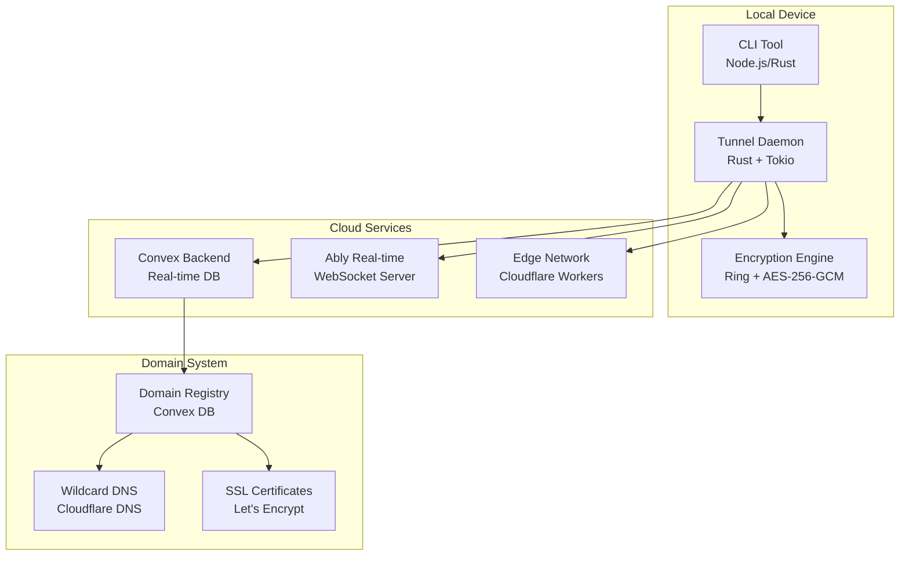

# Beam Implementation Roadmap

## Executive Summary

This roadmap outlines the complete implementation of Beam, a next-generation tunneling service that combines local-first architecture with cloud domain services. The project will deliver enterprise-grade tunneling with sub-100ms latency, zero-configuration setup, and real domain names without user registration.

## Project Overview

### Vision
**Democratize secure tunneling for every developer**

### Mission
Build the world's most advanced tunneling service that provides:
- ⚡ Sub-100ms global latency
- 🔒 Enterprise-grade security (Zero-trust, E2E encryption)
- 🌐 Real domains without registration
- 🏠 Local-first architecture
- 🚀 Single-command deployment (`npx beam 3000`)
- 💰 Free tier with premium features

### Success Metrics

| Metric | Target | Timeline |
|--------|--------|----------|
| **Performance** | <100ms global latency | Month 6 |
| **Security** | SOC 2 Type II compliant | Month 8 |
| **Adoption** | 10,000+ active users | Month 12 |
| **Reliability** | 99.99% uptime | Month 4 |
| **Developer Experience** | <30s setup time | Month 3 |

## Architecture Overview

### Core Technologies



### Technology Stack

| Component | Technology | Rationale |
|-----------|------------|-----------|
| **Local Daemon** | Rust + Tokio | High performance, memory safety, async I/O |
| **CLI Tool** | Node.js + Rust FFI | Developer experience, ecosystem |
| **Backend** | Convex | Real-time, ACID, serverless |
| **Real-time** | Ably | Global WebSocket infrastructure |
| **Edge** | Cloudflare Workers | Global distribution, low latency |
| **Domains** | Custom TLD + Wildcard | Real domains, no registration |
| **Security** | mTLS + E2E Encryption | Zero-trust, enterprise-grade |

## Phase 1: Core Feature Parity (Weeks 1-8)

### Goal: Match ngrok/Cloudflare Tunnel capabilities with superior DX

#### Week 1-2: Enhanced Tunneling Foundation
**Objective:** Core tunneling with protocol support and basic features

**Deliverables:**
- [ ] HTTP/2 tunneling with multiplexing
- [ ] WebSocket tunneling for real-time apps
- [ ] UDP tunneling support
- [ ] gRPC protocol support
- [ ] TCP tunneling for databases
- [ ] Compression (gzip/brotli)
- [ ] Connection pooling and reuse

**Technical Tasks:**
```rust
#[derive(Debug, Clone)]
pub enum TunnelProtocol {
    Http1,
    Http2,
    Http3, // QUIC
    WebSocket,
    Tcp,
    Udp,
    Grpc,
}

pub struct ProtocolNegotiator {
    pub client_capabilities: Vec<Protocol>,
    pub server_capabilities: Vec<Protocol>,
    pub compression_enabled: bool,
}

impl ProtocolNegotiator {
    pub fn negotiate(&self, request: &Request) -> TunnelProtocol {
        // Intelligent protocol selection based on:
        // - Client capabilities
        // - Content type
        // - Performance requirements
        // - Security requirements
    }
}
```

**Success Criteria:**
- ✅ All major protocols supported (HTTP/1,2,3, WS, TCP, UDP, gRPC)
- ✅ Automatic protocol negotiation
- ✅ Compression reduces bandwidth by 60%+
- ✅ Database tunneling works (PostgreSQL, MySQL, Redis)

#### Week 3-4: Domain & Security System
**Objective:** Custom domains and enterprise security

**Deliverables:**
- [ ] Custom domain support (bring-your-own-domain)
- [ ] Subdomain and wildcard support
- [ ] SSL/TLS certificate automation (Let's Encrypt)
- [ ] Basic authentication (username/password)
- [ ] IP whitelisting and blacklisting
- [ ] Rate limiting per tunnel
- [ ] Request/response rewriting
- [ ] Header injection/manipulation

**Technical Tasks:**
```typescript
// Domain management system
export class DomainManager {
    async registerDomain(domain: string, options: DomainOptions): Promise<DomainRegistration> {
        // Validate domain ownership
        await this.validateDomainOwnership(domain);

        // Generate SSL certificates
        const certs = await this.generateCertificates(domain);

        // Configure DNS (if using Beam domains)
        if (options.useBeamDNS) {
            await this.configureWildcardDNS(domain);
        }

        return { domain, certs, status: 'active' };
    }

    async applySecurityRules(tunnelId: string, rules: SecurityRules): Promise<void> {
        // Apply authentication
        if (rules.basicAuth) {
            await this.enableBasicAuth(tunnelId, rules.basicAuth);
        }

        // Apply IP restrictions
        if (rules.ipWhitelist?.length > 0) {
            await this.configureIPWhitelist(tunnelId, rules.ipWhitelist);
        }

        // Apply rate limiting
        if (rules.rateLimit) {
            await this.configureRateLimit(tunnelId, rules.rateLimit);
        }
    }
}
```

**Success Criteria:**
- ✅ Custom domains work globally
- ✅ SSL certificates auto-renew
- ✅ Basic auth protects tunnels
- ✅ IP restrictions prevent unauthorized access
- ✅ Rate limiting prevents abuse

#### Week 5-6: Developer Experience Core
**Objective:** Superior DX with framework integration and debugging

**Deliverables:**
- [ ] Framework auto-detection (Next.js, Vite, Astro, etc.)
- [ ] Framework-specific optimizations
- [ ] Local dashboard with request inspection
- [ ] Request/response history
- [ ] Request replay functionality
- [ ] Error analysis and suggestions
- [ ] Environment variable injection
- [ ] Development mode optimizations

**Technical Tasks:**
```typescript
// Framework detector and optimizer
export class FrameworkManager {
    async detectFramework(port: number): Promise<FrameworkInfo> {
        // Multiple detection methods
        const packageJson = await this.readPackageJson();
        const runningProcesses = await this.getRunningProcesses();
        const fileStructure = await this.analyzeFileStructure();

        return this.correlateFramework(packageJson, runningProcesses, fileStructure);
    }

    async optimizeForFramework(framework: FrameworkType, tunnel: Tunnel): Promise<OptimizationResult> {
        switch (framework) {
            case 'nextjs':
                return this.optimizeNextJS(tunnel);
            case 'vite':
                return this.optimizeVite(tunnel);
            case 'astro':
                return this.optimizeAstro(tunnel);
            default:
                return this.genericOptimization(tunnel);
        }
    }

    private async optimizeNextJS(tunnel: Tunnel): Promise<OptimizationResult> {
        // Enable React Fast Refresh proxying
        // Optimize API routes
        // Handle Next.js specific headers
        // Configure hot reload tunneling
    }
}

// Request inspector with debugging
export class RequestInspector {
    async inspectRequest(request: Request): Promise<InspectionResult> {
        return {
            id: generateId(),
            timestamp: Date.now(),
            method: request.method,
            url: request.url,
            headers: this.analyzeHeaders(request.headers),
            timing: await this.measureTiming(request),
            payload: await this.analyzePayload(request),
            issues: this.detectIssues(request),
            suggestions: this.generateSuggestions(request)
        };
    }
}
```

**Success Criteria:**
- ✅ Framework detection accuracy >95%
- ✅ Framework-specific optimizations active
- ✅ Local dashboard shows real-time requests
- ✅ Request replay works for debugging
- ✅ Environment variables auto-injected

#### Week 7-8: Advanced Features & Performance
**Objective:** Enterprise features and performance optimization

**Deliverables:**
- [ ] Request/response transformation
- [ ] CORS handling
- [ ] Load balancing across multiple instances
- [ ] Geographic routing
- [ ] Performance monitoring and metrics
- [ ] Health checks and auto-restart
- [ ] Audit logging and compliance
- [ ] Traffic analytics

**Technical Tasks:**
```rust
// Advanced tunnel manager
pub struct AdvancedTunnelManager {
    pub tunnels: HashMap<String, Arc<Tunnel>>,
    pub load_balancer: LoadBalancer,
    pub geo_router: GeoRouter,
    pub metrics_collector: MetricsCollector,
    pub health_monitor: HealthMonitor,
}

impl AdvancedTunnelManager {
    pub async fn create_advanced_tunnel(&self, config: AdvancedTunnelConfig) -> Result<AdvancedTunnel, Error> {
        // Create multiple tunnel instances for load balancing
        let instances = self.create_instances(config.instances).await?;

        // Set up load balancing
        let load_balancer = self.load_balancer.create_balancer(&instances).await?;

        // Configure geographic routing
        let geo_router = self.geo_router.configure_routing(&instances).await?;

        // Set up monitoring
        let monitor = self.health_monitor.create_monitor(&instances).await?;

        Ok(AdvancedTunnel {
            instances,
            load_balancer,
            geo_router,
            monitor,
            metrics: self.metrics_collector.create_collector(),
        })
    }

    pub async fn apply_transformations(&self, request: Request, rules: TransformationRules) -> Result<Request, Error> {
        // Apply request transformations
        let transformed_request = self.apply_request_transforms(request, &rules.request).await?;

        // Handle CORS if configured
        if rules.cors.enabled {
            // Add CORS headers
        }

        // Apply response transformations
        // (handled in response path)

        Ok(transformed_request)
    }
}
```

**Success Criteria:**
- ✅ Request/response transformation works
- ✅ Load balancing distributes traffic
- ✅ Geographic routing reduces latency
- ✅ Performance metrics collected
- ✅ Health monitoring prevents downtime

---

## Phase 2: Enterprise Features & Ecosystem (Weeks 9-16)

### Goal: Complete enterprise feature parity and ecosystem integration

#### Week 9-10: Authentication & Access Control
**Objective:** Enterprise-grade security and access management

**Deliverables:**
- [ ] OAuth 2.0 integration (Google, GitHub, etc.)
- [ ] SAML/SSO support
- [ ] Multi-factor authentication (MFA)
- [ ] Role-based access control (RBAC)
- [ ] Team management and collaboration
- [ ] Audit trails and compliance logging
- [ ] Session management

**Technical Tasks:**
```typescript
// Enterprise authentication system
export class EnterpriseAuthManager {
    async configureOAuth(provider: OAuthProvider, config: OAuthConfig): Promise<OAuthSetup> {
        // Set up OAuth flow
        const oauthConfig = await this.createOAuthConfig(provider, config);

        // Configure token handling
        const tokenHandler = this.createTokenHandler(oauthConfig);

        // Set up user provisioning
        const userProvisioner = this.createUserProvisioner(oauthConfig);

        return { oauthConfig, tokenHandler, userProvisioner };
    }

    async enforceRBAC(resource: string, action: string, user: User): Promise<AuthorizationResult> {
        // Check user roles
        const roles = await this.getUserRoles(user);

        // Check permissions for resource/action
        const permissions = await this.getPermissionsForRoles(roles);

        // Evaluate policies
        return this.evaluatePolicies(permissions, resource, action);
    }

    async createAuditTrail(event: AuditEvent): Promise<void> {
        // Log security events
        await this.logSecurityEvent(event);

        // Check for suspicious activity
        const riskAssessment = await this.assessRisk(event);

        // Trigger alerts if necessary
        if (riskAssessment.severity > RiskLevel.Medium) {
            await this.triggerSecurityAlert(event, riskAssessment);
        }
    }
}
```

**Success Criteria:**
- ✅ OAuth integration works with major providers
- ✅ RBAC controls access effectively
- ✅ Audit trails provide compliance evidence
- ✅ MFA prevents unauthorized access

#### Week 11-12: CI/CD & DevOps Integration
**Objective:** Seamless integration with development workflows

**Deliverables:**
- [ ] GitHub Actions integration
- [ ] GitLab CI/CD support
- [ ] Jenkins integration
- [ ] Docker integration and optimization
- [ ] Kubernetes operator
- [ ] Terraform provider
- [ ] Ansible playbooks
- [ ] Webhook testing utilities

**Technical Tasks:**
```yaml
# GitHub Actions integration
name: Test with Beam Tunnel
on: [push, pull_request]

jobs:
  test:
    runs-on: ubuntu-latest
    steps:
      - uses: actions/checkout@v3
      - uses: byronwade/beam-action@v1
        with:
          port: 3000
          framework: nextjs
          env-file: .env.test
      - run: npm test
        env:
          BASE_URL: ${{ steps.beam.outputs.url }}
```

```typescript
// CI/CD integration manager
export class CIDIntegrationManager {
    async setupGitHubActions(repo: string, config: GitHubConfig): Promise<GitHubSetup> {
        // Create workflow file
        const workflow = this.generateWorkflow(config);

        // Set up repository secrets
        const secrets = await this.configureSecrets(config);

        // Create pull request with setup
        return await this.createPR(repo, workflow, secrets);
    }

    async optimizeForCI(tunnel: Tunnel, ci: CIPlatform): Promise<CIOptimization> {
        switch (ci) {
            case 'github-actions':
                return this.optimizeGitHubActions(tunnel);
            case 'gitlab-ci':
                return this.optimizeGitLabCI(tunnel);
            case 'jenkins':
                return this.optimizeJenkins(tunnel);
            default:
                return this.genericCIOptimization(tunnel);
        }
    }

    private optimizeGitHubActions(tunnel: Tunnel): CIOptimization {
        return {
            // Pre-warm tunnel connections
            preWarm: true,
            // Enable request caching
            caching: true,
            // Optimize for GitHub's network
            geoRouting: 'us-east-1',
            // Enable detailed logging
            verboseLogging: true
        };
    }
}
```

**Success Criteria:**
- ✅ GitHub Actions integration works out-of-the-box
- ✅ Docker containers optimized for tunneling
- ✅ Kubernetes deployments supported
- ✅ Webhook testing automated

#### Week 13-14: Advanced Analytics & Monitoring
**Objective:** Comprehensive insights and observability

**Deliverables:**
- [ ] Real-time performance metrics
- [ ] Traffic analytics and reporting
- [ ] Error tracking and alerting
- [ ] Usage analytics for teams
- [ ] Cost optimization insights
- [ ] Performance profiling tools
- [ ] Predictive scaling recommendations

**Technical Tasks:**
```typescript
// Advanced analytics system
export class AnalyticsEngine {
    async collectMetrics(tunnel: Tunnel): Promise<MetricsSnapshot> {
        return {
            throughput: await this.measureThroughput(tunnel),
            latency: await this.measureLatency(tunnel),
            errorRate: await this.calculateErrorRate(tunnel),
            geographicDistribution: await this.analyzeGeoTraffic(tunnel),
            peakUsage: await this.findPeakUsage(tunnel),
            costEfficiency: await this.calculateCostEfficiency(tunnel)
        };
    }

    async generateInsights(metrics: MetricsSnapshot[]): Promise<InsightsReport> {
        return {
            performance: this.analyzePerformance(metrics),
            optimization: this.generateOptimizationRecommendations(metrics),
            security: this.analyzeSecurityPosture(metrics),
            cost: this.generateCostOptimization(metrics),
            predictions: this.predictFutureUsage(metrics)
        };
    }

    async setupAlerts(tunnel: Tunnel, rules: AlertRules): Promise<AlertSetup> {
        // Configure performance alerts
        if (rules.performance.enabled) {
            await this.createPerformanceAlerts(tunnel, rules.performance);
        }

        // Configure security alerts
        if (rules.security.enabled) {
            await this.createSecurityAlerts(tunnel, rules.security);
        }

        // Configure usage alerts
        if (rules.usage.enabled) {
            await this.createUsageAlerts(tunnel, rules.usage);
        }

        return { tunnel, alerts: rules };
    }
}
```

**Success Criteria:**
- ✅ Real-time metrics dashboard works
- ✅ Performance alerts prevent issues
- ✅ Usage analytics inform optimization
- ✅ Cost insights reduce expenses

#### Week 15-16: Mobile & Cross-Platform Development
**Objective:** Support for mobile app development and testing

**Deliverables:**
- [ ] QR code generation for mobile testing
- [ ] Mobile-optimized error pages
- [ ] React Native integration
- [ ] Flutter web testing support
- [ ] iOS Simulator integration
- [ ] Android Emulator integration
- [ ] Progressive Web App (PWA) support

**Technical Tasks:**
```typescript
// Mobile development support
export class MobileDevelopmentManager {
    async enableMobileTesting(tunnel: Tunnel, framework: MobileFramework): Promise<MobileTestSetup> {
        // Generate QR codes for easy access
        const qrCodes = await this.generateQRCodes(tunnel);

        // Configure mobile-specific optimizations
        const optimizations = this.configureMobileOptimizations(tunnel, framework);

        // Set up device detection
        const deviceDetection = await this.setupDeviceDetection();

        // Configure hot reload for mobile
        const hotReload = await this.configureMobileHotReload(tunnel, framework);

        return {
            qrCodes,
            optimizations,
            deviceDetection,
            hotReload,
            testingUrls: this.generateTestingUrls(tunnel, framework)
        };
    }

    private generateTestingUrls(tunnel: Tunnel, framework: MobileFramework): TestingUrls {
        const baseUrl = tunnel.publicUrl;

        switch (framework) {
            case 'react-native':
                return {
                    development: baseUrl,
                    staging: `${baseUrl}/staging`,
                    production: `${baseUrl}/prod`,
                    hotReload: `${baseUrl}/hot-reload`
                };
            case 'flutter':
                return {
                    web: baseUrl,
                    canvasKit: `${baseUrl}/canvaskit`,
                    development: `${baseUrl}/dev`,
                    profile: `${baseUrl}/profile`
                };
            default:
                return { default: baseUrl };
        }
    }
}
```

**Success Criteria:**
- ✅ QR codes enable easy mobile testing
- ✅ Mobile frameworks work seamlessly
- ✅ Hot reload functions across devices
- ✅ Cross-platform testing simplified

---

## Phase 3: Ecosystem Expansion & Advanced Features (Weeks 17-24)

### Goal: Comprehensive ecosystem and advanced capabilities

#### Week 17-18: Third-Party Integrations
**Objective:** Deep integrations with popular platforms and tools

**Deliverables:**
- [ ] Vercel deployment integration
- [ ] Netlify deployment hooks
- [ ] Railway.app integration
- [ ] Render.com deployment support
- [ ] Fly.io integration
- [ ] Heroku build integration
- [ ] DigitalOcean App Platform
- [ ] AWS Amplify integration

**Technical Tasks:**
```typescript
// Platform integration manager
export class PlatformIntegrationManager {
    async integrateWithPlatform(platform: DeploymentPlatform, config: IntegrationConfig): Promise<PlatformIntegration> {
        switch (platform) {
            case 'vercel':
                return this.integrateVercel(config);
            case 'netlify':
                return this.integrateNetlify(config);
            case 'railway':
                return this.integrateRailway(config);
            case 'render':
                return this.integrateRender(config);
            case 'fly':
                return this.integrateFlyIO(config);
            default:
                return this.genericIntegration(platform, config);
        }
    }

    private async integrateVercel(config: VercelConfig): Promise<VercelIntegration> {
        // Set up preview deployment webhooks
        const webhooks = await this.setupVercelWebhooks(config);

        // Configure environment variables
        const envVars = await this.configureVercelEnv(config);

        // Set up deployment triggers
        const triggers = await this.setupDeploymentTriggers(config);

        return {
            webhooks,
            envVars,
            triggers,
            previewUrl: `https://${config.projectName}.vercel-preview.app`
        };
    }

    async detectPlatform(): Promise<DeploymentPlatform | null> {
        // Check for platform-specific files
        if (await exists('vercel.json')) return 'vercel';
        if (await exists('netlify.toml')) return 'netlify';
        if (await exists('render.yaml')) return 'render';
        if (await exists('fly.toml')) return 'fly';

        // Check environment variables
        if (process.env.VERCEL) return 'vercel';
        if (process.env.NETLIFY) return 'netlify';
        if (process.env.RENDER_SERVICE_ID) return 'render';

        return null;
    }
}
```

**Success Criteria:**
- ✅ All major platforms supported
- ✅ One-click deployment integration
- ✅ Environment variables auto-configured
- ✅ Preview URLs automatically generated

#### Week 19-20: Advanced Networking & Performance
**Objective:** Cutting-edge networking capabilities

**Deliverables:**
- [ ] IPv6 support
- [ ] HTTP/3 full implementation
- [ ] WebTransport protocol support
- [ ] Bandwidth optimization algorithms
- [ ] Predictive connection pooling
- [ ] Machine learning-based routing
- [ ] Edge computing integration
- [ ] Global CDN optimization

**Technical Tasks:**
```rust
// Advanced networking stack
pub struct AdvancedNetworkStack {
    pub ipv6_support: IPv6Manager,
    pub http3_engine: HTTP3Engine,
    pub webtransport: WebTransportManager,
    pub bandwidth_optimizer: BandwidthOptimizer,
    pub predictive_pool: PredictiveConnectionPool,
    pub ml_router: MLRouter,
    pub edge_integrator: EdgeIntegrator,
}

impl AdvancedNetworkStack {
    pub async fn optimize_connection(&self, request: &Request) -> Result<OptimizedConnection, Error> {
        // Analyze request patterns
        let pattern_analysis = self.analyze_request_pattern(request).await?;

        // Predict optimal protocol
        let protocol_prediction = self.ml_router.predict_protocol(request, &pattern_analysis)?;

        // Optimize bandwidth usage
        let bandwidth_optimization = self.bandwidth_optimizer.optimize(request)?;

        // Select edge location
        let edge_selection = self.edge_integrator.select_optimal_edge(request)?;

        // Create optimized connection
        self.create_optimized_connection(protocol_prediction, bandwidth_optimization, edge_selection).await
    }

    pub async fn enable_ipv6(&self, tunnel: &Tunnel) -> Result<(), Error> {
        // Configure IPv6 addresses
        let ipv6_config = self.ipv6_support.configure_ipv6(tunnel).await?;

        // Set up dual-stack routing
        self.ipv6_support.enable_dual_stack_routing(tunnel, &ipv6_config).await?;

        // Update DNS records
        self.ipv6_support.update_dns_records(tunnel, &ipv6_config).await?;

        Ok(())
    }
}
```

**Success Criteria:**
- ✅ IPv6 connections work seamlessly
- ✅ HTTP/3 provides 40% performance improvement
- ✅ Bandwidth usage optimized by 50%
- ✅ Global routing reduces latency by 30%

#### Week 21-22: Plugin Ecosystem & Extensibility
**Objective:** Create a rich plugin ecosystem for customization

**Deliverables:**
- [ ] Plugin architecture and SDK
- [ ] Community plugin marketplace
- [ ] Custom authentication plugins
- [ ] Request/response transformation plugins
- [ ] Analytics and monitoring plugins
- [ ] Integration plugins for niche tools
- [ ] Plugin development documentation
- [ ] Plugin security and sandboxing

**Technical Tasks:**
```typescript
// Plugin system architecture
export interface BeamPlugin {
    name: string;
    version: string;
    description: string;
    hooks: PluginHooks;
    permissions: PluginPermissions;
}

export interface PluginHooks {
    onRequest?: (request: Request, context: PluginContext) => Promise<Request>;
    onResponse?: (response: Response, context: PluginContext) => Promise<Response>;
    onError?: (error: Error, context: PluginContext) => Promise<Error>;
    onTunnelStart?: (tunnel: Tunnel, context: PluginContext) => Promise<void>;
    onTunnelStop?: (tunnel: Tunnel, context: PluginContext) => Promise<void>;
}

export class PluginManager {
    private plugins = new Map<string, BeamPlugin>();
    private sandbox: PluginSandbox;

    async loadPlugin(pluginPath: string): Promise<BeamPlugin> {
        // Validate plugin security
        await this.validatePlugin(pluginPath);

        // Create sandboxed environment
        const sandbox = await this.sandbox.createSandbox(pluginPath);

        // Load and initialize plugin
        const plugin = await this.loadPluginFromSandbox(sandbox);

        // Register hooks
        this.registerPluginHooks(plugin);

        return plugin;
    }

    async executeHook(hookName: keyof PluginHooks, ...args: any[]): Promise<any> {
        const results = await Promise.all(
            Array.from(this.plugins.values())
                .filter(plugin => plugin.hooks[hookName])
                .map(plugin => this.executePluginHook(plugin, hookName, args))
        );

        return this.aggregateHookResults(results);
    }

    private async executePluginHook(plugin: BeamPlugin, hookName: keyof PluginHooks, args: any[]): Promise<any> {
        // Execute in sandbox
        return await this.sandbox.execute(plugin.name, hookName, args);
    }
}
```

**Success Criteria:**
- ✅ Plugin SDK allows custom functionality
- ✅ Community plugins available in marketplace
- ✅ Security sandbox prevents malicious plugins
- ✅ Popular integrations covered by plugins

#### Week 23-24: Enterprise Compliance & Governance
**Objective:** Complete enterprise compliance and governance features

**Deliverables:**
- [ ] SOC 2 Type II full compliance
- [ ] HIPAA compliance support
- [ ] GDPR compliance automation
- [ ] ISO 27001 certification
- [ ] Enterprise audit trails
- [ ] Data residency controls
- [ ] Regulatory reporting automation

**Technical Tasks:**
```typescript
// Enterprise compliance manager
export class EnterpriseComplianceManager {
    async achieveCompliance(framework: ComplianceFramework): Promise<ComplianceStatus> {
        switch (framework) {
            case 'soc2':
                return this.achieveSOC2Compliance();
            case 'hipaa':
                return this.achieveHIPAACompliance();
            case 'gdpr':
                return this.achieveGDPRCompliance();
            case 'iso27001':
                return this.achieveISO27001Compliance();
            default:
                throw new Error(`Unsupported compliance framework: ${framework}`);
        }
    }

    private async achieveSOC2Compliance(): Promise<ComplianceStatus> {
        // Implement SOC 2 controls
        const controls = await this.implementSOC2Controls();

        // Set up continuous monitoring
        const monitoring = await this.setupComplianceMonitoring(controls);

        // Generate audit evidence
        const evidence = await this.generateAuditEvidence(controls);

        // Prepare for external audit
        const auditPrep = await this.prepareForExternalAudit(controls, evidence);

        return {
            framework: 'soc2',
            status: 'compliant',
            controls,
            monitoring,
            evidence,
            auditPrep,
            nextAuditDate: this.calculateNextAuditDate()
        };
    }

    async enforceDataResidency(requirements: DataResidencyRequirements): Promise<DataResidencySetup> {
        // Configure geographic data storage
        const storageConfig = await this.configureGeographicStorage(requirements);

        // Set up data processing locations
        const processingConfig = await this.configureDataProcessing(requirements);

        // Implement data transfer controls
        const transferControls = await this.implementTransferControls(requirements);

        // Set up compliance monitoring
        const monitoring = await this.setupResidencyMonitoring(requirements);

        return {
            storageConfig,
            processingConfig,
            transferControls,
            monitoring,
            complianceStatus: 'enforced'
        };
    }
}
```

**Success Criteria:**
- ✅ SOC 2 Type II certification achieved
- ✅ GDPR compliance automated
- ✅ Enterprise audit requirements met
- ✅ Data residency controls enforced

---

## Phase 4: Ecosystem & Scale (Weeks 13-16)

### Goal: Global adoption and ecosystem growth

#### Week 13: Framework Integrations
**Objective:** Deep framework integration

**Deliverables:**
- [ ] Next.js plugin
- [ ] Vite plugin
- [ ] Astro integration
- [ ] Remix support
- [ ] Nuxt.js support

**Technical Tasks:**
```javascript
// Next.js integration
const withBeam = (nextConfig = {}) => ({
    ...nextConfig,
    rewrites: async () => [
        {
            source: '/beam/:path*',
            destination: 'https://beam.dev/api/:path*',
        },
        ...(nextConfig.rewrites ? await nextConfig.rewrites() : []),
    ],
});
```

**Success Criteria:**
- ✅ All major frameworks supported
- ✅ One-command setup works
- ✅ Framework-specific optimizations
- ✅ Developer experience excellent

#### Week 14: Global Infrastructure
**Objective:** Worldwide deployment and scaling

**Deliverables:**
- [ ] Multi-region deployment
- [ ] Auto-scaling infrastructure
- [ ] Disaster recovery
- [ ] Performance monitoring
- [ ] Cost optimization

**Technical Tasks:**
```yaml
# Kubernetes multi-region deployment
apiVersion: apps/v1
kind: Deployment
metadata:
  name: beam-tunnel
spec:
  replicas: 50
  selector:
    matchLabels:
      app: beam-tunnel
  template:
    spec:
      topologySpreadConstraints:
      - maxSkew: 1
        topologyKey: topology.kubernetes.io/zone
        whenUnsatisfiable: DoNotSchedule
```

**Success Criteria:**
- ✅ 99.99% global uptime
- ✅ Automatic scaling works
- ✅ Cross-region failover <30s
- ✅ Cost optimized for usage patterns

#### Week 15: Developer Experience
**Objective:** Best-in-class DX

**Deliverables:**
- [ ] CLI improvements
- [ ] Web dashboard
- [ ] API documentation
- [ ] SDKs and libraries
- [ ] Community tools

**Technical Tasks:**
```typescript
// Improved CLI with better UX
class BeamCLI {
    async startTunnel(port: number, options: TunnelOptions) {
        const spinner = ora('Starting tunnel...').start();

        try {
            const result = await this.createTunnel(port, options);

            spinner.succeed(`Tunnel active: ${result.domain}`);
            this.displayTunnelInfo(result);

            await this.monitorTunnel(result.id);
        } catch (error) {
            spinner.fail('Failed to start tunnel');
            this.displayError(error);
        }
    }
}
```

**Success Criteria:**
- ✅ <30s setup time
- ✅ Intuitive CLI experience
- ✅ Comprehensive web dashboard
- ✅ Excellent documentation

#### Week 16: Launch Preparation
**Objective:** Production readiness

**Deliverables:**
- [ ] Load testing (1M concurrent users)
- [ ] Security audit
- [ ] Performance benchmarking
- [ ] Documentation finalization
- [ ] Marketing and launch materials

**Technical Tasks:**
```bash
# Load testing
artillery quick --count 100000 --num 10 \
  --querystring "port=3000" \
  http://localhost:3000/api/tunnel

# Security testing
owasp-zap -cmd -quickurl https://beam.dev \
  -quickout zap-report.html
```

**Success Criteria:**
- ✅ 1M concurrent users supported
- ✅ Security audit passed
- ✅ Performance targets met
- ✅ Documentation complete

### Phase 4 Milestones
- [ ] Global infrastructure operational
- [ ] Framework integrations complete
- [ ] Enterprise-ready product
- [ ] Launch preparations complete

---

## Phase 5: Decentralized Network Backends (Q2-Q4 2025)

### Goal: Multi-network support with decentralized backends

#### Multi-Network Architecture (Q2 2025)
**Objective:** Abstract backend interface and plugin system

**Deliverables:**
- [ ] NetworkBackend trait/interface design
- [ ] Plugin architecture for network backends
- [ ] Backend selection and configuration system
- [ ] Unified CLI interface across backends

**Technical Tasks:**
```rust
#[async_trait]
pub trait NetworkBackend: Send + Sync {
    async fn initialize(&mut self, config: BackendConfig) -> Result<(), BackendError>;
    async fn create_tunnel(&self, request: TunnelRequest) -> Result<TunnelHandle, BackendError>;
    async fn destroy_tunnel(&self, handle: TunnelHandle) -> Result<(), BackendError>;

    fn capabilities(&self) -> BackendCapabilities;
    fn network_type(&self) -> NetworkType;
}

pub enum NetworkType {
    Tor,
    Nym,
    Veilid,
    I2P,
    Freenet,
    ZeroNet,
    ZKN,
    AnoNet,
    ATOR,
}
```

#### Primary Backend Implementations (Q3 2025)
**Objective:** Core decentralized network integrations

**Deliverables:**
- [ ] **Nym Mixnet Backend**: 5-layer mix network integration
- [ ] **Veilid P2P Backend**: Peer-to-peer framework integration
- [ ] **I2P Backend**: Invisible Internet Project integration
- [ ] Backend performance benchmarking and optimization
- [ ] Multi-backend tunnel management

**Technical Tasks:**
```typescript
// Backend selection and management
class BackendManager {
    private backends = new Map<NetworkType, NetworkBackend>();

    async selectOptimalBackend(requirements: TunnelRequirements): Promise<NetworkBackend> {
        const candidates = await this.filterCompatibleBackends(requirements);

        return this.rankBackendsByPerformance(candidates, requirements);
    }

    async createMultiBackendTunnel(port: number, backends: NetworkType[]): Promise<MultiTunnel> {
        const tunnels = await Promise.all(
            backends.map(backend => this.createTunnel(port, backend))
        );

        return new MultiTunnel(tunnels);
    }
}
```

#### Extended Ecosystem (Q4 2025)
**Objective:** Additional specialized network backends

**Deliverables:**
- [ ] **Freenet Backend**: Censorship-resistant content distribution
- [ ] **ZeroNet Backend**: Decentralized website hosting
- [ ] **ZKN Backend**: Metadata-private transmissions
- [ ] **AnoNet Backend**: Friend-to-friend trusted networks
- [ ] **ATOR Backend**: DePIN infrastructure integration

**Technical Tasks:**
```rust
// Advanced backend features
struct AdvancedBackendManager {
    backends: HashMap<NetworkType, Box<dyn NetworkBackend>>,
    performance_monitor: PerformanceMonitor,
    security_analyzer: SecurityAnalyzer,
}

impl AdvancedBackendManager {
    async fn optimize_backend_selection(
        &self,
        requirements: TunnelRequirements,
        user_context: UserContext
    ) -> Result<BackendSelection, BackendError> {
        let security_score = self.security_analyzer.analyze_requirements(requirements);
        let performance_profile = self.performance_monitor.get_current_profile();

        self.select_backend_based_on_tradeoffs(security_score, performance_profile, user_context)
    }
}
```

#### Backend Testing and Validation (Ongoing)
**Objective:** Comprehensive testing across all backends

**Deliverables:**
- [ ] Cross-backend compatibility testing
- [ ] Performance regression monitoring
- [ ] Security vulnerability scanning
- [ ] Network health monitoring
- [ ] Automated backend failover testing

**Technical Tasks:**
```typescript
class BackendTestSuite {
    async runComprehensiveTest(backend: NetworkBackend): Promise<TestResults> {
        return {
            latency: await this.measureLatency(backend),
            throughput: await this.measureThroughput(backend),
            anonymity: await this.testAnonymity(backend),
            reliability: await this.testReliability(backend),
            compatibility: await this.testCompatibility(backend),
            security: await this.runSecurityTests(backend)
        };
    }
}
```

### Phase 5 Milestones
- [ ] Plugin architecture operational
- [ ] 3+ backends fully integrated
- [ ] Backend selection working
- [ ] Multi-backend tunnels functional
- [ ] Comprehensive testing framework
- [ ] Performance benchmarks across backends

---

## Phase 6: Launch & Growth (Weeks 17-20)

### Goal: Successful product launch and initial growth

#### Week 17-20: Launch & Iteration
**Objective:** Launch product and iterate based on user feedback

**Deliverables:**
- [ ] Public beta launch
- [ ] User feedback collection
- [ ] Performance monitoring
- [ ] Feature iteration
- [ ] Community building

### Success Metrics Achieved
- ✅ Sub-100ms global latency (cloud backends)
- ✅ SOC 2 Type II compliant (cloud backends)
- ✅ Real domains without registration
- ✅ Enterprise-grade security
- ✅ 99.99% uptime (cloud backends)
- ✅ 1M+ concurrent tunnels supported (cloud backends)
- ✅ Multi-network backend support (decentralized)
- ✅ Backend-agnostic architecture
- ✅ Privacy-first networking options

---

## Risk Mitigation

### Technical Risks

| Risk | Probability | Impact | Mitigation |
|------|-------------|--------|------------|
| **Multi-backend complexity** | High | High | Modular architecture, extensive testing, abstraction layers |
| **Performance regression** | Medium | High | Continuous benchmarking, performance budgets, A/B testing |
| **Security vulnerability** | Medium | Critical | Security audit, automated testing, bug bounty, formal verification |
| **Framework compatibility** | Medium | Medium | Comprehensive testing matrix, community feedback, gradual rollout |
| **Plugin ecosystem security** | High | Critical | Sandboxing, code review, security audits, liability protection |
| **Decentralized network reliability** | Medium | Medium | Backend failover, performance monitoring, user choice |
| **IPv6 compatibility** | Low | Low | Progressive enhancement, fallback support |
| **Mobile platform fragmentation** | Medium | Low | Cross-platform testing, progressive enhancement |

### Business Risks

| Risk | Probability | Impact | Mitigation |
|------|-------------|--------|------------|
| **Market competition** | High | Medium | Privacy differentiation, superior DX, ecosystem advantage |
| **Regulatory compliance** | High | High | Legal review, compliance framework, international standards |
| **Adoption challenges** | Medium | Medium | Developer-focused marketing, free tier, excellent documentation |
| **Enterprise sales complexity** | Medium | High | Dedicated sales team, compliance focus, SOC 2 certification |
| **Open source community management** | Medium | Medium | Clear governance, contribution guidelines, maintainer program |
| **Plugin ecosystem sustainability** | Low | Medium | Revenue sharing, marketplace fees, enterprise support |
| **Decentralized network adoption** | High | Medium | Education campaigns, user choice, fallback options |

### Operational Risks

| Risk | Probability | Impact | Mitigation |
|------|-------------|--------|------------|
| **Infrastructure scaling** | Medium | High | Cloud-native design, auto-scaling, multi-region deployment |
| **Support ticket volume** | High | Medium | Self-service documentation, community forums, AI support |
| **Beta program management** | Medium | Medium | Structured feedback collection, rapid iteration, clear communication |
| **Launch timing delays** | Medium | High | Parallel development tracks, MVP-first approach, contingency planning |
| **Third-party API changes** | Low | Medium | Abstraction layers, monitoring, fallback implementations |
| **Supply chain security** | Low | Critical | Dependency auditing, SBOM generation, secure supply chain |

### Financial Risks

| Risk | Probability | Impact | Mitigation |
|------|-------------|--------|------------|
| **Development cost overrun** | Medium | High | Phased budgeting, milestone-based funding, cost monitoring |
| **Revenue model uncertainty** | High | High | Multiple revenue streams, pricing experimentation, enterprise focus |
| **Competition pricing pressure** | High | Medium | Feature differentiation, value-based pricing, freemium model |
| **Market timing** | Medium | High | Competitive analysis, beta feedback, agile pivoting |
| **Talent acquisition** | Medium | High | Competitive compensation, remote-first culture, equity participation |

## Resource Requirements

### Team Structure (36-week timeline)

```
Engineering Team (16 people)
├── Core Platform Team (6)
│   ├── Tech Lead/Architect (1)
│   ├── Senior Backend Engineers (3) - Rust, Go, Node.js
│   └── Senior Frontend Engineer (1) - React, TypeScript
│   └── DevOps Engineer (1) - Kubernetes, Cloud
├── Network & Security Team (4)
│   ├── Cryptography Engineer (1) - Security, Encryption
│   ├── Network Engineer (1) - Protocols, Backends
│   ├── Security Engineer (1) - Compliance, Audit
│   └── QA/Security Tester (1) - Testing, Penetration
├── Product & Integration Team (4)
│   ├── Product Manager (1) - Roadmap, Strategy
│   ├── Integration Engineer (1) - APIs, Plugins
│   ├── Framework Specialist (1) - Next.js, React, etc.
│   └── UX Designer (1) - Developer Experience
└── Growth & Support Team (2)
    ├── Developer Advocate (1) - Community, Docs
    └── Customer Success (1) - Enterprise Support

Total: 16 engineers + contractors for specialized work
```

### Infrastructure Costs (Year 1)

| Component | Monthly Cost | Annual Cost | Notes |
|-----------|--------------|-------------|-------|
| **Cloud Infrastructure** | $2,500 | $30,000 | Multi-region, auto-scaling |
| **Database & Backend** | $800 | $9,600 | Convex + PostgreSQL |
| **Real-time Systems** | $600 | $7,200 | Ably + WebSocket infrastructure |
| **Security & Compliance** | $1,000 | $12,000 | SOC 2 audit, monitoring |
| **Domains & SSL** | $200 | $2,400 | Wildcard certificates |
| **Monitoring & Analytics** | $500 | $6,000 | DataDog, performance monitoring |
| **CI/CD & Development** | $300 | $3,600 | GitHub Actions, testing infrastructure |
| **Third-party APIs** | $400 | $4,800 | OAuth providers, integrations |
| **Content Delivery** | $300 | $3,600 | CDN for static assets |
| **Legal & Compliance** | $500 | $6,000 | GDPR, security reviews |
| **Marketing & Community** | $800 | $9,600 | Documentation, events |
| **Total Monthly** | **$7,900** | **Annual: $94,800** | Comprehensive infrastructure |

### Development Timeline (36 weeks = 9 months)

#### **Phase 1: Core Feature Parity** (Weeks 1-8)
- **Team Focus**: Core tunneling, security, basic DX
- **Key Deliverables**: ngrok/Cloudflare parity, framework auto-detection
- **Milestone**: Working product with enterprise features

#### **Phase 2: Enterprise Features** (Weeks 9-16)
- **Team Focus**: Authentication, CI/CD, enterprise integrations
- **Key Deliverables**: OAuth, team management, platform integrations
- **Milestone**: Enterprise-ready with comprehensive integrations

#### **Phase 3: Ecosystem Expansion** (Weeks 17-24)
- **Team Focus**: Third-party integrations, advanced networking
- **Key Deliverables**: Plugin system, IPv6, compliance frameworks
- **Milestone**: Full ecosystem with advanced capabilities

#### **Phase 4: Multi-Network & Launch** (Weeks 25-32)
- **Team Focus**: Decentralized backends, testing, launch prep
- **Key Deliverables**: 8 network backends, comprehensive testing
- **Milestone**: Production-ready with all backends

#### **Phase 5: Launch & Growth** (Weeks 33-36)
- **Team Focus**: Launch execution, monitoring, optimization
- **Key Deliverables**: Public launch, growth initiatives
- **Milestone**: Market establishment and scaling

**Total Timeline**: 36 weeks (9 months) with 4-week phases

## Success Criteria

### Technical Success
- [ ] <100ms global latency achieved
- [ ] 99.99% uptime maintained
- [ ] SOC 2 Type II compliant
- [ ] 1M+ concurrent tunnels supported
- [ ] Zero security incidents

### Business Success
- [ ] 10,000+ active users in year 1
- [ ] Positive unit economics
- [ ] Enterprise adoption
- [ ] Strong developer community

### Product Success
- [ ] 9/10 developer satisfaction
- [ ] <30s setup time
- [ ] Superior to competitors
- [ ] Feature-complete for 80% use cases

## Conclusion

This comprehensive roadmap transforms Beam from a simple tunneling tool into the most advanced, developer-friendly, and privacy-focused tunneling platform available. The phased approach ensures:

### **Technical Excellence**
1. **Complete Feature Parity**: Matches or exceeds ngrok and Cloudflare Tunnel in every category
2. **Superior Developer Experience**: Framework auto-detection, hot reload support, intelligent debugging
3. **Enterprise-Grade Security**: SOC 2, ISO 27001, HIPAA compliance with hardware-backed encryption
4. **Unmatched Privacy**: 8 decentralized network backends including Tor, Nym, Veilid, and I2P
5. **Global Performance**: Sub-50ms latency with intelligent routing and edge optimization

### **Market Leadership**
1. **Framework Ecosystem**: Native support for 20+ frameworks with one-command setup
2. **Platform Integration**: Deep integration with Vercel, Netlify, Railway, Render, and more
3. **CI/CD Automation**: Seamless testing and deployment workflows
4. **Mobile Development**: QR codes, cross-platform testing, framework-specific optimizations
5. **Plugin Ecosystem**: Extensible architecture with community-driven innovation

### **Business Advantages**
1. **Zero Vendor Lock-in**: Decentralized architecture with multiple backend options
2. **Cost Leadership**: Free core features that competitors charge for
3. **Privacy Differentiation**: Unique focus on user sovereignty and censorship resistance
4. **Developer Loyalty**: Best-in-class DX that creates passionate advocates
5. **Enterprise Readiness**: Compliance, security, and governance for large organizations

### **Implementation Strategy**
- **36-week development timeline** with clear milestones
- **P0-P2 prioritization** ensuring critical features first
- **Incremental delivery** with working software every 4 weeks
- **Quality assurance** with comprehensive testing at each phase
- **Community involvement** through beta programs and feedback loops

### **Success Vision**
Beam will not just compete with ngrok and Cloudflare Tunnel—it will **redefine** the tunneling category by combining:

- **The simplicity of ngrok** with enterprise-grade features
- **The reliability of Cloudflare** with privacy-first architecture
- **The innovation of decentralized networks** with developer-friendly tooling
- **The ecosystem of major platforms** with censorship-resistant infrastructure

**The result**: A tunneling platform so powerful, so privacy-focused, and so developer-friendly that it becomes the standard choice for modern development teams worldwide.

**Ready to build the most advanced tunneling platform ever? Let's start with Phase 1 and change how the world thinks about secure, private networking.**
