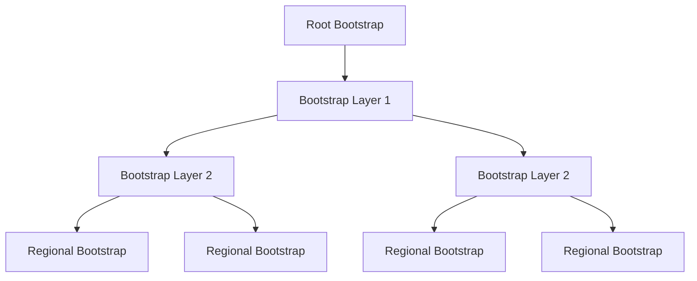

# Decentralized Deployment Strategies

## 🌐 Deploying Beam in Decentralized Environments

Deploying Beam requires fundamentally different strategies than traditional applications. This guide covers deployment patterns specifically designed for decentralized, peer-to-peer systems.

## Table of Contents

- [Deployment Philosophy](#deployment-philosophy)
- [Peer Deployment Patterns](#peer-deployment-patterns)
- [Bootstrap Node Strategies](#bootstrap-node-strategies)
- [Geographic Distribution](#geographic-distribution)
- [Container Orchestration](#container-orchestration)
- [Edge Computing Deployment](#edge-computing-deployment)
- [Monitoring & Observability](#monitoring--observability)
- [Disaster Recovery](#disaster-recovery)

## Deployment Philosophy

### Decentralized Deployment Principles

#### 1. **No Single Points of Failure**
```yaml
# Traditional deployment (single point of failure)
services:
  beam-server:
    image: beam:latest
    ports:
      - "3000:3000"
    replicas: 1  # Single instance = single point of failure

# Decentralized deployment (distributed resilience)
services:
  beam-peer-1:
    image: beam:latest
    environment:
      - BOOTSTRAP_PEERS=peer-2:4000,peer-3:4000
  beam-peer-2:
    image: beam:latest
    environment:
      - BOOTSTRAP_PEERS=peer-1:4000,peer-3:4000
  beam-peer-3:
    image: beam:latest
    environment:
      - BOOTSTRAP_PEERS=peer-1:4000,peer-2:4000
```

#### 2. **Peer-to-Peer Auto-Discovery**
```typescript
// Traditional: Manual service registration
const service = {
  name: 'beam-tunnel',
  address: 'beam.company.com:3000'
};
await registry.register(service);

// Decentralized: Automatic peer discovery
const peer = new BeamPeer();
await peer.joinNetwork({
  bootstrapPeers: ['peer1.beam.network', 'peer2.beam.network'],
  autoDiscover: true
});
// Peer automatically discovers and connects to other peers
```

#### 3. **Geographic Distribution by Default**
```typescript
// Traditional: Single region deployment
const deployment = {
  region: 'us-east-1',
  instances: 3
};

// Decentralized: Global distribution
const globalDeployment = {
  regions: ['us-east', 'eu-west', 'asia-east', 'south-america'],
  peersPerRegion: 5,
  autoBalance: true
};
```

## Peer Deployment Patterns

### Bootstrap Peer Network

#### Core Bootstrap Infrastructure
```yaml
# docker-compose.bootstrap.yml
version: '3.8'
services:
  bootstrap-1:
    image: beam/bootstrap:latest
    ports:
      - "4000:4000"
      - "4040:4040"
    environment:
      - BEAM_MODE=bootstrap
      - BEAM_PEER_ID=bootstrap-1
      - BEAM_BOOTSTRAP_PEERS=bootstrap-2:4000,bootstrap-3:4000
    volumes:
      - bootstrap-data:/app/data
    networks:
      - beam-network

  bootstrap-2:
    image: beam/bootstrap:latest
    ports:
      - "4001:4000"
      - "4041:4040"
    environment:
      - BEAM_MODE=bootstrap
      - BEAM_PEER_ID=bootstrap-2
      - BEAM_BOOTSTRAP_PEERS=bootstrap-1:4000,bootstrap-3:4000
    volumes:
      - bootstrap-data:/app/data
    networks:
      - beam-network

  bootstrap-3:
    image: beam/bootstrap:latest
    ports:
      - "4002:4000"
      - "4042:4040"
    environment:
      - BEAM_MODE=bootstrap
      - BEAM_PEER_ID=bootstrap-3
      - BEAM_BOOTSTRAP_PEERS=bootstrap-1:4000,bootstrap-2:4000
    volumes:
      - bootstrap-data:/app/data
    networks:
      - beam-network

networks:
  beam-network:
    driver: bridge

volumes:
  bootstrap-data:
```

#### Bootstrap Peer Responsibilities
- **Network Coordination**: Help new peers join the network
- **DHT Seeding**: Provide initial DHT data
- **Health Monitoring**: Track network status
- **Load Balancing**: Distribute connection requests

### Regional Peer Deployment

#### Geographic Distribution Strategy
```typescript
interface RegionalDeployment {
  region: string;
  peers: number;
  bootstrapPeers: string[];
  resources: {
    cpu: string;
    memory: string;
    storage: string;
  };
  network: {
    bandwidth: string;
    latencyTarget: number;
  };
}

const globalDeployment: RegionalDeployment[] = [
  {
    region: 'us-east',
    peers: 10,
    bootstrapPeers: ['us-east-bootstrap-1', 'us-east-bootstrap-2'],
    resources: { cpu: '2', memory: '4Gi', storage: '100Gi' },
    network: { bandwidth: '1Gbps', latencyTarget: 10 }
  },
  {
    region: 'eu-west',
    peers: 8,
    bootstrapPeers: ['eu-west-bootstrap-1', 'eu-west-bootstrap-2'],
    resources: { cpu: '2', memory: '4Gi', storage: '100Gi' },
    network: { bandwidth: '1Gbps', latencyTarget: 15 }
  },
  {
    region: 'asia-east',
    peers: 12,
    bootstrapPeers: ['asia-east-bootstrap-1', 'asia-east-bootstrap-2'],
    resources: { cpu: '2', memory: '4Gi', storage: '100Gi' },
    network: { bandwidth: '1Gbps', latencyTarget: 20 }
  }
];
```

#### Regional Peer Configuration
```yaml
# k8s/peer-deployment.yaml
apiVersion: apps/v1
kind: Deployment
metadata:
  name: beam-peer-us-east
  labels:
    region: us-east
    component: peer
spec:
  replicas: 10
  selector:
    matchLabels:
      region: us-east
      component: peer
  template:
    metadata:
      labels:
        region: us-east
        component: peer
    spec:
      affinity:
        nodeAffinity:
          requiredDuringSchedulingIgnoredDuringExecution:
            nodeSelectorTerms:
            - matchExpressions:
              - key: topology.kubernetes.io/region
                operator: In
                values:
                - us-east-1
      containers:
      - name: beam-peer
        image: beam/peer:latest
        env:
        - name: BEAM_REGION
          value: "us-east"
        - name: BEAM_BOOTSTRAP_PEERS
          value: "us-east-bootstrap-1:4000,us-east-bootstrap-2:4000"
        - name: BEAM_PEER_MODE
          value: "regional"
        resources:
          requests:
            cpu: "500m"
            memory: "1Gi"
          limits:
            cpu: "2000m"
            memory: "4Gi"
        ports:
        - containerPort: 4000
          name: p2p
        - containerPort: 4040
          name: inspector
        livenessProbe:
          httpGet:
            path: /health
            port: 4040
          initialDelaySeconds: 30
          periodSeconds: 10
        readinessProbe:
          httpGet:
            path: /ready
            port: 4040
          initialDelaySeconds: 5
          periodSeconds: 5
```

### Edge Computing Deployment

#### Deploying on Edge Devices
```yaml
# docker-compose.edge.yml
version: '3.8'
services:
  beam-edge-peer:
    image: beam/edge:latest
    platform: linux/arm64  # For Raspberry Pi, Apple Silicon
    deploy:
      mode: global  # Run on every node
      resources:
        limits:
          cpus: '0.5'
          memory: 512M
        reservations:
          cpus: '0.25'
          memory: 256M
    environment:
      - BEAM_MODE=edge
      - BEAM_PEER_ROLE=relay
      - BEAM_LOW_RESOURCE_MODE=true
      - BEAM_BOOTSTRAP_PEERS=cloud-bootstrap-1:4000,cloud-bootstrap-2:4000
    volumes:
      - /dev/null:/app/logs  # Disable logging on resource-constrained devices
    networks:
      - beam-edge
    restart: unless-stopped

  beam-edge-monitor:
    image: beam/monitor:latest
    deploy:
      mode: replicated
      replicas: 1
    environment:
      - BEAM_MONITOR_EDGE_PEERS=true
      - BEAM_METRICS_RETENTION=24h  # Shorter retention for edge
    volumes:
      - edge-metrics:/app/metrics
    networks:
      - beam-edge
    depends_on:
      - beam-edge-peer

networks:
  beam-edge:
    driver: overlay
    attachable: true

volumes:
  edge-metrics:
```

#### Edge Peer Capabilities
- **Low Resource Usage**: Optimized for Raspberry Pi, routers, IoT devices
- **Intermittent Connectivity**: Handles offline/online transitions gracefully
- **Local Caching**: Stores frequently accessed data locally
- **Mesh Networking**: Connects with nearby edge devices

### Hybrid Cloud-Edge Deployment

#### Cloud + Edge Integration
```typescript
interface HybridDeployment {
  cloud: {
    regions: string[];
    peers: number;
    role: 'bootstrap' | 'relay' | 'full';
  };
  edge: {
    devices: string[];
    capabilities: string[];
    connectivity: 'always' | 'intermittent';
  };
  coordination: {
    cloudEdgeSync: boolean;
    failoverStrategy: 'cloud-first' | 'edge-first' | 'auto';
  };
}

const hybridDeployment: HybridDeployment = {
  cloud: {
    regions: ['us-east', 'eu-west', 'asia-east'],
    peers: 20,
    role: 'full'
  },
  edge: {
    devices: ['raspberry-pi-1', 'jetson-nano-1', 'router-1'],
    capabilities: ['relay', 'cache', 'monitor'],
    connectivity: 'intermittent'
  },
  coordination: {
    cloudEdgeSync: true,
    failoverStrategy: 'auto'
  }
};
```

## Bootstrap Node Strategies

### Bootstrap Node Architecture

#### Hierarchical Bootstrap Network


#### Bootstrap Node Types

1. **Root Bootstrap Nodes**
   - Authoritative bootstrap peers
   - Known public IP addresses
   - High availability requirements
   - Global distribution

2. **Regional Bootstrap Nodes**
   - Geographic load balancing
   - Lower latency for local peers
   - Connected to root nodes
   - Regional redundancy

3. **Community Bootstrap Nodes**
   - Run by community members
   - Optional participation
   - Load distribution
   - Network health monitoring

### Bootstrap Node Deployment

#### Root Bootstrap Configuration
```yaml
# bootstrap-root.yaml
apiVersion: apps/v1
kind: Deployment
metadata:
  name: beam-bootstrap-root
  namespace: beam-system
spec:
  replicas: 3  # High availability
  selector:
    matchLabels:
      component: bootstrap
      tier: root
  template:
    metadata:
      labels:
        component: bootstrap
        tier: root
    spec:
      affinity:
        podAntiAffinity:
          requiredDuringSchedulingIgnoredDuringExecution:
          - labelSelector:
              matchExpressions:
              - key: component
                operator: In
                values:
                - bootstrap
            topologyKey: kubernetes.io/hostname
      containers:
      - name: bootstrap
        image: beam/bootstrap:latest
        env:
        - name: BEAM_BOOTSTRAP_TIER
          value: "root"
        - name: BEAM_PUBLIC_ADDRESSES
          value: "bootstrap-1.beam.network:4000,bootstrap-2.beam.network:4000"
        - name: BEAM_PEER_DISCOVERY
          value: "static"
        ports:
        - containerPort: 4000
          name: bootstrap
        livenessProbe:
          tcpSocket:
            port: 4000
          initialDelaySeconds: 30
          periodSeconds: 10
        readinessProbe:
          tcpSocket:
            port: 4000
          initialDelaySeconds: 5
          periodSeconds: 5
        resources:
          requests:
            cpu: "1000m"
            memory: "2Gi"
          limits:
            cpu: "2000m"
            memory: "4Gi"
```

## Geographic Distribution

### Global Deployment Strategy

#### Continent-Based Distribution
```typescript
const globalStrategy = {
  northAmerica: {
    regions: ['us-east-1', 'us-west-2', 'ca-central-1'],
    peers: 25,
    bootstrapPeers: 2
  },
  europe: {
    regions: ['eu-west-1', 'eu-central-1', 'eu-north-1'],
    peers: 20,
    bootstrapPeers: 2
  },
  asia: {
    regions: ['ap-east-1', 'ap-south-1', 'ap-southeast-1'],
    peers: 30,
    bootstrapPeers: 3
  },
  southAmerica: {
    regions: ['sa-east-1'],
    peers: 8,
    bootstrapPeers: 1
  },
  africa: {
    regions: ['af-south-1'],
    peers: 6,
    bootstrapPeers: 1
  },
  oceania: {
    regions: ['ap-southeast-2'],
    peers: 4,
    bootstrapPeers: 1
  }
};
```

#### Geographic Routing Optimization
```typescript
class GeographicRouter {
  private peerLocations: Map<string, GeoLocation> = new Map();
  private regionLatency: Map<string, Map<string, number>> = new Map();

  async routeMessage(fromPeer: string, toPeer: string): Promise<Route> {
    const fromLocation = this.peerLocations.get(fromPeer);
    const toLocation = this.peerLocations.get(toPeer);

    if (!fromLocation || !toLocation) {
      return this.findFallbackRoute(fromPeer, toPeer);
    }

    // Calculate geographic distance
    const distance = this.calculateDistance(fromLocation, toLocation);

    // Find optimal intermediate peers
    const intermediatePeers = await this.findIntermediatePeers(
      fromLocation,
      toLocation,
      distance
    );

    return {
      path: [fromPeer, ...intermediatePeers, toPeer],
      estimatedLatency: this.estimateLatency(intermediatePeers),
      reliability: this.calculateReliability(intermediatePeers)
    };
  }

  private calculateDistance(loc1: GeoLocation, loc2: GeoLocation): number {
    // Haversine formula for geographic distance
    const R = 6371; // Earth's radius in kilometers
    const dLat = this.toRadians(loc2.lat - loc1.lat);
    const dLon = this.toRadians(loc2.lon - loc1.lon);

    const a = Math.sin(dLat/2) * Math.sin(dLat/2) +
              Math.cos(this.toRadians(loc1.lat)) * Math.cos(this.toRadians(loc2.lat)) *
              Math.sin(dLon/2) * Math.sin(dLon/2);

    const c = 2 * Math.atan2(Math.sqrt(a), Math.sqrt(1-a));
    return R * c;
  }
}
```

## Container Orchestration

### Kubernetes Deployment

#### Beam P2P Network on Kubernetes
```yaml
# beam-network.yaml
apiVersion: v1
kind: ConfigMap
metadata:
  name: beam-config
  namespace: beam-system
data:
  bootstrap-peers: |
    bootstrap-1.beam.svc.cluster.local:4000
    bootstrap-2.beam.svc.cluster.local:4000
    bootstrap-3.beam.svc.cluster.local:4000
  network-config: |
    mode: p2p
    discovery: kubernetes
    service-account: beam-peer

---
apiVersion: apps/v1
kind: StatefulSet
metadata:
  name: beam-peer
  namespace: beam-system
spec:
  serviceName: beam-peer
  replicas: 10
  selector:
    matchLabels:
      app: beam-peer
  template:
    metadata:
      labels:
        app: beam-peer
    spec:
      serviceAccountName: beam-peer
      containers:
      - name: beam
        image: beam/peer:latest
        env:
        - name: BEAM_MODE
          value: "kubernetes"
        - name: BEAM_KUBERNETES_NAMESPACE
          valueFrom:
            fieldRef:
              fieldPath: metadata.namespace
        - name: BEAM_PEER_ID
          valueFrom:
            fieldRef:
              fieldPath: metadata.name
        envFrom:
        - configMapRef:
            name: beam-config
        ports:
        - containerPort: 4000
          name: p2p
        - containerPort: 4040
          name: inspector
        volumeMounts:
        - name: beam-data
          mountPath: /app/data
        livenessProbe:
          httpGet:
            path: /health
            port: 4040
          initialDelaySeconds: 30
          periodSeconds: 30
        readinessProbe:
          httpGet:
            path: /ready
            port: 4040
          initialDelaySeconds: 5
          periodSeconds: 10
        resources:
          requests:
            cpu: "500m"
            memory: "1Gi"
          limits:
            cpu: "2000m"
            memory: "4Gi"
  volumeClaimTemplates:
  - metadata:
      name: beam-data
    spec:
      accessModes: ["ReadWriteOnce"]
      resources:
        requests:
          storage: 50Gi
```

#### Service Discovery in Kubernetes
```yaml
# beam-service.yaml
apiVersion: v1
kind: Service
metadata:
  name: beam-peer
  namespace: beam-system
  labels:
    app: beam-peer
spec:
  clusterIP: None  # Headless service for P2P discovery
  ports:
  - port: 4000
    name: p2p
  - port: 4040
    name: inspector
  selector:
    app: beam-peer

---
apiVersion: v1
kind: Service
metadata:
  name: beam-bootstrap
  namespace: beam-system
spec:
  ports:
  - port: 4000
    targetPort: 4000
  selector:
    app: beam-bootstrap
  type: LoadBalancer
```

### Docker Swarm Deployment

#### Swarm P2P Network
```yaml
# docker-compose.swarm.yml
version: '3.8'

services:
  beam-peer:
    image: beam/peer:latest
    deploy:
      mode: global  # Run on every node
      restart_policy:
        condition: on-failure
        delay: 5s
        max_attempts: 3
        window: 120s
    environment:
      - BEAM_MODE=swarm
      - BEAM_SWARM_SERVICE=beam-peer
      - BEAM_BOOTSTRAP_PEERS=tasks.beam-bootstrap:4000
    networks:
      - beam-network
    volumes:
      - beam-data:/app/data

  beam-bootstrap:
    image: beam/bootstrap:latest
    deploy:
      replicas: 3
      placement:
        constraints:
          - node.role == manager
    environment:
      - BEAM_MODE=bootstrap
      - BEAM_SWARM_MODE=true
    networks:
      - beam-network
    ports:
      - "4000:4000"

networks:
  beam-network:
    driver: overlay
    attachable: true

volumes:
  beam-data:
    driver: local
```

## Edge Computing Deployment

### IoT Device Deployment

#### Raspberry Pi Cluster
```yaml
# docker-compose.raspberry-pi.yml
version: '3.8'
services:
  beam-edge:
    image: beam/edge:arm64
    platform: linux/arm64
    privileged: true  # For network access
    network_mode: host  # Direct hardware access
    environment:
      - BEAM_MODE=edge
      - BEAM_HARDWARE=raspberry-pi
      - BEAM_LOW_POWER_MODE=true
      - BEAM_BOOTSTRAP_PEERS=cloud-bootstrap.beam.network:4000
      - BEAM_PEER_ROLE=relay-cache
    volumes:
      - /sys:/sys:ro  # Hardware monitoring
      - /proc:/proc:ro
      - edge-cache:/app/cache
    restart: unless-stopped
    deploy:
      resources:
        limits:
          cpus: '0.5'
          memory: 256M
        reservations:
          cpus: '0.2'
          memory: 128M

volumes:
  edge-cache:
    driver: local
```

#### Edge Peer Capabilities
```typescript
interface EdgePeerCapabilities {
  hardware: {
    cpu: string;
    memory: string;
    storage: string;
    network: string;
  };
  capabilities: {
    relay: boolean;      // Can route traffic
    cache: boolean;      // Can cache data
    compute: boolean;    // Can run computations
    storage: boolean;    // Can store data
  };
  constraints: {
    batteryPowered: boolean;
    intermittentConnectivity: boolean;
    bandwidthLimited: boolean;
  };
}

const raspberryPiCapabilities: EdgePeerCapabilities = {
  hardware: {
    cpu: 'ARM Cortex-A72',
    memory: '2GB LPDDR4',
    storage: '32GB microSD',
    network: '1Gbps Ethernet'
  },
  capabilities: {
    relay: true,
    cache: true,
    compute: false,  // Limited CPU
    storage: true
  },
  constraints: {
    batteryPowered: false,
    intermittentConnectivity: false,
    bandwidthLimited: false
  }
};
```

### 5G Edge Computing

#### Multi-Access Edge Computing (MEC)
```yaml
# beam-mec.yaml
apiVersion: apps/v1
kind: Deployment
metadata:
  name: beam-mec-peer
  namespace: beam-system
spec:
  replicas: 1
  selector:
    matchLabels:
      component: beam-mec
  template:
    metadata:
      labels:
        component: beam-mec
    spec:
      nodeSelector:
        beam/edge-compute: "true"  # Schedule on MEC nodes
      containers:
      - name: beam-mec
        image: beam/mec:latest
        env:
        - name: BEAM_MODE
          value: "mec"
        - name: BEAM_LATENCY_TARGET
          value: "5ms"  # Ultra-low latency
        - name: BEAM_EDGE_COMPUTE
          value: "true"
        - name: BEAM_5G_INTEGRATION
          value: "true"
        resources:
          requests:
            cpu: "1000m"
            memory: "2Gi"
          limits:
            cpu: "2000m"
            memory: "4Gi"
        ports:
        - containerPort: 4000
          hostPort: 4000  # Direct host access for low latency
```

## Monitoring & Observability

### Decentralized Monitoring Architecture

#### Peer Health Monitoring
```typescript
class PeerHealthMonitor {
  private peers: Map<string, PeerStatus> = new Map();
  private healthChecks: Map<string, HealthCheck[]> = new Map();

  async monitorPeer(peerId: string): Promise<PeerHealth> {
    const checks = this.healthChecks.get(peerId) || [];

    const results = await Promise.allSettled(
      checks.map(check => this.runHealthCheck(peerId, check))
    );

    const health: PeerHealth = {
      peerId,
      status: this.calculateOverallStatus(results),
      checks: results.map((result, index) => ({
        name: checks[index].name,
        status: result.status === 'fulfilled' ? 'healthy' : 'unhealthy',
        latency: result.status === 'fulfilled' ? result.value.latency : null,
        error: result.status === 'rejected' ? result.reason : null
      })),
      lastChecked: new Date()
    };

    this.peers.set(peerId, health);
    return health;
  }

  private calculateOverallStatus(results: PromiseSettledResult<any>[]): 'healthy' | 'degraded' | 'unhealthy' {
    const successful = results.filter(r => r.status === 'fulfilled').length;
    const total = results.length;
    const successRate = successful / total;

    if (successRate >= 0.9) return 'healthy';
    if (successRate >= 0.5) return 'degraded';
    return 'unhealthy';
  }
}
```

#### Network-Wide Observability
```typescript
interface NetworkObservability {
  metrics: {
    activePeers: number;
    totalConnections: number;
    messagesPerSecond: number;
    averageLatency: number;
    errorRate: number;
  };
  topology: {
    regions: string[];
    peerDistribution: Map<string, number>;
    connectionGraph: ConnectionGraph;
  };
  alerts: {
    peerFailures: Alert[];
    networkPartitions: Alert[];
    performanceDegradation: Alert[];
  };
}

class NetworkObserver {
  private observability: NetworkObservability;

  async updateObservability(): Promise<void> {
    // Collect metrics from all peers
    const peerMetrics = await this.collectPeerMetrics();

    // Analyze network topology
    const topology = await this.analyzeTopology();

    // Generate alerts
    const alerts = await this.generateAlerts(peerMetrics, topology);

    this.observability = {
      metrics: this.aggregateMetrics(peerMetrics),
      topology,
      alerts
    };
  }

  private async collectPeerMetrics(): Promise<PeerMetrics[]> {
    const peers = await this.getAllPeers();

    return Promise.all(
      peers.map(async (peer) => {
        try {
          return await peer.getMetrics();
        } catch (error) {
          return {
            peerId: peer.id,
            status: 'unreachable',
            error: error.message
          };
        }
      })
    );
  }
}
```

## Disaster Recovery

### Decentralized Backup Strategy

#### Distributed Data Backup
```typescript
interface BackupStrategy {
  redundancy: number;  // How many copies of each piece of data
  geographic: boolean; // Distribute across geographic regions
  encryption: boolean; // Encrypt backups
  verification: boolean; // Verify backup integrity
}

class DecentralizedBackup {
  private strategy: BackupStrategy;

  async backupData(data: Uint8Array, key: string): Promise<BackupResult> {
    // Split data into chunks
    const chunks = this.splitData(data, 1024 * 1024); // 1MB chunks

    // Encrypt chunks
    const encryptedChunks = await Promise.all(
      chunks.map(chunk => this.encryptChunk(chunk))
    );

    // Distribute across peers
    const distribution = await this.distributeChunks(encryptedChunks, key);

    // Verify distribution
    await this.verifyDistribution(distribution);

    return {
      key,
      chunks: distribution.chunks.length,
      peers: distribution.peers,
      redundancy: this.strategy.redundancy,
      verified: true
    };
  }

  async restoreData(key: string): Promise<Uint8Array> {
    // Locate chunks across network
    const chunkLocations = await this.locateChunks(key);

    // Retrieve chunks from peers
    const chunks = await Promise.all(
      chunkLocations.map(async (location) => {
        const chunk = await this.retrieveChunk(location);
        return this.decryptChunk(chunk);
      })
    );

    // Reassemble data
    return this.reassembleData(chunks);
  }
}
```

### Network Recovery Procedures

#### Automated Network Healing
```typescript
class NetworkRecovery {
  async detectAndRecover(): Promise<RecoveryResult> {
    // Detect network issues
    const issues = await this.detectIssues();

    if (issues.length === 0) {
      return { recovered: true, actions: [] };
    }

    // Prioritize recovery actions
    const actions = this.prioritizeRecoveryActions(issues);

    // Execute recovery procedures
    const results = [];
    for (const action of actions) {
      try {
        const result = await this.executeRecoveryAction(action);
        results.push(result);
      } catch (error) {
        results.push({ action, success: false, error: error.message });
      }
    }

    return {
      recovered: results.every(r => r.success),
      actions: results
    };
  }

  private async detectIssues(): Promise<NetworkIssue[]> {
    const issues: NetworkIssue[] = [];

    // Check peer connectivity
    const connectivity = await this.checkPeerConnectivity();
    if (connectivity.unreachablePeers > 0) {
      issues.push({
        type: 'connectivity',
        severity: 'high',
        description: `${connectivity.unreachablePeers} peers unreachable`,
        affectedPeers: connectivity.unreachable
      });
    }

    // Check data consistency
    const consistency = await this.checkDataConsistency();
    if (!consistency.consistent) {
      issues.push({
        type: 'consistency',
        severity: 'medium',
        description: 'Data inconsistency detected',
        affectedData: consistency.inconsistentKeys
      });
    }

    // Check performance degradation
    const performance = await this.checkPerformance();
    if (performance.degraded) {
      issues.push({
        type: 'performance',
        severity: 'low',
        description: 'Performance degradation detected',
        metrics: performance.metrics
      });
    }

    return issues;
  }
}
```

### Geographic Failover

#### Cross-Region Recovery
```typescript
class GeographicFailover {
  private regions: Map<string, RegionStatus>;

  async handleRegionalFailure(failedRegion: string): Promise<FailoverResult> {
    // Identify affected peers
    const affectedPeers = await this.getPeersInRegion(failedRegion);

    // Find backup regions
    const backupRegions = await this.findBackupRegions(failedRegion);

    // Migrate services to backup regions
    const migrations = [];
    for (const peer of affectedPeers) {
      const backupRegion = await this.selectBackupRegion(peer, backupRegions);
      const migration = await this.migratePeerToRegion(peer, backupRegion);
      migrations.push(migration);
    }

    // Update network topology
    await this.updateNetworkTopology(migrations);

    // Verify service continuity
    const verification = await this.verifyServiceContinuity(migrations);

    return {
      failedRegion,
      affectedPeers: affectedPeers.length,
      migrations: migrations.length,
      serviceContinuity: verification.continuous,
      estimatedRecoveryTime: verification.recoveryTime
    };
  }

  private async selectBackupRegion(peer: Peer, backupRegions: string[]): Promise<string> {
    // Score regions by distance, capacity, and current load
    const scores = await Promise.all(
      backupRegions.map(async (region) => ({
        region,
        score: await this.scoreRegionForPeer(region, peer)
      }))
    );

    // Return highest scoring region
    return scores.sort((a, b) => b.score - a.score)[0].region;
  }
}
```

This comprehensive deployment strategy ensures Beam can be deployed across diverse environments while maintaining the decentralized principles that make it resilient, scalable, and censorship-resistant. The focus on geographic distribution, peer diversity, and automated recovery mechanisms ensures the network remains robust and available globally.


