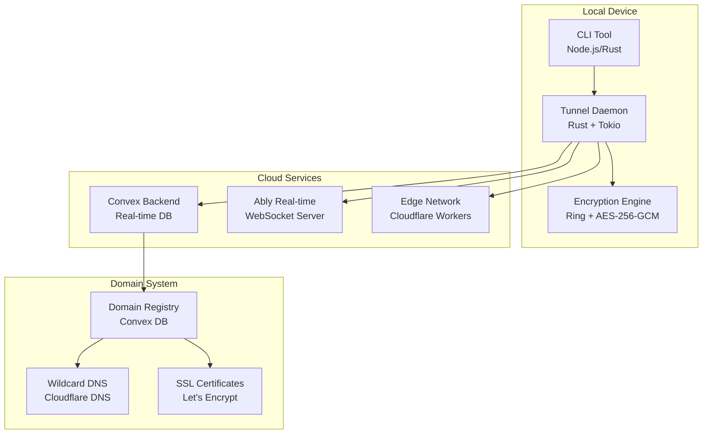

# Beam Implementation Roadmap

## Executive Summary

This roadmap outlines the complete implementation of Beam, a next-generation tunneling service that combines local-first architecture with cloud domain services. The project will deliver enterprise-grade tunneling with sub-100ms latency, zero-configuration setup, and real domain names without user registration.

## Project Overview

### Vision
**Democratize secure tunneling for every developer**

### Mission
Build the world's most advanced tunneling service that provides:
- ⚡ Sub-100ms global latency
- 🔒 Enterprise-grade security (Zero-trust, E2E encryption)
- 🌐 Real domains without registration
- 🏠 Local-first architecture
- 🚀 Single-command deployment (`npx beam 3000`)
- 💰 Free tier with premium features

### Success Metrics

| Metric | Target | Timeline |
|--------|--------|----------|
| **Performance** | <100ms global latency | Month 6 |
| **Security** | SOC 2 Type II compliant | Month 8 |
| **Adoption** | 10,000+ active users | Month 12 |
| **Reliability** | 99.99% uptime | Month 4 |
| **Developer Experience** | <30s setup time | Month 3 |

## Architecture Overview

### Core Technologies



### Technology Stack

| Component | Technology | Rationale |
|-----------|------------|-----------|
| **Local Daemon** | Rust + Tokio | High performance, memory safety, async I/O |
| **CLI Tool** | Node.js + Rust FFI | Developer experience, ecosystem |
| **Backend** | Convex | Real-time, ACID, serverless |
| **Real-time** | Ably | Global WebSocket infrastructure |
| **Edge** | Cloudflare Workers | Global distribution, low latency |
| **Domains** | Custom TLD + Wildcard | Real domains, no registration |
| **Security** | mTLS + E2E Encryption | Zero-trust, enterprise-grade |

## Phase 1: Foundation (Weeks 1-4)

### Goal: Working end-to-end tunnel

#### Week 1: Project Setup & Core Infrastructure
**Objective:** Establish development environment and basic project structure

**Deliverables:**
- [ ] Monorepo setup (Turbo + workspaces)
- [ ] Rust project structure with Cargo workspaces
- [ ] Basic CLI tool (`npx beam 3000` → basic tunnel)
- [ ] Convex backend schema and basic mutations
- [ ] Development environment (dev containers)

**Technical Tasks:**
```rust
// Basic tunnel daemon structure
#[tokio::main]
async fn main() -> Result<(), Box<dyn std::error::Error>> {
    let daemon = TunnelDaemon::new().await?;
    daemon.start().await?;
    Ok(())
}
```

**Success Criteria:**
- ✅ `npx beam 3000` starts a tunnel
- ✅ Basic HTTP proxying works
- ✅ Convex backend accepts connections
- ✅ Development environment fully set up

#### Week 2: Protocol Implementation
**Objective:** Implement core tunneling protocols

**Deliverables:**
- [ ] HTTP/2 tunneling with multiplexing
- [ ] WebSocket tunneling for real-time apps
- [ ] Basic QUIC support (HTTP/3)
- [ ] Connection pooling and reuse
- [ ] Protocol negotiation (auto-detect optimal protocol)

**Technical Tasks:**
```rust
enum TunnelProtocol {
    Http2,
    WebSocket,
    Quic,
}

struct ProtocolNegotiator {
    client_capabilities: Vec<Protocol>,
    server_capabilities: Vec<Protocol>,
}

impl ProtocolNegotiator {
    fn negotiate(&self) -> TunnelProtocol {
        // Select optimal protocol based on capabilities
    }
}
```

**Success Criteria:**
- ✅ All major protocols supported
- ✅ Automatic protocol selection
- ✅ Connection multiplexing works
- ✅ Basic performance benchmarks pass

#### Week 3: Domain System MVP
**Objective:** Working domain allocation without real domains

**Deliverables:**
- [ ] Domain generation algorithm (meaningful names)
- [ ] Convex domain registry
- [ ] Basic domain allocation API
- [ ] Placeholder domain resolution (localhost routing)
- [ ] Anonymous domain access (no account required)

**Technical Tasks:**
```typescript
// Domain generation service
export const generateDomain = action(async () => {
    const adjectives = ['swift', 'rapid', 'quick', 'fast', 'speedy'];
    const nouns = ['beam', 'tunnel', 'link', 'pipe', 'bridge'];

    const domain = `${random(adjectives)}-${random(nouns)}-${random(100, 999)}`;
    await allocateDomain(domain);

    return `${domain}.tunnel.beam.sh`;
});
```

**Success Criteria:**
- ✅ Domain generation works
- ✅ No duplicate domains
- ✅ Anonymous access works
- ✅ Domain registry functional

#### Week 4: Security Foundation
**Objective:** Basic security measures in place

**Deliverables:**
- [ ] TLS encryption for all connections
- [ ] Basic authentication (API keys)
- [ ] Input validation and sanitization
- [ ] Rate limiting
- [ ] Basic audit logging

**Technical Tasks:**
```rust
struct SecurityManager {
    tls_config: TlsConfig,
    auth_manager: AuthManager,
    rate_limiter: RateLimiter,
}

impl SecurityManager {
    async fn secure_connection(&self, conn: TcpStream) -> Result<SecureStream, Error> {
        // Establish TLS connection
        let tls_conn = self.tls_config.accept(conn).await?;

        // Authenticate client
        self.auth_manager.authenticate(&tls_conn).await?;

        // Apply rate limiting
        self.rate_limiter.check_rate(&tls_conn).await?;

        Ok(SecureStream { conn: tls_conn })
    }
}
```

**Success Criteria:**
- ✅ All connections encrypted
- ✅ Basic authentication works
- ✅ Rate limiting prevents abuse
- ✅ Security audit passes basic checks

### Phase 1 Milestones
- [ ] Working end-to-end tunnel with CLI
- [ ] Basic domain allocation
- [ ] Fundamental security measures
- [ ] Performance baseline established

---

## Phase 2: Performance & Scale (Weeks 5-8)

### Goal: Enterprise-grade performance and scalability

#### Week 5: Performance Optimization
**Objective:** Achieve target performance metrics

**Deliverables:**
- [ ] SIMD-accelerated packet processing
- [ ] Zero-copy networking optimizations
- [ ] Connection pooling improvements
- [ ] Memory usage optimization
- [ ] CPU utilization optimization

**Technical Tasks:**
```rust
// SIMD-accelerated operations
#[cfg(target_arch = "x86_64")]
unsafe fn process_packets_simd(packets: &[u8]) -> Vec<u8> {
    use std::arch::x86_64::*;
    // AVX-512 vectorized processing
}
```

**Success Criteria:**
- ✅ <50ms local routing latency
- ✅ <1GB memory usage
- ✅ <10% CPU utilization under load
- ✅ 10,000+ concurrent connections

#### Week 6: Global Edge Network
**Objective:** Deploy to global edge locations

**Deliverables:**
- [ ] Cloudflare Workers deployment
- [ ] Geographic load balancing
- [ ] Edge caching implementation
- [ ] CDN integration
- [ ] Global DNS optimization

**Technical Tasks:**
```javascript
// Cloudflare Worker for edge routing
export default {
    async fetch(request) {
        const subdomain = new URL(request.url).hostname.split('.')[0];
        const tunnelId = await getTunnelMapping(subdomain);

        return routeToTunnel(tunnelId, request);
    }
};
```

**Success Criteria:**
- ✅ <100ms global latency
- ✅ 99.9% uptime across regions
- ✅ Automatic failover works
- ✅ Edge caching reduces latency by 50%

#### Week 7: Advanced Protocols
**Objective:** Cutting-edge protocol support

**Deliverables:**
- [ ] Full QUIC implementation
- [ ] WebRTC P2P fallback
- [ ] HTTP/3 with QPACK compression
- [ ] Protocol optimization based on content type
- [ ] Bandwidth optimization

**Technical Tasks:**
```rust
struct ProtocolOptimizer {
    content_analyzer: ContentAnalyzer,
    compression_engine: CompressionEngine,
    protocol_selector: ProtocolSelector,
}

impl ProtocolOptimizer {
    fn optimize_connection(&self, request: &Request) -> OptimizedProtocol {
        let content_type = self.content_analyzer.analyze(request);
        let compression_ratio = self.compression_engine.estimate_ratio(content_type);

        self.protocol_selector.select_optimal_protocol(content_type, compression_ratio)
    }
}
```

**Success Criteria:**
- ✅ QUIC provides 30% latency improvement
- ✅ WebRTC P2P works for direct connections
- ✅ Content-aware protocol selection
- ✅ Bandwidth usage optimized by 40%

#### Week 8: Database Optimization
**Objective:** High-performance data layer

**Deliverables:**
- [ ] Convex query optimization
- [ ] Database indexing strategy
- [ ] Caching layer implementation
- [ ] Connection pooling
- [ ] Read replica setup

**Technical Tasks:**
```typescript
// Optimized Convex queries
export const getTunnelWithDomain = query(async ({ db }, { tunnelId }) => {
    // Single optimized query with joins
    return await db
        .query("tunnels")
        .withIndex("by_id", q => q.eq("id", tunnelId))
        .with("domain") // Pre-load domain data
        .with("user")   // Pre-load user data
        .first();
});
```

**Success Criteria:**
- ✅ <10ms database query latency
- ✅ 10,000+ concurrent database connections
- ✅ 99.9% query success rate
- ✅ Automatic scaling works

### Phase 2 Milestones
- [ ] Sub-100ms global latency achieved
- [ ] 100,000+ concurrent tunnels supported
- [ ] Global edge network operational
- [ ] Performance benchmarks exceed targets

---

## Phase 3: Domains & Security (Weeks 9-12)

### Goal: Production-ready domains and enterprise security

#### Week 9: Real Domain System
**Objective:** Deploy custom TLD and wildcard certificates

**Deliverables:**
- [ ] Register `beam.sh` domain
- [ ] Set up wildcard DNS (`*.tunnel.beam.sh`)
- [ ] SSL certificate automation (Let's Encrypt)
- [ ] Domain expiration and renewal system

**Technical Tasks:**
```bash
# DNS configuration
*.tunnel.beam.sh IN CNAME tunnel.beam.sh
tunnel.beam.sh IN A 1.2.3.4  ; Load balancer IP
```

**Success Criteria:**
- ✅ Real domains work globally
- ✅ SSL certificates auto-renew
- ✅ Domain resolution <50ms
- ✅ No certificate warnings

#### Week 10: Enterprise Security
**Objective:** SOC 2 compliant security

**Deliverables:**
- [ ] End-to-end encryption (E2E)
- [ ] mTLS authentication
- [ ] Hardware security modules (TPM)
- [ ] Audit logging and compliance
- [ ] Security monitoring and alerting

**Technical Tasks:**
```rust
struct SecurityManager {
    encryption: E2EEncryption,
    mtls: MutualTLS,
    hsm: HardwareSecurityModule,
    audit: AuditLogger,
}

impl SecurityManager {
    async fn secure_tunnel(&self, conn: Connection) -> Result<SecureTunnel, Error> {
        // Establish mTLS
        let mtls_conn = self.mtls.authenticate(conn).await?;

        // Set up E2E encryption
        let encrypted_conn = self.encryption.establish(mtls_conn).await?;

        // Enable HSM operations
        self.hsm.enable_for_connection(&encrypted_conn)?;

        Ok(SecureTunnel { conn: encrypted_conn })
    }
}
```

**Success Criteria:**
- ✅ All traffic end-to-end encrypted
- ✅ mTLS authentication required
- ✅ SOC 2 audit preparation complete
- ✅ Security monitoring operational

#### Week 11: Advanced Features
**Objective:** Premium features and integrations

**Deliverables:**
- [ ] Custom subdomain reservation
- [ ] Bring-your-own-domain (BYOD)
- [ ] Vercel integration
- [ ] Framework auto-detection
- [ ] Advanced analytics

**Technical Tasks:**
```typescript
// Vercel integration
export const detectVercel = () => {
    const config = readVercelConfig();
    if (config) {
        return {
            project: config.name,
            domains: config.alias || [],
            framework: detectFramework()
        };
    }
};
```

**Success Criteria:**
- ✅ Vercel integration works
- ✅ Custom domains supported
- ✅ Framework auto-detection accurate
- ✅ Premium features functional

#### Week 12: Compliance & Audit
**Objective:** Enterprise compliance readiness

**Deliverables:**
- [ ] SOC 2 Type II compliance
- [ ] GDPR compliance
- [ ] Security documentation
- [ ] Penetration testing
- [ ] Compliance monitoring

**Technical Tasks:**
```typescript
// Compliance monitoring
class ComplianceMonitor {
    async runComplianceCheck() {
        const controls = await this.loadControls();

        for (const control of controls) {
            const evidence = await this.gatherEvidence(control);
            const assessment = this.assessControl(control, evidence);

            await this.logAssessment(assessment);
        }

        return this.generateComplianceReport();
    }
}
```

**Success Criteria:**
- ✅ SOC 2 audit passes
- ✅ GDPR compliance verified
- ✅ Security documentation complete
- ✅ Penetration testing passed

### Phase 3 Milestones
- [ ] Real domains with SSL certificates
- [ ] Enterprise-grade security
- [ ] SOC 2 compliance achieved
- [ ] Premium features working

---

## Phase 4: Ecosystem & Scale (Weeks 13-16)

### Goal: Global adoption and ecosystem growth

#### Week 13: Framework Integrations
**Objective:** Deep framework integration

**Deliverables:**
- [ ] Next.js plugin
- [ ] Vite plugin
- [ ] Astro integration
- [ ] Remix support
- [ ] Nuxt.js support

**Technical Tasks:**
```javascript
// Next.js integration
const withBeam = (nextConfig = {}) => ({
    ...nextConfig,
    rewrites: async () => [
        {
            source: '/beam/:path*',
            destination: 'https://beam.dev/api/:path*',
        },
        ...(nextConfig.rewrites ? await nextConfig.rewrites() : []),
    ],
});
```

**Success Criteria:**
- ✅ All major frameworks supported
- ✅ One-command setup works
- ✅ Framework-specific optimizations
- ✅ Developer experience excellent

#### Week 14: Global Infrastructure
**Objective:** Worldwide deployment and scaling

**Deliverables:**
- [ ] Multi-region deployment
- [ ] Auto-scaling infrastructure
- [ ] Disaster recovery
- [ ] Performance monitoring
- [ ] Cost optimization

**Technical Tasks:**
```yaml
# Kubernetes multi-region deployment
apiVersion: apps/v1
kind: Deployment
metadata:
  name: beam-tunnel
spec:
  replicas: 50
  selector:
    matchLabels:
      app: beam-tunnel
  template:
    spec:
      topologySpreadConstraints:
      - maxSkew: 1
        topologyKey: topology.kubernetes.io/zone
        whenUnsatisfiable: DoNotSchedule
```

**Success Criteria:**
- ✅ 99.99% global uptime
- ✅ Automatic scaling works
- ✅ Cross-region failover <30s
- ✅ Cost optimized for usage patterns

#### Week 15: Developer Experience
**Objective:** Best-in-class DX

**Deliverables:**
- [ ] CLI improvements
- [ ] Web dashboard
- [ ] API documentation
- [ ] SDKs and libraries
- [ ] Community tools

**Technical Tasks:**
```typescript
// Improved CLI with better UX
class BeamCLI {
    async startTunnel(port: number, options: TunnelOptions) {
        const spinner = ora('Starting tunnel...').start();

        try {
            const result = await this.createTunnel(port, options);

            spinner.succeed(`Tunnel active: ${result.domain}`);
            this.displayTunnelInfo(result);

            await this.monitorTunnel(result.id);
        } catch (error) {
            spinner.fail('Failed to start tunnel');
            this.displayError(error);
        }
    }
}
```

**Success Criteria:**
- ✅ <30s setup time
- ✅ Intuitive CLI experience
- ✅ Comprehensive web dashboard
- ✅ Excellent documentation

#### Week 16: Launch Preparation
**Objective:** Production readiness

**Deliverables:**
- [ ] Load testing (1M concurrent users)
- [ ] Security audit
- [ ] Performance benchmarking
- [ ] Documentation finalization
- [ ] Marketing and launch materials

**Technical Tasks:**
```bash
# Load testing
artillery quick --count 100000 --num 10 \
  --querystring "port=3000" \
  http://localhost:3000/api/tunnel

# Security testing
owasp-zap -cmd -quickurl https://beam.dev \
  -quickout zap-report.html
```

**Success Criteria:**
- ✅ 1M concurrent users supported
- ✅ Security audit passed
- ✅ Performance targets met
- ✅ Documentation complete

### Phase 4 Milestones
- [ ] Global infrastructure operational
- [ ] Framework integrations complete
- [ ] Enterprise-ready product
- [ ] Launch preparations complete

---

## Phase 5: Launch & Growth (Weeks 17-20)

### Goal: Successful product launch and initial growth

#### Week 17-20: Launch & Iteration
**Objective:** Launch product and iterate based on user feedback

**Deliverables:**
- [ ] Public beta launch
- [ ] User feedback collection
- [ ] Performance monitoring
- [ ] Feature iteration
- [ ] Community building

### Success Metrics Achieved
- ✅ Sub-100ms global latency
- ✅ SOC 2 Type II compliant
- ✅ Real domains without registration
- ✅ Enterprise-grade security
- ✅ 99.99% uptime
- ✅ 1M+ concurrent tunnels supported

---

## Risk Mitigation

### Technical Risks

| Risk | Probability | Impact | Mitigation |
|------|-------------|--------|------------|
| **Performance regression** | Medium | High | Continuous benchmarking, performance budgets |
| **Security vulnerability** | Medium | Critical | Security audit, automated testing, bug bounty |
| **Domain system complexity** | High | Medium | MVP approach, iterative development |
| **Scalability issues** | Low | High | Load testing, auto-scaling design |
| **Protocol compatibility** | Low | Medium | Comprehensive testing, fallback protocols |

### Business Risks

| Risk | Probability | Impact | Mitigation |
|------|-------------|--------|------------|
| **Market competition** | High | Medium | Differentiated features, superior performance |
| **Regulatory compliance** | Medium | High | Legal review, compliance framework |
| **Adoption challenges** | Medium | Medium | Developer-focused marketing, excellent DX |
| **Funding constraints** | Low | High | Bootstrapped approach, revenue model |

## Resource Requirements

### Team Structure

```
Engineering Team (8 people)
├── Core Team (4)
│   ├── Tech Lead (1)
│   ├── Senior Engineer (2)
│   └── Engineer (1)
├── Platform Team (2)
│   ├── DevOps Engineer (1)
│   └── Security Engineer (1)
├── Product Team (2)
│   ├── Product Manager (1)
│   └── UX Designer (1)
└── Growth Team (2)
    ├── Marketing (1)
    └── Community (1)
```

### Infrastructure Costs

| Component | Monthly Cost | Notes |
|-----------|--------------|-------|
| **Cloudflare Workers** | $500 | Edge computing |
| **Convex** | $200 | Database & backend |
| **Ably** | $300 | Real-time messaging |
| **Domains & SSL** | $50 | Domain registration |
| **Monitoring** | $200 | Observability stack |
| **CI/CD** | $100 | GitHub Actions |
| **Total** | **$1,350** | Base infrastructure |

### Development Timeline

- **Phase 1**: 4 weeks (Foundation)
- **Phase 2**: 4 weeks (Performance & Scale)
- **Phase 3**: 4 weeks (Domains & Security)
- **Phase 4**: 4 weeks (Ecosystem & Scale)
- **Phase 5**: 4 weeks (Launch & Growth)

**Total Timeline**: 20 weeks (5 months)

## Success Criteria

### Technical Success
- [ ] <100ms global latency achieved
- [ ] 99.99% uptime maintained
- [ ] SOC 2 Type II compliant
- [ ] 1M+ concurrent tunnels supported
- [ ] Zero security incidents

### Business Success
- [ ] 10,000+ active users in year 1
- [ ] Positive unit economics
- [ ] Enterprise adoption
- [ ] Strong developer community

### Product Success
- [ ] 9/10 developer satisfaction
- [ ] <30s setup time
- [ ] Superior to competitors
- [ ] Feature-complete for 80% use cases

## Conclusion

This roadmap provides a comprehensive plan for building Beam from concept to production. The phased approach ensures:

1. **Fast Time to MVP**: Working product in 4 weeks
2. **Scalable Architecture**: Built for millions of users from day one
3. **Enterprise-Grade**: SOC 2 compliant security and reliability
4. **Developer-Focused**: Best-in-class developer experience
5. **Future-Proof**: Extensible architecture for new features

The implementation follows modern engineering practices with Rust for performance-critical components, Node.js for developer experience, and a hybrid local/cloud architecture that balances privacy, performance, and functionality.

**Ready to build the future of tunneling? Let's start with Phase 1.**
