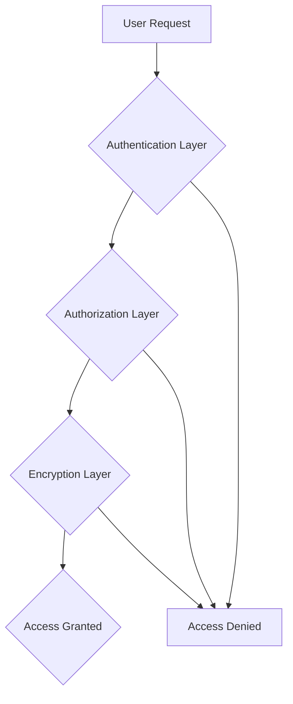

# Security Overview

## 🔒 Comprehensive Security Architecture

Beam implements a **zero-trust security model** that ensures every connection, every request, and every data transmission is authenticated, authorized, and encrypted. Our security philosophy is simple: **never trust, always verify**.

## Core Security Principles

### 🛡️ Zero-Trust Architecture

Every component in the Beam ecosystem operates under the assumption that no entity - internal or external - can be trusted by default. All access requires explicit authentication and authorization.



### 🔐 End-to-End Encryption

**All data in transit and at rest is encrypted** using industry-standard cryptographic protocols:

- **TLS 1.3** for all external communications
- **AES-256-GCM** for data encryption
- **Ed25519** for digital signatures
- **ChaCha20-Poly1305** for high-performance encryption

### 🏢 Enterprise-Grade Security Features

#### Identity & Access Management
- **Multi-factor authentication (MFA)**
- **Role-based access control (RBAC)**
- **Single sign-on (SSO) integration**
- **Hardware security module (HSM) support**

#### Network Security
- **Distributed denial-of-service (DDoS) protection**
- **Web application firewall (WAF)**
- **Intrusion detection and prevention systems (IDS/IPS)**
- **Network segmentation and isolation**

#### Data Protection
- **Data encryption at rest**
- **Secure key management**
- **Data loss prevention (DLP)**
- **Audit logging and monitoring**

## Security Model Components

### 1. Authentication Layer

#### Token-Based Authentication
```typescript
interface AuthToken {
  sub: string;        // Subject (user ID)
  iss: string;        // Issuer
  aud: string;        // Audience
  exp: number;        // Expiration time
  iat: number;        // Issued at time
  jti: string;        // JWT ID
  scope: string[];    // Permissions
}
```

#### Hardware-Backed Authentication
- **TPM (Trusted Platform Module)** integration
- **YubiKey** and **FIDO2** support
- **Biometric authentication**

### 2. Authorization Layer

#### Policy-Based Access Control
```yaml
# Example security policy
policy:
  name: "tunnel-access-policy"
  rules:
    - resource: "tunnel:*"
      actions: ["create", "read", "update", "delete"]
      conditions:
        - ipAddress: "192.168.1.0/24"
        - timeOfDay: "09:00-17:00"
        - userGroups: ["developers", "admins"]
```

#### Context-Aware Authorization
- **Time-based access controls**
- **Location-based restrictions**
- **Device fingerprinting**
- **Behavioral analytics**

### 3. Encryption Layer

#### Hybrid Encryption Strategy
```typescript
class HybridEncryption {
  // Asymmetric encryption for key exchange
  async generateKeyPair(): Promise<CryptoKeyPair> {
    return await crypto.subtle.generateKey(
      {
        name: "RSA-OAEP",
        modulusLength: 4096,
        publicExponent: new Uint8Array([1, 0, 1]),
        hash: "SHA-256"
      },
      true,
      ["encrypt", "decrypt"]
    );
  }

  // Symmetric encryption for data
  async encryptData(key: CryptoKey, data: Uint8Array): Promise<Uint8Array> {
    return await crypto.subtle.encrypt(
      { name: "AES-GCM", iv: crypto.getRandomValues(new Uint8Array(12)) },
      key,
      data
    );
  }
}
```

#### Perfect Forward Secrecy
- **Ephemeral key exchange**
- **Session key rotation**
- **Key derivation functions (HKDF)**

## Threat Model

### Attack Vectors & Mitigations

#### 1. Man-in-the-Middle (MitM) Attacks
**Mitigation:**
- Certificate pinning
- Certificate transparency monitoring
- DNSSEC validation
- Tor hidden service integration

#### 2. Denial-of-Service (DoS) Attacks
**Mitigation:**
- Rate limiting and throttling
- Distributed architecture
- Auto-scaling capabilities
- Traffic filtering at edge

#### 3. Data Exfiltration
**Mitigation:**
- Data loss prevention (DLP)
- Content inspection
- Encryption at rest
- Audit logging

#### 4. Privilege Escalation
**Mitigation:**
- Least privilege principle
- Regular permission audits
- Session management
- Multi-factor authentication

## Compliance & Standards

### Industry Standards Compliance

#### SOC 2 Type II
- **Security**: Administrative, physical, and technical safeguards
- **Availability**: System availability and performance
- **Confidentiality**: Protection of sensitive information
- **Privacy**: Collection, use, and disclosure of personal information

#### GDPR Compliance
- **Data minimization**
- **Purpose limitation**
- **Storage limitation**
- **Data subject rights**
- **Breach notification**

#### HIPAA Compliance (Healthcare)
- **Technical safeguards**: Access control, audit controls, integrity
- **Physical safeguards**: Facility access controls, workstation security
- **Administrative safeguards**: Security management, workforce security

### Security Certifications

- **ISO 27001**: Information security management systems
- **NIST Cybersecurity Framework**: Identify, Protect, Detect, Respond, Recover
- **PCI DSS**: Payment card industry data security standard (Level 1)

## Incident Response

### Security Incident Response Plan

#### Phase 1: Detection & Analysis (0-1 hour)
1. **Automated detection** via monitoring systems
2. **Initial triage** by security operations center (SOC)
3. **Severity assessment** using CVSS scoring
4. **Stakeholder notification** for critical incidents

#### Phase 2: Containment (1-4 hours)
1. **Isolate affected systems**
2. **Implement temporary countermeasures**
3. **Preserve evidence** for forensic analysis
4. **Communicate with affected parties**

#### Phase 3: Eradication & Recovery (4-24 hours)
1. **Identify root cause**
2. **Remove malicious components**
3. **Restore systems from clean backups**
4. **Validate system integrity**

#### Phase 4: Lessons Learned (1-7 days)
1. **Post-incident review**
2. **Update security controls**
3. **Improve detection capabilities**
4. **Update incident response procedures**

## Security Monitoring & Logging

### Comprehensive Audit Trail

#### Audit Log Categories
- **Authentication events**: Login, logout, MFA attempts
- **Authorization decisions**: Access granted/denied, policy violations
- **Data access**: File operations, database queries, API calls
- **System events**: Configuration changes, software updates
- **Security events**: Firewall rules, intrusion attempts

#### Log Retention & Analysis
```typescript
interface AuditLogEntry {
  timestamp: Date;
  eventType: string;
  userId: string;
  resource: string;
  action: string;
  result: 'success' | 'failure';
  ipAddress: string;
  userAgent: string;
  metadata: Record<string, any>;
}
```

### Real-Time Security Monitoring

#### Key Metrics Monitored
- **Authentication failure rate**
- **Unusual access patterns**
- **Data exfiltration attempts**
- **Configuration changes**
- **System resource utilization**

## Security Best Practices

### For Users

#### Account Security
- **Use strong, unique passwords**
- **Enable multi-factor authentication**
- **Regularly review access logs**
- **Report suspicious activity immediately**

#### Data Protection
- **Encrypt sensitive data before transmission**
- **Use secure connections (HTTPS/TLS)**
- **Implement proper access controls**
- **Regularly backup important data**

### For Administrators

#### System Hardening
- **Keep systems updated and patched**
- **Implement least privilege access**
- **Regular security assessments**
- **Monitor and audit system activity**

#### Network Security
- **Use firewalls and intrusion detection**
- **Implement network segmentation**
- **Monitor network traffic**
- **Regular vulnerability scanning**

## Security Resources

### Documentation
- [Security Policy](policy/security-policy.md)
- [Threat Model](threat-model/security-architecture.md)
- [Cryptography Details](cryptography/)
- [Compliance Information](compliance/)

### Tools & Services
- **Security Scanner**: Automated vulnerability detection
- **Log Analyzer**: Real-time log monitoring and analysis
- **Incident Response Platform**: Coordinated incident management
- **Security Information and Event Management (SIEM)**

### Contact Information
- **Security Team**: security@beam.dev
- **Emergency Response**: +1 (555) 123-4567
- **Bug Bounty Program**: https://beam.dev/security/bounty

---

## Security Commitment

Beam is committed to maintaining the highest standards of security and privacy. We continuously invest in security research, implement industry best practices, and maintain transparent communication about our security measures and incidents.

**Your security is our top priority.** 🛡️